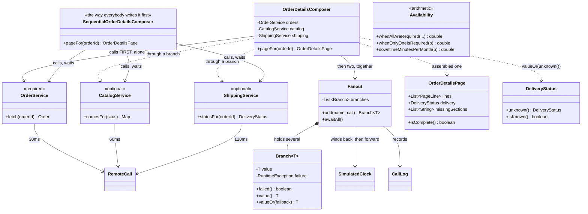

# API Composition — Class Diagram

Mermaid source

## What the arrows are saying

**The composer's first arrow is different from its other two.** `OrderService` is
called directly, on its own, before the fan-out exists. Catalog and Shipping are
reached *through* branches. That asymmetry is not stylistic — it is the dependency
between the calls made visible. Catalog needs to be told which skus to name, and only
Orders knows them, so the shape is one call and then two together rather than one
flat burst of three.

**`Fanout` knows nothing about orders, pages or shopping.** It takes named pieces of
work, runs them all from the same starting moment, and hands back a handle to each.
That generality is why one class serves the whole project — and it is also why
`Fanout` cannot possibly decide for you which failures matter. It parks them; the
composer judges them.

**`Branch` has two accessors and the whole design decision lives in choosing between
them.** `value()` rethrows whatever the branch caught, for data the page needs.
`valueOr(fallback)` substitutes, for data it can do without. Required versus optional
is not a configuration file or an annotation in this project; it is which of those
two methods the composer calls, on a line somebody wrote deliberately.

**The three services are stereotyped by what they mean to the page, not by what they
extend.** `<<required>>` on Orders, `<<optional>>` on the other two. That is a product
decision that had to be made before the outage, and putting it on the diagram is the
point: it is the most important fact about the system and it appears nowhere in the
type system.

**`SequentialOrderDetailsComposer` has three identical arrows and no `Fanout` at
all.** Structurally it is simpler, and that is exactly why it survives code review.
Its cost lives in the timeline and in an outage, neither of which a class diagram can
show you — which is the honest limitation of this picture, and the reason act one and
act three exist as something you can run.

**`OrderDetailsPage` carries `missingSections`.** A composed page is not simply
present or absent; it can arrive with a hole in it, and the type says so. Without that
list, a page missing its delivery section is indistinguishable from a page for an
order that has not shipped yet.

**`DeliveryStatus.unknown()` is a static factory on the record itself**, rather than a
null or an empty string invented at the call site. It exists so that "we could not
check" is a value the page can hold and display, rather than an absence somebody has
to guess the meaning of later.

**`Availability` points at nothing.** It is pure arithmetic with no dependencies, and
it is in the project because the single most important property of a composed page —
that it is less available than any service it calls — is a multiplication, not a
design. Keeping it as code means `AvailabilityTest` pins the numbers, and the written
explanation cannot drift away from them.
