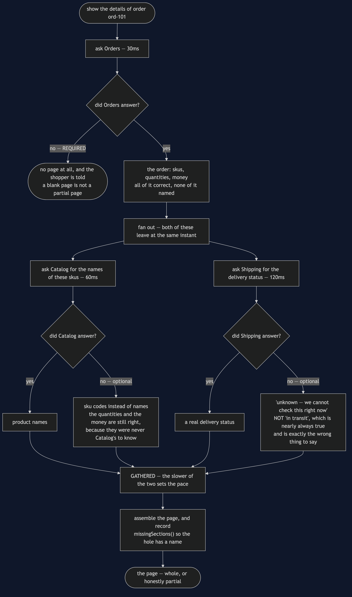
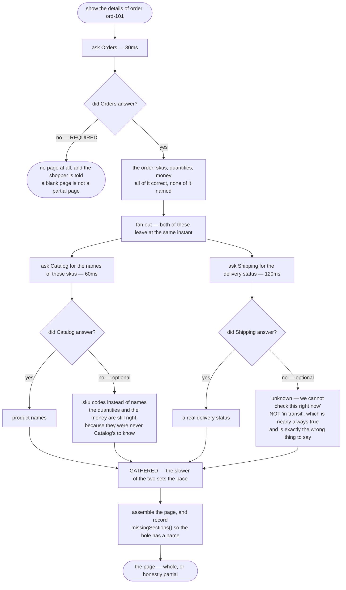

# API Composition — Data Flow Diagram

One page, followed from the request to the rendered rows. The architecture diagram says
what the page depends on; this one says **what each dependency contributes, and what the
page looks like when one of them contributes nothing**.

The thing to follow is that the three answers do not merge into one pot. Each one fills a
specific part of the page and can be missing on its own terms. Orders supplies the skus,
the quantities and the money. Catalog supplies names, and only names. Shipping supplies a
delivery status, and only that. Because the contributions are separate, the failures can be
handled separately — and that is the whole reason a partial page is possible at all.

Notice where the fork after each optional call goes. It does not go to an error. It goes to
a **substitute that says what it is**: sku codes where names should have been, and
`DeliveryStatus.unknown()`, which means "we cannot check this right now" rather than a
plausible guess.

Mermaid source

## What the picture is telling you

**One branch ends the page and two do not.** That asymmetry is the design, and it was
decided before the outage rather than during it. The middle of an outage is the worst
possible time to be working out what a page means without its delivery section.

**Both optional branches land in the same place whether they succeeded or not.** `Gather`
has four arrows into it, and the composer does not care which pair it got. That is what
`Fanout.Branch` buys: a failed branch parks its failure instead of ending the fan-out, and
the composer then asks each one whether the absence is fatal.

**The substitutes are deliberately unattractive.** Sku codes look worse than names, and
"unknown" looks worse than "in transit". That is the correct aesthetic. A shopper told the
parcel is in transit will not ring up about the one that never left, and a page that
quietly drops the delivery section is indistinguishable from a page for an order that has
not shipped yet.

**`Gather` costs the maximum of the two branches, not the sum.** 30ms and then the slower
of 60 and 120 gives 150ms. The sequential version of this diagram is a straight line —
30 + 60 + 120 = 210ms — and the middle call's answer sits waiting for sixty milliseconds
while Shipping, which does not need it, has not yet been asked.

**Parallelism removes the addition and not the maximum.** Put Shipping at 400ms and the
page goes to 430ms; no restructuring beats that while Shipping is on the critical path.
There is a test called `theSlowestDependencySetsThePace` that says so.

## The same page, assembled the obvious way

`SequentialOrderDetailsComposer` is three lines of ordinary Java and there is no bug in it.
Every test in its class passes, including `itBuildsTheRightPage`. A code review would wave
it through, because the cost is not visible in the code at all — it is visible only in the
timeline, where each call waits for an answer it does not need.

The failure behaviour is worse than the timing. When Shipping is down, the sequential
version has already received the order and the product names, and it throws both away to
report an error. The composed version keeps them and says which section is missing. Same
three services, same outage, and one of the two pages is still worth showing to a customer.
