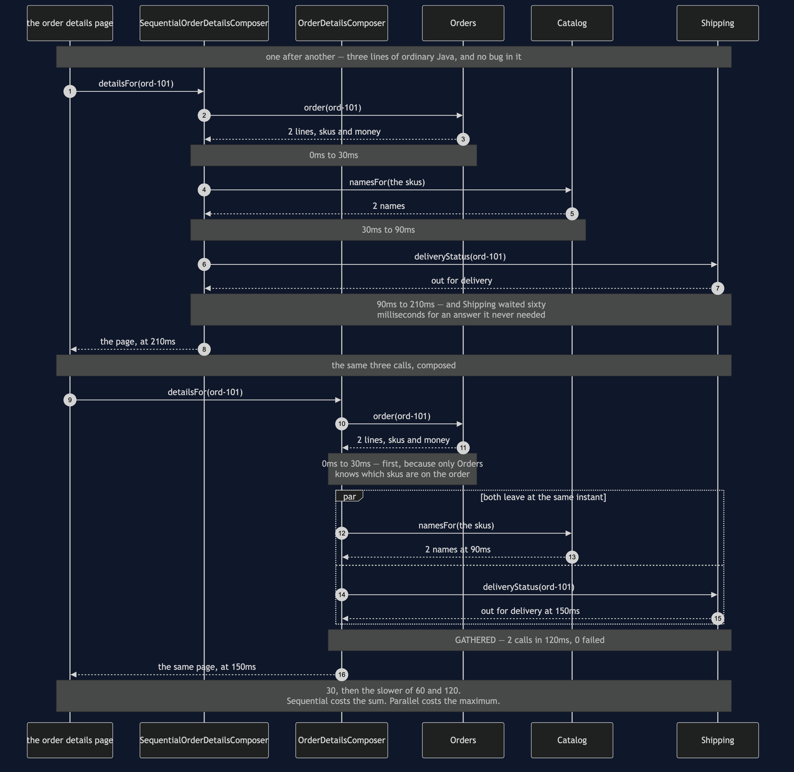
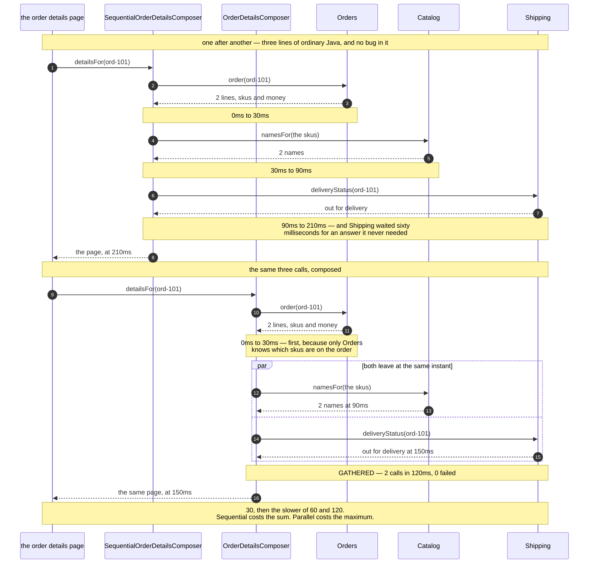

# API Composition — Sequence Diagram

The one sequence worth having in your head before the others make sense: the same order
details page built twice, once with the calls queued and once with them sent together, and
the shopper waiting 210 milliseconds or 150.

[`uml-diagram.md`](uml-diagram.md) holds the full set of five acts, including both outages
and the availability arithmetic. This document puts the two composers side by side, because
the pattern is a trade and a trade is only visible as a comparison.

The clock runs in the notes and every figure is one the demo prints. Watch the second and
third calls in the upper half: Shipping sits waiting sixty milliseconds for Catalog's answer
and then does not use it. That wasted wait is the entire subject of the lower half.

Mermaid source

## Reading the timings

**210 against 150, and the difference is entirely waiting.** Not work — both versions make
exactly three calls and do exactly the same assembly. The sequential version simply spends
sixty milliseconds of the shopper's time on a dependency that had nothing to wait for.

**The first call is alone on both sides, and that is not laziness.** Catalog has to be told
which skus to name, and only Orders knows them. The honest work in composing a page is
deciding which calls genuinely depend on which; the flat "fan out everything" picture is
usually wrong, and it is wrong here.

**Parallelism removes the addition, not the maximum.** The lower half is 30 + max(60, 120).
Put Shipping at 400ms and the page goes to 430ms, and no restructuring will beat that while
Shipping is on the critical path. There is a test named for exactly this.

**Nothing here is really parallel.** `Fanout` runs its branches in a loop, winding the clock
back to the moment of departure before each and forward to the slowest arrival afterwards.
A test checks that both branches share a start time, which is the property that matters. In
a real service this would be a virtual thread per branch or `CompletableFuture.allOf`, and
every figure above would be the same.

## What changes when a dependency is down

**Shipping fails.** The composed version keeps what it already has and renders the page:
the skus, the names, the quantities and the money, with `delivery: unknown, we cannot check
this right now` and `missing: [delivery status]`. The sequential version has the order and
the names in hand too — and throws both away to report an error. Same outage, same data
already paid for, and only one of the two pages is worth showing to a customer.

**Orders fails.** The composed version refuses to build anything, and that is correct. A
page with no order on it is not a partial page, it is a blank one. Required means required,
and the whole value of the classification is that it is honoured in both directions.

**Nobody fails, but everybody could.** The fifth act is arithmetic rather than a sequence:
three services at 99.9% make a page that needs all three available 99.7% of the time — over
two hours a month against each service's forty-three minutes, because the outages mostly do
not overlap. The way out is not better services, it is needing fewer of them, which is what
the optional labels buy. When that lever runs out, the answer is to stop assembling on
demand and keep a copy that is already assembled: [CQRS](../cqrs-pattern).
