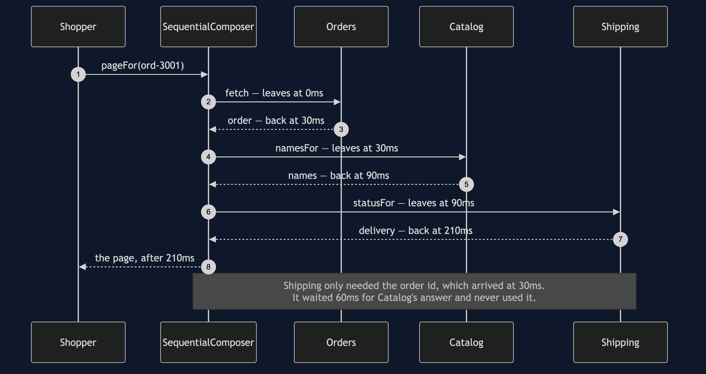
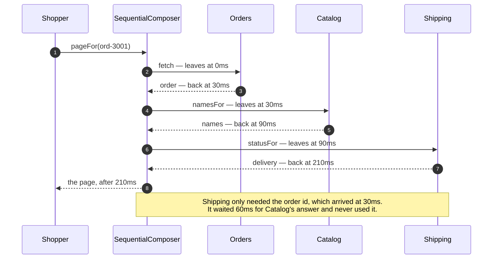
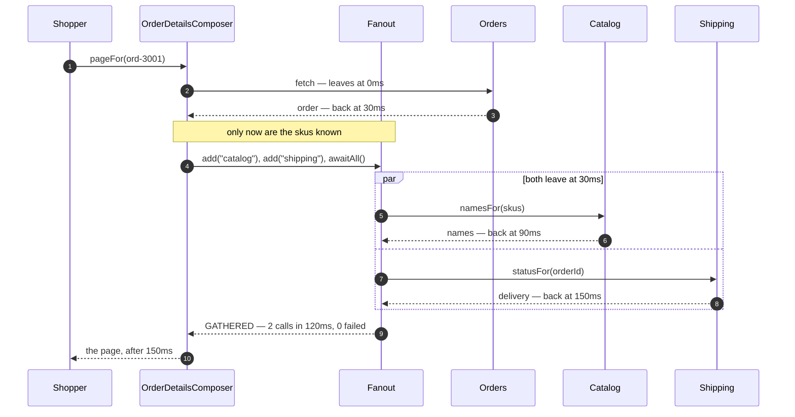
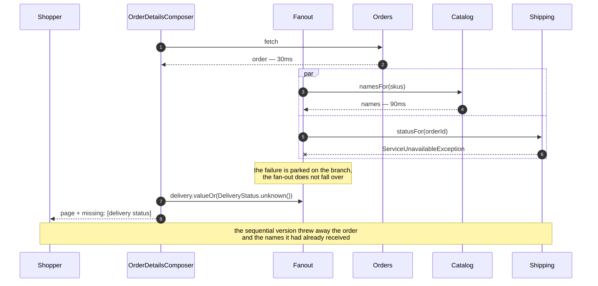
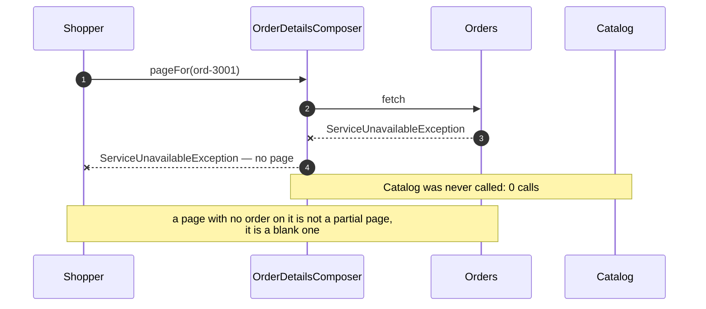
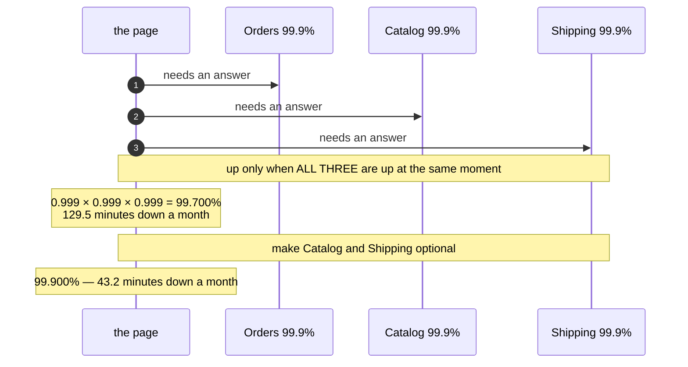

# API Composition — UML Sequence Diagrams

Five sequences over the same page. Throughout: Orders answers in **30ms**, Catalog in
**60ms**, Shipping in **120ms**. Every number below comes out of `./gradlew run`.

## Act One: Three Calls In A Queue

Mermaid source

Thirty plus sixty plus a hundred and twenty. The page costs the **sum**.

The line worth staring at is the third call. Shipping needs the order id and nothing
else, and the order id was available at thirty milliseconds. It sat and waited for
Catalog anyway, because that is what a sequence of statements does.

## Act Two: The Same Calls, Sent Together

Thirty, then the slower of sixty and one hundred and twenty. The page costs the
**maximum**.

Sixty milliseconds have gone, and they are precisely the sixty that Shipping used to
spend waiting for something it did not need. `bothBranchesLeaveTogether` asserts that
the two branches share a departure time, and `itPaysForTheSlowestBranchOnly` asserts
the total.

Note what this diagram does *not* show: three arrows leaving at zero. Catalog cannot
be asked which skus to name before Orders has said what they are. One call, then two
together, is the real shape of most composed pages.

## Act Three: Shipping Is Down

The same outage, two completely different outcomes. The sequential composer throws,
and with it goes the order and the product names that had already arrived —
`itLosesWorkAlreadyDone` asserts that loss. The composed page shows what the shopper
bought, what it cost, and says plainly that the delivery status could not be checked.

The mechanism is one `catch` inside `Branch.run`, and one choice of accessor:
`valueOr` rather than `value`.

## Act Four: Orders Is Down

This is the classification working in the other direction, and it is **correct
behaviour rather than a gap in the pattern**. Orders is required. Without it there is
no honest page to show, so the composer does not attempt one — and because the
failure happens before the fan-out exists, Catalog is not troubled at all.
`itStopsWhenTheOrderIsMissing` asserts the zero calls.

Being able to say "this dependency is required" is as much a part of the pattern as
being able to say "this one is optional". A composer that degrades everything is a
composer that will eventually show somebody a page about nothing.

## Act Five: What Three Dependencies Do To Availability

Not a sequence so much as an argument drawn as one, because the shape is the point:
three arrows out, and the page only works when every one of them comes back.

Availabilities multiply. Three services that each behave impeccably — forty-three
minutes of downtime a month apiece — combine into a page with over two hours, because
their outages mostly do not overlap.

The way out is not better services. It is **needing fewer of them**, which is exactly
what the required-and-optional classification buys.

## Notes

- Every act uses the same three services with the same latencies. Nothing about the
  services changes between acts. What changes is which composer is asked and which
  service has been told to fail — which is the honest way to compare two designs.
- `Fanout` runs its branches in a loop, winding `SimulatedClock` back to the moment of
  departure before each one and forward to the slowest arrival at the end. The
  timeline that comes out is the timeline genuinely parallel calls would produce,
  which is why act two can be reasoned about without any threads existing.
- Nothing in this project sleeps. A 400ms page costs a test nothing, so
  `theSlowestDependencySetsThePace` can set Shipping to 400ms and the suite still
  finishes in about a second.
- In a real service the fan-out would be a virtual thread per branch, or
  `CompletableFuture.allOf`, with a timeout on each. Every argument above would be
  unchanged.
