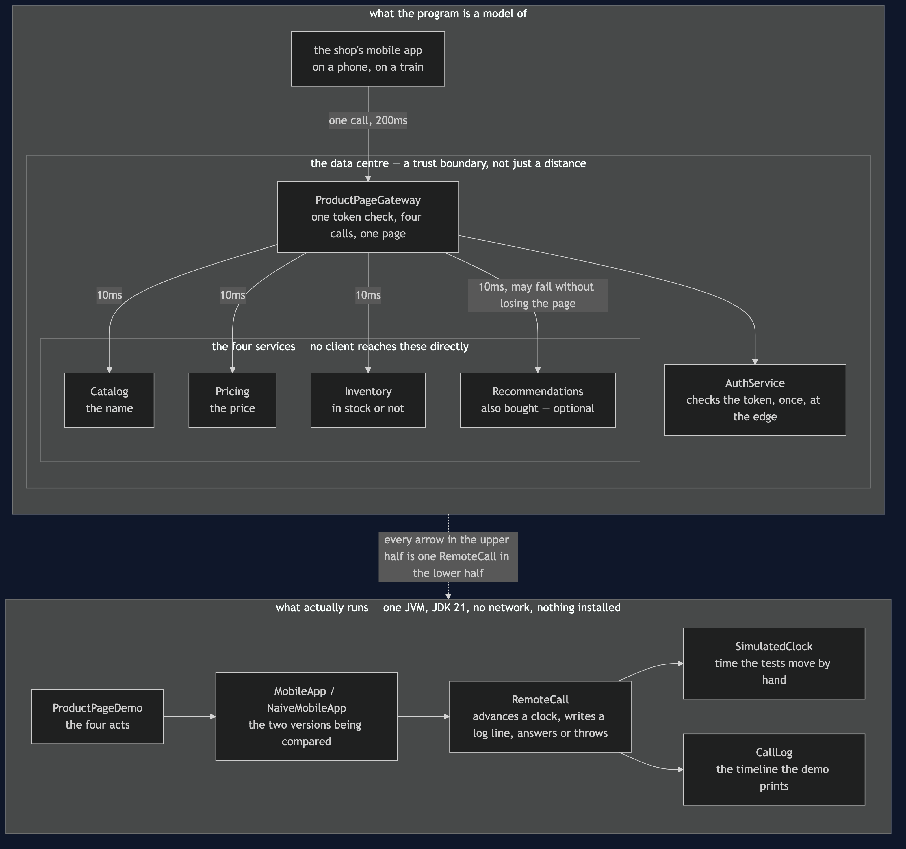
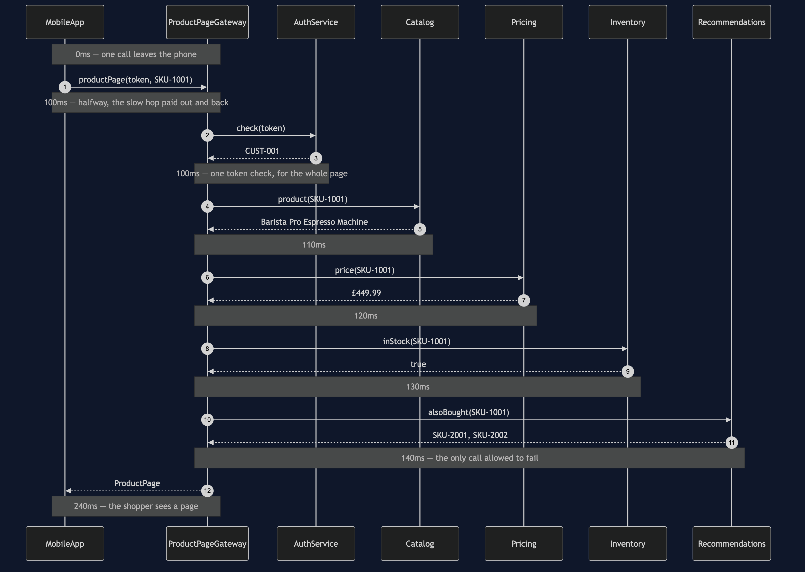

# API Gateway Pattern

**Put one service in front of all the others, so a client makes a single call
instead of five and only has to know one address.**

Think of a hotel reception desk. You do not keep separate phone numbers for
housekeeping, the restaurant and the concierge; you ring reception, and reception
deals with whoever needs dealing with. One number to remember, and it does not
change when the hotel reorganises its departments.

The shop's mobile app needs a product page, and that page is made of four
services' worth of information: the name from **Catalog**, the price from
**Pricing**, availability from **Inventory**, and "customers also bought" from
**Recommendations**. The obvious app calls all four itself. It works. It is also
four slow trips instead of one, four token checks instead of one, and — the
expensive part — it loses the whole product page on the day a feature nobody would
miss goes down.

## Run

```bash
./gradlew run
```

Four acts. The first two are the same page built two ways:

```
==================================================================
1. No gateway: the app calls all four services itself
==================================================================
      0ms ->   200ms  Catalog          OK        Barista Pro Espresso Machine
    200ms ->   400ms  Pricing          OK        £449.99
    400ms ->   600ms  Inventory        OK        true
    600ms ->   800ms  Recommendations  OK        [SKU-2001, SKU-2002]
  page: Barista Pro Espresso Machine  £449.99  in stock  2 suggestions
  four round trips over the mobile network, 4 token checks, shopper waited 800ms

==================================================================
2. With a gateway: the app makes one call
==================================================================
      0ms ->   240ms  Gateway          OK        Barista Pro Espresso Machine  £449.99  in...
    100ms ->   100ms  Gateway          AUTH      one token check for CUST-001
    100ms ->   110ms  Catalog          OK        Barista Pro Espresso Machine
    110ms ->   120ms  Pricing          OK        £449.99
    120ms ->   130ms  Inventory        OK        true
    130ms ->   140ms  Recommendations  OK        [SKU-2001, SKU-2002]
  page: Barista Pro Espresso Machine  £449.99  in stock  2 suggestions
  1 round trip over the mobile network, 1 token check, shopper waited 240ms
```

Identical page. 240 milliseconds against 800, and one token check against four. A
phone reaching the data centre takes about 200ms per trip; two services inside it
take about 10. The gateway's own call opens the timeline and closes it 240ms later,
and the four internal calls all happen *inside* that trip.

The other two acts are the same failure, twice:

```
==================================================================
3. Recommendations is down, and there is no gateway
==================================================================
      0ms ->   200ms  Catalog          OK        Barista Pro Espresso Machine
    200ms ->   400ms  Pricing          OK        £449.99
    400ms ->   600ms  Inventory        OK        true
    600ms ->   800ms  Recommendations  FAILED    no answer
  no page: Recommendations did not answer
  the name, the price and the stock all arrived, and were thrown away with the error.
  the shopper wanted to know what an espresso machine costs. They cannot find out,
  because a feature nobody would miss is unavailable.

==================================================================
4. Recommendations is down, and there is a gateway
==================================================================
      0ms ->   240ms  Gateway          OK        Barista Pro Espresso Machine  £449.99  in...
    100ms ->   100ms  Gateway          AUTH      one token check for CUST-001
    100ms ->   110ms  Catalog          OK        Barista Pro Espresso Machine
    110ms ->   120ms  Pricing          OK        £449.99
    120ms ->   130ms  Inventory        OK        true
    130ms ->   140ms  Recommendations  FAILED    no answer
    140ms ->   140ms  Gateway          DEGRADED  page served without suggestions
  page: Barista Pro Espresso Machine  £449.99  in stock  0 suggestions
  degraded: true. The shopper sees the price, the stock and no suggestions,
  which is a product page. Nobody is told anything is wrong, because for them
  nothing is.
```

The gateway knows Recommendations is optional and Pricing is not. That is a fact
about a shop rather than about software, and the reason the pattern is worth a whole
service is that the fact now lives in one place instead of in every client.

## Test

```bash
./gradlew test
```

25 tests, in about a second, with no `Thread.sleep` anywhere. Time is a
`SimulatedClock` the tests move by hand, and failures are scripted — `failNext(2)`
means "fail the next two calls, then behave" — so every assertion is about what the
pattern did rather than what chance did.

Both versions of the app return the same product page, so no test asserts that the
page is correct; that would pass on the naive version too. Every test asserts
something only the gateway gives you: one network crossing, one token check, 240ms
against 800ms, a degraded page when an optional service fails, an honest error when
an essential one does, and — the test whose job is to stop a future feature — that
the price on the page is Pricing's answer unmodified.

## One JVM, no infrastructure

This project starts nothing. No Docker, no Spring, no Kafka, no database, no HTTP
port. It runs offline with only a JDK installed. A service is a plain class, and a
remote call is `RemoteCall`: it advances a simulated clock by however long its link
takes, writes a line into the timeline, and either answers or throws.

That is a deliberate trade and it is worth being straight about. What you get is
the pattern's shape — what objects exist, what each decides, where the error
handling goes and why it goes there rather than somewhere else — and that shape is
the same whether the call underneath is a method call or an HTTP request. What you
do not get is a distributed system: no deployment, no service mesh, no partial
network partitions, no capacity planning. Finish this project and you will know
what an API gateway is and could write one. You will not have run one in
production.

## Technologies and versions

Nothing here is a range and nothing is `latest`: a course that worked last year and does
not work today is worse than one that never took the dependency.

| What | Version | Why it is here |
| --- | --- | --- |
| Java | 21 | The repository standard, requested through the Gradle toolchain block |
| Gradle | 9.2.1 | The wrapper in this directory; no separate install needed |
| JUnit 5 | 5.10.2 | The 25 tests, through `junit-bom` so the Jupiter artefacts cannot disagree |

That is the entire list, and the short version of it is the point. **This project has no
runtime dependency at all** — the `dependencies` block in `build.gradle` names nothing but
JUnit, and JUnit is `testImplementation`. There is no Spring, no HTTP client, no JSON
library and no container. Every one of the twelve projects in this category is built the
same way, so a reader who can run one can run all of them, offline, with a JDK and nothing
else.

## Learning Material

| Document | What it covers |
| --- | --- |
| [`docs/problem-statement.md`](docs/problem-statement.md) | Four calls from a train, with the numbers, and the product page that gets lost |
| [`docs/api-gateway-pattern-explained.md`](docs/api-gateway-pattern-explained.md) | The pattern from a hotel reception desk, the code, the costs, and gateway vs facade |
| [`docs/class-diagram.md`](docs/class-diagram.md) | The types, and why `MobileApp` depends on exactly one thing |
| [`docs/architecture-diagram.md`](docs/architecture-diagram.md) | What would be running, how far apart it would be, and the 200-against-10 that is the whole argument |
| [`docs/data-flow-diagram.md`](docs/data-flow-diagram.md) | One page, hop by hop: what each service adds, and the one fork that is the pattern's only decision |
| [`docs/sequence-diagram.md`](docs/sequence-diagram.md) | The healthy page in call order, with the clock running — and why four calls fit inside one |
| [`docs/uml-diagram.md`](docs/uml-diagram.md) | Four sequences: the happy path, both failure paths, and no gateway at all |
| [`docs/animation.html`](docs/animation.html) | The timeline, one call at a time, in a browser |
| [`docs/prerequisites.md`](docs/prerequisites.md) | What you need to know, what you explicitly do not, and how to get a JDK |
| [`docs/session.md`](docs/session.md) | A one-hour taught session with exercises |
| [`docs/spec.md`](docs/spec.md) | The generated specification, with measured test counts and timings |
| [`docs/youtube.md`](docs/youtube.md) | Title, description and chapters for the video |

### The pattern in one picture

The class diagram, and the thing to look for is the count of arrows leaving `MobileApp`.
There is one. Everything it used to know — four addresses, four response shapes, which of
the four it could afford to lose — now lives behind `ProductPageGateway`.


### What runs where

The lower half is the literal truth: one JVM, no network. The upper half is what it models
— a phone, a data centre, and a boundary that only the gateway crosses.



### How the data moves

One page, from the tap to the pixels. A token and a product code go out; four services'
answers come back combined into one object, and exactly one of those four is allowed to be
missing.


### Who calls whom, in order

The same page in call order, with the clock down the side. The app's single call opens at
0ms and closes at 240ms, and all four internal calls happen inside it.



### All four sequences

The full set from [`docs/uml-diagram.md`](docs/uml-diagram.md), in the order that document
argues them.

**One. The happy path, with a gateway.** One slow crossing, four fast ones inside it.


**Two. An optional service is down.** Recommendations refuses to answer, the gateway
substitutes an empty list, and the shopper gets a product page and is told nothing —
because for them nothing is wrong.


**Three. An essential service is down.** Pricing fails and the gateway deliberately does
not rescue it. Inventory is never called, because there is no point stocking a product
whose price is unknown.


**Four. No gateway at all.** Four slow crossings, four token checks, and the name, the
price and the stock all discarded when the last call fails.


### Video

The narrated walkthrough is built from [`video/scenes.py`](video/scenes.py) by
[`video/build_video.sh`](video/build_video.sh). The rendered file is not committed —
see the repository README for why — and takes about ten minutes to produce on macOS.

## Where this sits

First of twelve in
[`micro-services-design-patterns`](..), and the gentlest. It is placed first
because it invites the comparison with
[Facade](../../structural/facade-pattern) — the same shape one process boundary
apart — which makes it the easiest bridge from the Gang of Four patterns into
this category.

The distinguishing question, if you only remember one thing: **does the thing I am
hiding sit on the other side of a network and a trust boundary?** If not, you want
a facade, and you should not pay for a gateway.
