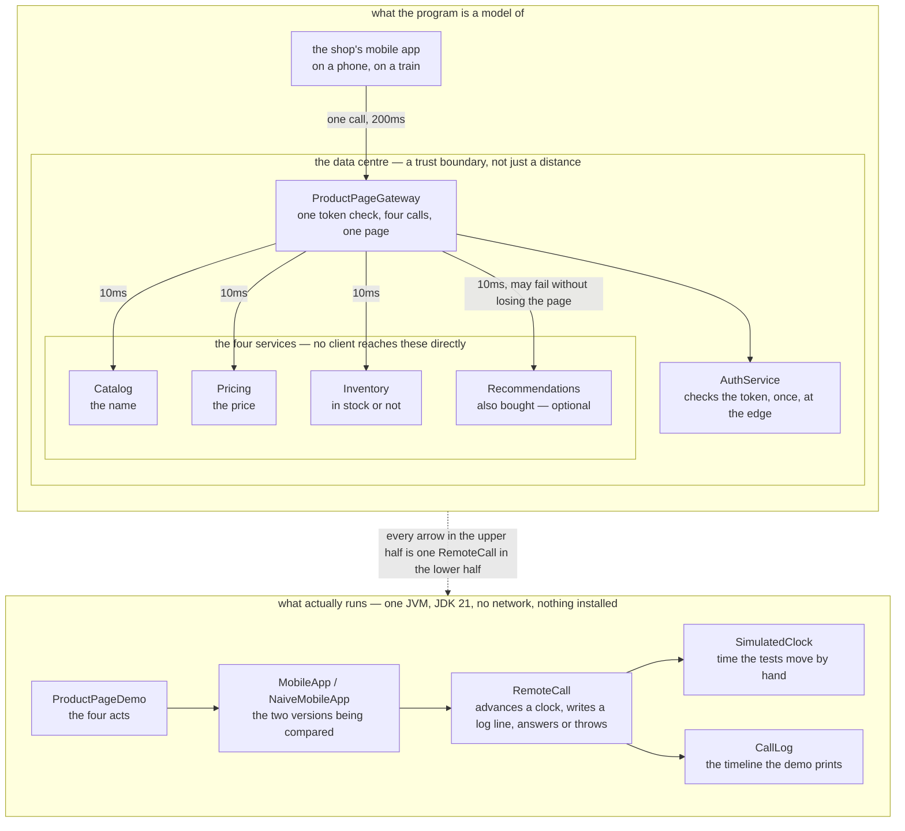

# API Gateway Pattern — Architecture Diagram

Where each piece of this project sits, and — because this project starts nothing — what
each piece *stands for*. The class diagram shows the types and the sequence diagrams show
the order of the calls; this one answers the question those two cannot, which is **what
would be running, and how far apart would it be**.

Read the picture as two halves stacked. The lower half is the literal truth: one Java
program, one process, no network, nothing installed. The upper half is what that program
is a model of: a phone on a train, a data centre some distance away, and five services
inside it.

The one number that carries the whole argument is on the arrows. A call from the phone to
the data centre is `MOBILE_LATENCY_MILLIS = 200`. A call between two services inside the
data centre is `INTERNAL_LATENCY_MILLIS = 10`. Twenty times, per call, and a product page
needs four calls. Those two constants are in `StoreServices`, so the ratio is a fact the
code enforces rather than a claim this document makes.

The second thing to look for is the dashed boundary around the four services. Nothing
outside that boundary has an arrow to anything inside it — every line that crosses it ends
at the gateway. That missing set of arrows is the pattern drawn as an absence: once the
gateway exists, the app does not know that Pricing has an address, and cannot acquire that
knowledge by accident.

Mermaid source

## What the diagram is telling you to count

**One line crosses the data centre boundary, not four.** That is the whole saving, and it
is a saving in *crossings* rather than in work. The gateway still makes four calls; they
are simply on the cheap side of the boundary. 240 milliseconds against 800, and one token
check against four.

**`AuthService` hangs off the gateway, not off each service.** Checking a token is work,
and doing it once at the edge instead of four times is most of the difference between the
two acts. It is also the first thing people put in a gateway in real systems, and the
reason the box is drawn there rather than beside the four services.

**Recommendations has a labelled arrow and the other three do not.** That label is the only
policy in the picture: this one service is optional and the others are not. It is a fact
about a shop rather than about software, and the point of the pattern is that it now lives
in one place instead of in every client.

## What it deliberately leaves out

There is no load balancer, no service registry, no circuit breaker and no cache, and the
gateway is drawn as one box rather than as the several replicas it would really be. Each
of those is a pattern of its own later in this category, and drawing them here would make
the picture describe a system rather than a pattern.

There is also no second gateway. One gateway serving a phone, a desktop browser and a
partner API eventually pulls in three directions at once, and the answer to that is
Backends for Frontends in the platform category — a different pattern with a different
bill, and out of scope for this picture.

Most importantly, **the lower half is not a small version of the upper half**. It is a
model. `RemoteCall` cannot be slow in a way nobody predicted, cannot half-answer, and
cannot be up for the app and down for the gateway. What the model does preserve exactly is
the shape: what objects exist, what each decides, and where the error handling goes.
