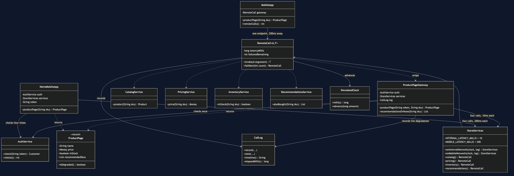
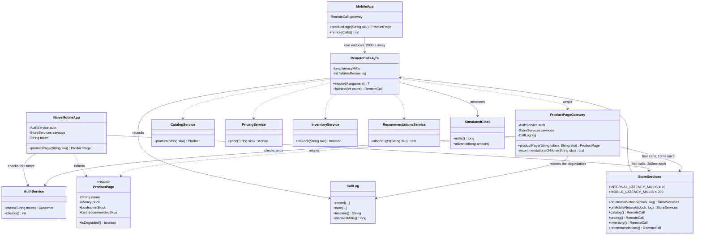

# API Gateway Pattern — Class Diagram

Shows the static structure: the client that makes one call, the gateway that
knows the page is made of four parts, the four services that know nothing about
the page, and — kept deliberately outside the pattern — the naive client that
calls all four itself.

Mermaid source

## Notes

**`MobileApp` depends on one thing.** It holds a single `RemoteCall` and has two
public methods. There is nowhere in it for a service address, a response format or
a judgement about which services are optional to live. That is not tidiness — it
is the property that means a change behind the gateway does not need an app
release, and there is a test that asserts the method count to keep it true.

**`NaiveMobileApp` depends on everything.** It holds `AuthService` and all four
services, and it reaches every one of them across the two-hundred-millisecond
link. Compare the two rows of arrows: the pattern moved the fan-out from the far
side of the slow link to the near side of the fast one.

**Both clients return the same `ProductPage`.** Deliberately. The diagram cannot
show you which is better, and neither can the return type. Only the timeline can,
which is why `CallLog` is a first-class participant here rather than a debugging
aid.

**`StoreServices` is the network, not a service.** Its two factory methods are the
same four services at two different distances. Making latency a property of the
link rather than of the service is what lets one demo run the same code from a
phone and from inside the data centre.

**The gateway depends on `CallLog` and the naive client does not.** That asymmetry
is meaningful. Serving a degraded page is a *decision*, and a decision nobody
records is a decision nobody can audit. The naive client never makes the decision,
so it never has anything to record.

**The harness is three classes.** `SimulatedClock`, `RemoteCall` and `CallLog`.
Every project in this category carries its own copy rather than sharing a module,
so that one directory can be read start to finish without a library in the way.
