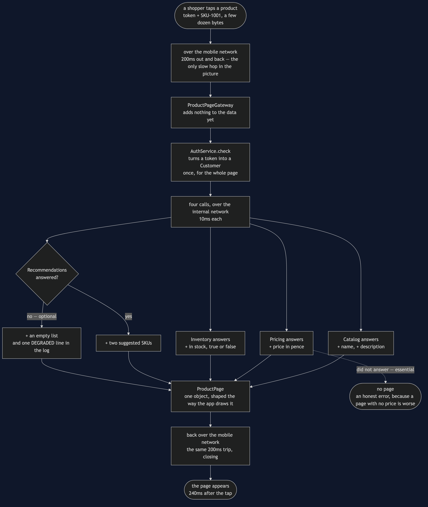
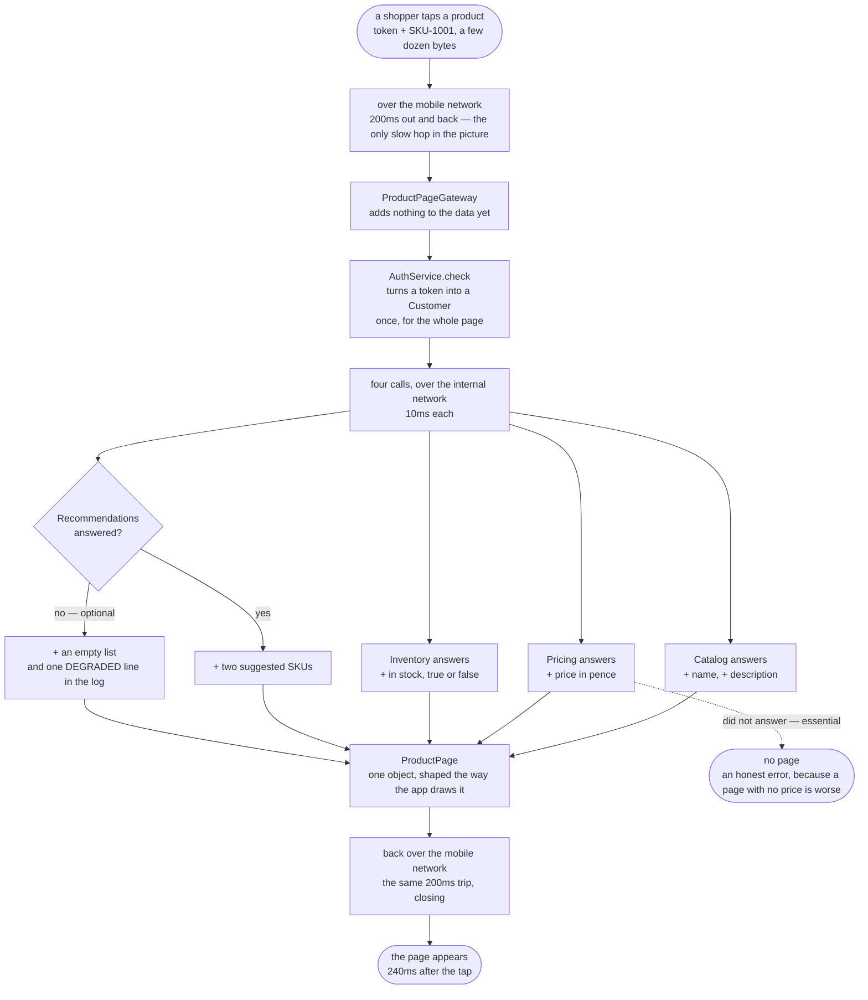

# API Gateway Pattern — Data Flow Diagram

One product page, followed from the tap on a phone to the page appearing, with a note at
every hop saying **what was added to the data and who added it**. The architecture diagram
says what would be running; this one says what moves between the boxes and how it changes
on the way.

What leaves the phone is very small: an access token and a product code — `SKU-1001` — and
that is the last the app contributes. Everything that arrives back has been assembled
somewhere else. Follow the middle column down and then back up, and notice that the four
pieces of the page enter from the side, one per service, and are combined exactly once, in
`ProductPageGateway.productPage`.

The single most important part of the picture is the fork near the bottom. Three of the
four answers are required and one is not. When Recommendations does not answer, its branch
merges back in as an empty list and the page continues; when Pricing does not answer, the
page stops. Both branches are drawn, because the difference between them is the pattern's
one real decision and everything else here is plumbing.

Mermaid source

## What the picture is telling you

**The app adds a token and a product code, and nothing else.** Everything on the page was
added on the far side of the slow hop. That is why the gateway can change what it calls,
in what order, and how many times, without an app-store release — the data leaving the
phone does not name a single service.

**The token becomes a `Customer` once.** In the version with no gateway that box appears
four times, once per service, and each of those four checks is work the shopper waits for.
One arrow instead of four is a real saving and not an accounting trick.

**Four answers go into one object.** `ProductPage` is the only place the four services'
answers exist together. Nothing downstream of it can tell which service supplied which
field, which is precisely what lets Catalog and Pricing be reorganised behind it.

**The fork is the only decision.** Look at how little logic is in the picture: one token
check, four calls, one `try`/`catch` around exactly one of them, one object built. A
gateway that grows a second decision — adjusting a price, hiding a product, applying a
discount — has started making judgements about data it does not own, and becomes the
hardest thing in the system to change. The absent boxes are the design.

## The same page without a gateway

Redraw it with the four service boxes moved to the far side of the mobile hop and the
`ProductPage` box moved onto the phone, and three things change at once. There are four
slow hops instead of one, so the shopper waits 800 milliseconds rather than 240. The token
check box appears four times. And the assembly happens on the phone, which means the
version of that assembly in the shopper's hand is whichever one they last updated.

The failure picture is worse than the timing picture. With the services called directly,
the name, the price and the stock have all arrived by the time Recommendations fails — and
they are thrown away with the error, because the app has no notion that one of the four
was optional. The shopper wanted to know what an espresso machine costs, and cannot find
out, because a feature nobody would miss is unavailable.
