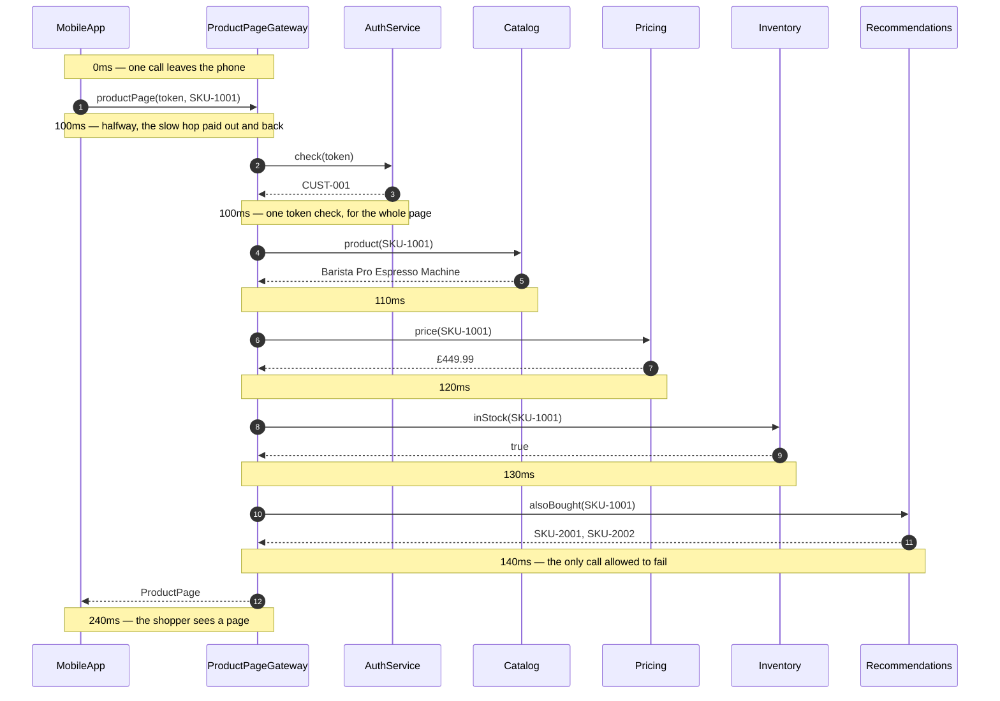

# API Gateway Pattern — Sequence Diagram

The same product page again, this time in the order the calls actually happen, with the
clock running down the left. The data flow diagram says what each hop adds; this one says
**when**, and the timings on it are the numbers the demo prints rather than round figures
chosen to look tidy.

[`uml-diagram.md`](uml-diagram.md) holds the full set of four sequences — both failure
paths and the comparison with no gateway at all. This document is the one sequence worth
having in your head before the others make sense: a healthy page, built once, with a
gateway in front.

The shape to notice is the nesting. The app's single call to the gateway opens at 0ms and
does not close until 240ms, and **every one of the gateway's four calls happens inside
it**. That is not a drawing convention, it is `RemoteCall` spending its latency in two
halves — one on the way out, one on the way back — so that inner calls land between them.
Charging the whole 200ms up front would put the internal calls after the outer call had
already returned, and the timeline would be a lie.

Mermaid source

## Reading the timings

**0ms to 240ms, and four calls inside.** The four internal calls occupy 100ms to 140ms —
forty milliseconds of the shopper's wait. The other two hundred are the phone reaching the
data centre and the answer coming back, and no pattern in this category can make that
cheaper. All a gateway can do is make you pay it once.

**One `AUTH` line, at 100ms.** It happens before any service is called and never happens
again. In the no-gateway version this is four separate checks, each on the far side of a
200ms hop.

**The calls are sequential, not parallel.** Catalog, then Pricing, then Inventory, then
Recommendations — 10ms each, one after another. Firing them together would take the
internal part from 40ms to 10ms, which is a 12% saving on a 240ms page and a permanent
increase in how hard the code is to read. This project leaves them sequential on purpose;
[API Composition](../api-composition-pattern) is where fanning out is the subject.

**Recommendations is last.** Nothing in the code requires that, and the page would be
identical if it were first. It is last because it is the one that is allowed to fail, and
putting the optional call at the end of the sequence is a small kindness to the next person
reading it.

## What changes when something breaks

Replace the Recommendations reply with a failure and the diagram grows exactly one extra
note — `DEGRADED, page served without suggestions` — and then continues to the same
`ProductPage` reply at 240ms. The shopper sees the price, the stock, and no suggestions,
which is a product page. Nobody is told anything is wrong, because for them nothing is.

Replace the **Pricing** reply with a failure and the diagram stops there. No page is
returned, the error travels all the way out, and the shopper is told plainly. That is the
right outcome: a product page with no price on it is worse than an error, and the gateway
is the one place in the system that knows the difference.

Both of those are drawn in full in [`uml-diagram.md`](uml-diagram.md), together with the
fourth sequence — the same page with no gateway at all, four slow hops, and everything
thrown away when the last one fails.
