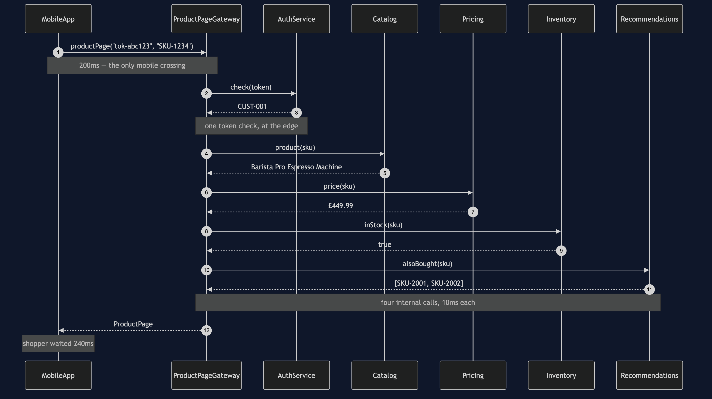
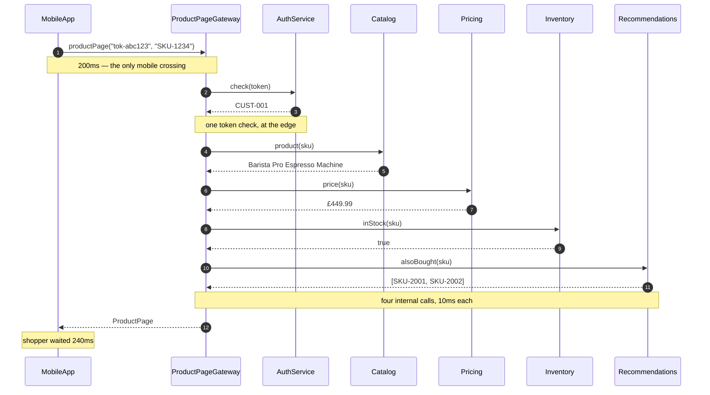
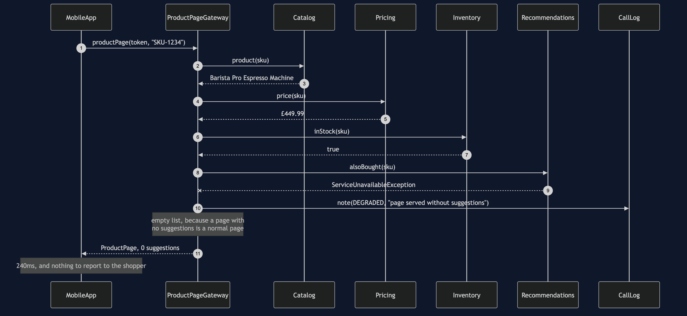
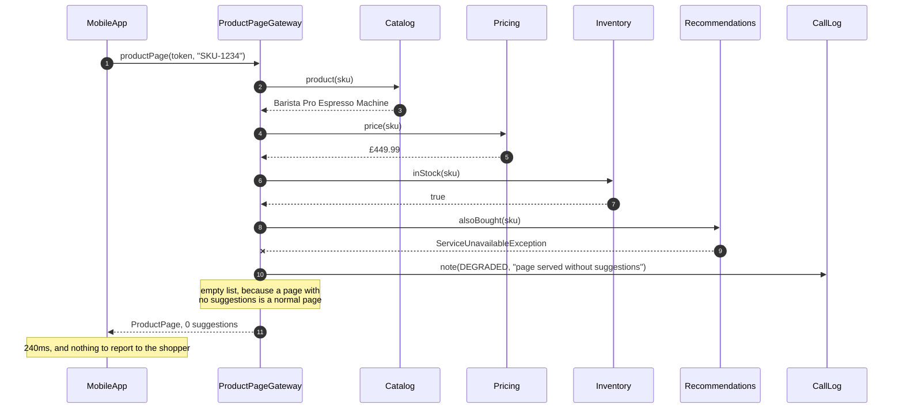
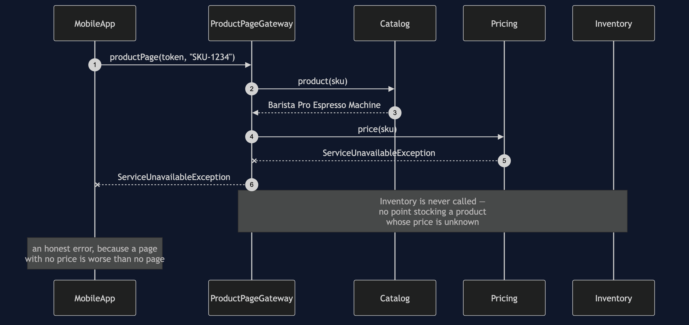
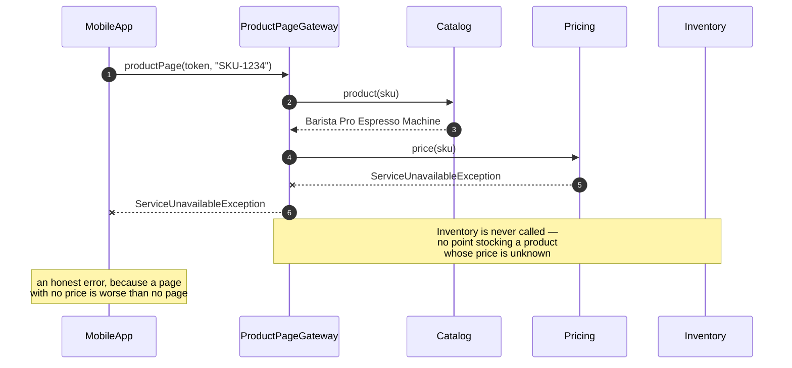
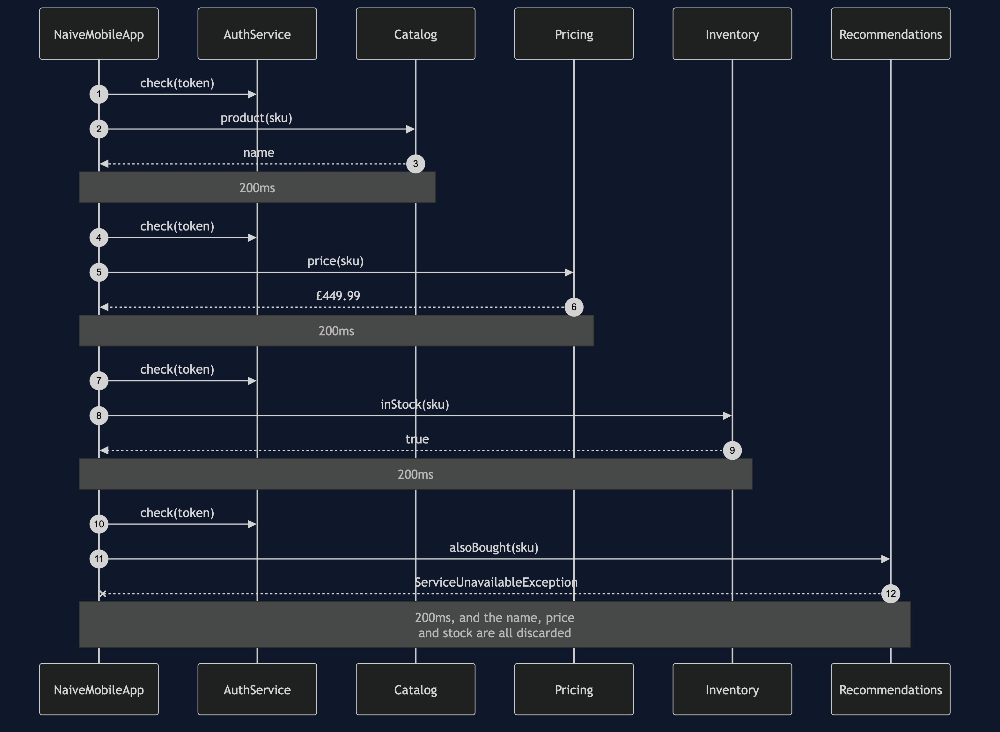
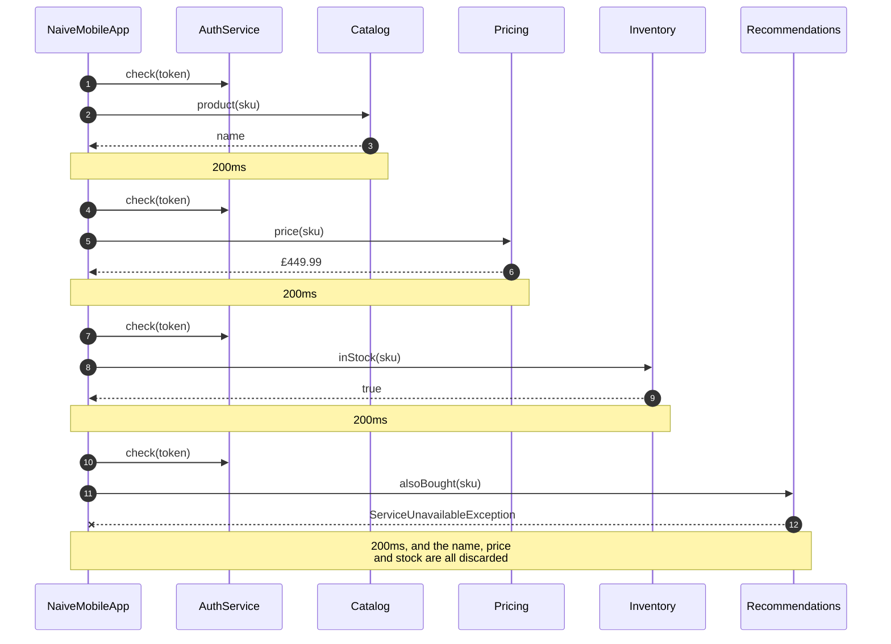

# API Gateway Pattern — UML Sequence Diagram

## The Happy Path, With A Gateway

One slow crossing, four fast ones inside it.

Mermaid source

## The Failure Path: An Optional Service Is Down

The same sequence, with Recommendations refusing to answer. The gateway makes a
decision and the shopper never finds out.

Mermaid source

## The Failure Path: An Essential Service Is Down

Pricing fails, and the gateway deliberately does *not* rescue it.

Mermaid source

## The Comparison: No Gateway At All

Mermaid source

## Notes

**Compare the first diagram with the last.** Same services, same answers, same
number of service calls. The difference is entirely where the slow link sits: once
at the front, or four times through the middle.

**The failure diagrams are the point of this pattern, not a footnote.** Two
failures, two different correct responses, and the reason they differ is a
business fact rather than a technical one: nobody misses suggestions, and everybody
needs the price. That judgement has to be written down *somewhere*, and the whole
argument for a gateway is that the somewhere should be one place.

**Notice what is missing from the third diagram.** Inventory is never called. The
gateway does not soldier on gathering the rest of a page it already knows it cannot
produce. There is a test for that, because the alternative — collecting three more
answers and then throwing them away — is a genuinely easy mistake to make.

**Nothing in the second diagram reaches the shopper.** The `DEGRADED` note goes to
the shop's own log. The shopper gets a product page. Telling them "recommendations
are currently unavailable" would be worse than silence, because for them nothing is
wrong.
