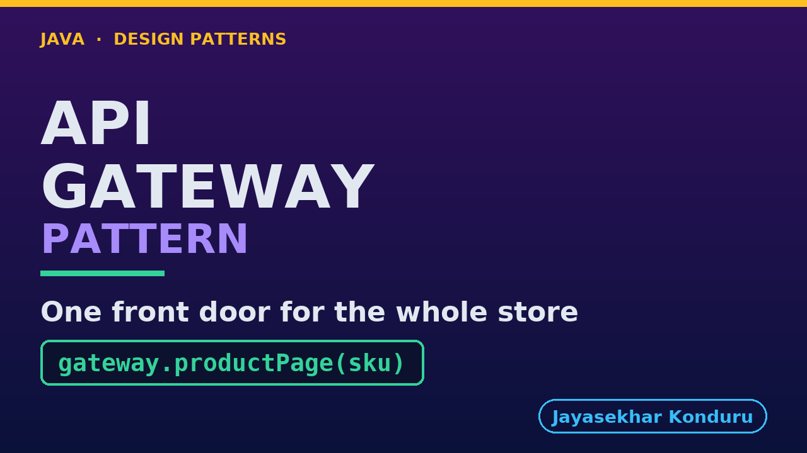

# YouTube — API Gateway Pattern

Everything needed to publish `video/api-gateway-pattern-explained.mp4`. Copy the fields straight out of this file.

Chapter timings are generated from the video's `.srt`. Re-run `python3 docs/make_youtube_docs.py api-gateway` after any change to the narration, or they will be wrong.

## Title

```
API Gateway in Java - One Front Door for the Store
```

50 characters — under the 60 YouTube shows before truncating in search results.

## Description

The first two lines are what a viewer sees above the fold, so they carry the hook rather than the boilerplate.

```
Learn the API Gateway pattern in Java 21, starting from a mobile app that makes four calls to build one product page and checks the same token four times. We price what that costs on a phone on a train rather than in a data centre, watch one optional service go down and take the whole page with it, then put a single address in front of the four and move the joining behind it. The gateway is one method with one catch block, and that catch block is the pattern: it decides that recommendations may be missing and that the catalog may not. Because both versions render the same page, the tests assert round trips, token checks and elapsed time instead of the output. We finish with the honest costs — one more hop, one more thing to deploy, and a new single point of failure — and with the line between a gateway and a facade.

CHAPTERS
00:00 Introduction
01:00 The Scenario
02:02 Four Calls From a Phone on a Train
03:07 The Naive Approach — The App Does the Joining
04:01 Why That Hurts
05:19 The API Gateway Pattern
06:12 An Analogy
07:25 The Roles
08:45 The Gateway — and the One Catch Block
10:23 The Same Outage, Both Ways
11:44 The Tests — Asserting the Cost, Not the Page
13:00 Running It — Five Acts
14:26 What to Remember
15:32 The Costs, Honestly
16:41 Thanks for Watching

SOURCE CODE, WRITTEN NOTES AND AN INTERACTIVE ANIMATION
https://github.com/jk-boot-up/java-design-patterns/tree/main/gradle-java/micro-services-design-patterns/api-gateway-pattern

WHAT YOU NEED FIRST
Java 21 and a working knowledge of classes and interfaces. No prior design-pattern knowledge is assumed. The full prerequisites are in docs/prerequisites.md in the repository.
```

## Chapters

YouTube renders these as chapters only if there are at least three and the first is at `00:00`.

```
00:00 Introduction
01:00 The Scenario
02:02 Four Calls From a Phone on a Train
03:07 The Naive Approach — The App Does the Joining
04:01 Why That Hurts
05:19 The API Gateway Pattern
06:12 An Analogy
07:25 The Roles
08:45 The Gateway — and the One Catch Block
10:23 The Same Outage, Both Ways
11:44 The Tests — Asserting the Cost, Not the Page
13:00 Running It — Five Acts
14:26 What to Remember
15:32 The Costs, Honestly
16:41 Thanks for Watching
```

## Tags

```
api gateway pattern, microservices java, backend for frontend, design patterns, java design patterns, gang of four, java 21, software design, clean code, object oriented design, java tutorial, ecommerce, programming tutorial
```

224 characters, under YouTube's 500 limit.

## Thumbnail



**Upload `docs/thumbnail.png`** — 1280×720, the size YouTube recommends, generated by `docs/make_thumbnails.py`. It is deliberately not the same image as the video's opening frame: a thumbnail is judged at about 360 pixels wide in a search result, so this one carries only the pattern name, one line of promise and one short piece of code, each set large enough to survive the shrink.

`video/poster.png` is the 1920×1080 opening frame, produced by the video build. It stays in the repository as the title card; it is not what gets uploaded.

YouTube will not pick the thumbnail up on its own — upload it under **Details → Thumbnail → Upload file**. A custom thumbnail requires a verified channel.

## Upload checklist

- [ ] Upload `video/api-gateway-pattern-explained.mp4` (1080p, H.264, 30 fps, AAC 48 kHz — already YouTube's recommended settings, no re-encode needed)
- [ ] Set the video language to **English** first, or the subtitle option may not appear
- [ ] Add subtitles: *Video elements → Add subtitles → Upload file → With timing* → `video/api-gateway-pattern-explained.srt`
- [ ] Upload `docs/thumbnail.png` as the thumbnail — do not let YouTube auto-pick a frame
- [ ] Paste the title, description and tags from above
- [ ] Add to the **Java Design Patterns** playlist, in learning order
- [ ] Wait for 1080p processing before sharing the link — code slides are unreadable at 360p

## Cards and end screen

End screen links to whichever pattern video goes up next — set it at upload time rather than assuming an order.

Add a card partway through pointing at the playlist, so a viewer who arrives at this pattern from search can find the rest of the series.

## Runtime

Approximately 17:37, narrated at 145 words per minute.
