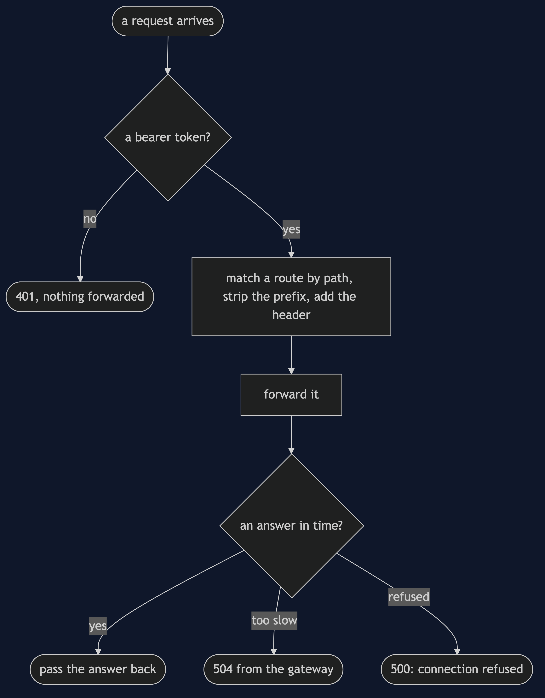
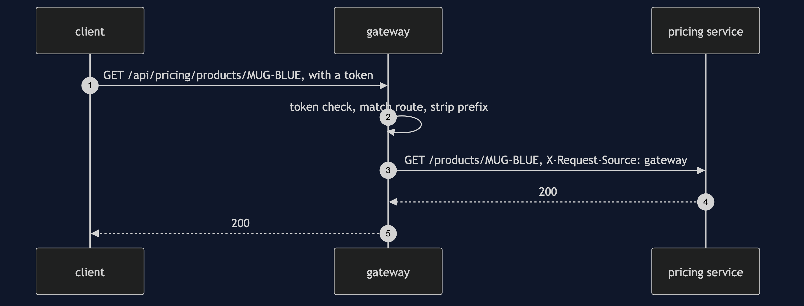

# API Gateway with Spring Cloud Gateway Pattern

```
src/main/java/com/jk/explore/apigatewaysc/
├── GatewayApplication.java   the entry point, the six acts, and the shop
├── GatewayRoutes.java        the routing table
├── TokenCheck.java           a filter for every route
├── Backend.java              one internal service, a real HTTP server
└── Gate.java                 holds a slow service
src/main/resources/application.properties   the timeout, and quiet logging
```

**Spring Cloud Gateway is a gateway you configure. It routes and filters real HTTP. Merging responses is still code you write.**

This project is the framework version of [API Gateway](../api-gateway-pattern). That project built the mechanism by hand. This one shows the same idea inside Spring Cloud Gateway. It does not re-teach the pattern. It shows what Spring Cloud Gateway adds, the failures that are its own, and what it costs.

## Run

```bash
./gradlew run
```

Six acts. The partner project, API Gateway, built the mechanism by hand. Here the same idea runs through Spring Cloud Gateway, and every count comes from real output.

```
ONE. One address, four services.
  GET /api/catalogue/products/MUG-BLUE -> 200 catalogue answers for /products/MUG-BLUE
  GET /api/pricing/products/MUG-BLUE -> 200 pricing answers for /products/MUG-BLUE
  GET /api/inventory/products/MUG-BLUE -> 200 inventory answers for /products/MUG-BLUE
  GET /api/recommendations/products/MUG-BLUE -> 200 recommendations answers for /products/MUG-BLUE
  the client knows one address, and the gateway's routing table knows the rest.
TWO. The prefix is stripped.
  the client asked for /api/pricing/products/MUG-BLUE. the pricing service was asked for: /products/MUG-BLUE.
  the pricing service saw the source header: gateway.
THREE. One token check, for every route.
  no token: 401
  no token, other route: 401
  requests that reached a service: 0.
  with a token: 200 catalogue answers for /products/MUG-BLUE
FOUR. One service down.
  recommendations: 500
  catalogue, still: 200
  the failure stayed on its own route. but a refused connection is reported as 500, not 503:
  to the client it looks like a bug in the shop. map it in the gateway if the difference matters.
FIVE. A gateway forwards. It does not compose.
  a product page needs three services here, so the client made 3 calls, and 3 reached services.
  merging them into one response is a job for composition code, in or behind the gateway.
SIX. A slow service.
  pricing never answers. the gateway answers for it: 504.
  the wait is a setting, spring.cloud.gateway.server.webflux.httpclient.response-timeout.
```

## Test

```bash
./gradlew test
```

2 test classes, 6 test methods, offline, with each Spring context started inside the test, and no server.

## Technologies and versions

| What | Version | Why it is here |
| --- | --- | --- |
| Java | 21 | The repository standard, via the Gradle toolchain block |
| Gradle | 9.2.1 | The wrapper in this directory; no separate install needed |
| Spring Boot | 4.1.1 | The container and the reactive web server |
| Spring Cloud | 2025.1.3 | The BOM that manages the gateway's version |
| spring-cloud-starter-gateway-server-webflux | 5.0.3 | The gateway |
| JUnit 5 | 5.10.2 | Test runner |

See [`docs/dependencies.md`](docs/dependencies.md).

## Learning Material

| Document | What it covers |
| --- | --- |
| [`docs/problem-statement.md`](docs/problem-statement.md) | The partner's gateway, and what is new |
| [`docs/api-gateway-with-spring-cloud-gateway-pattern-explained.md`](docs/api-gateway-with-spring-cloud-gateway-pattern-explained.md) | A real gateway, and what it leaves to you |
| [`docs/class-diagram.md`](docs/class-diagram.md) | The types |
| [`docs/architecture-diagram.md`](docs/architecture-diagram.md) | Client, gateway and four services |
| [`docs/data-flow-diagram.md`](docs/data-flow-diagram.md) | What the gateway does with a request |
| [`docs/sequence-diagram.md`](docs/sequence-diagram.md) | Written for a listener with the screen off |
| [`docs/uml-diagram.md`](docs/uml-diagram.md) | Four sequences |
| [`docs/animation.html`](docs/animation.html) | The six acts in a browser |
| [`docs/prerequisites.md`](docs/prerequisites.md) | What you need to know |
| [`docs/session.md`](docs/session.md) | A one-hour taught session |
| [`docs/spec.md`](docs/spec.md) | The generated specification |
| [`docs/youtube.md`](docs/youtube.md) | Title, description and chapters |
| [`docs/dependencies.md`](docs/dependencies.md) | What Spring Cloud Gateway is, what it costs, and that skipping this project loses none of the pattern |

### The pattern in one picture


### Where each piece sits


### How one request moves



### Who calls whom, in order



### All four sequences


### Video

Built from [`video/scenes.py`](video/scenes.py) by
[`video/build_video.sh`](video/build_video.sh). The rendered file is not
committed; see the repository README for why.

## Where you have already met this

The public edge of most Spring-based platforms.

## When this is too much

For one service, a gateway is a hop that adds nothing.

## Where this sits

This project pairs with [API Gateway](../api-gateway-pattern), and is a framework version in [`micro-services-design-patterns`](..).
