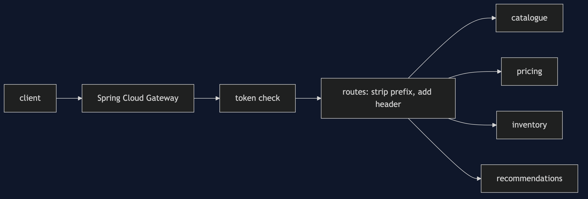
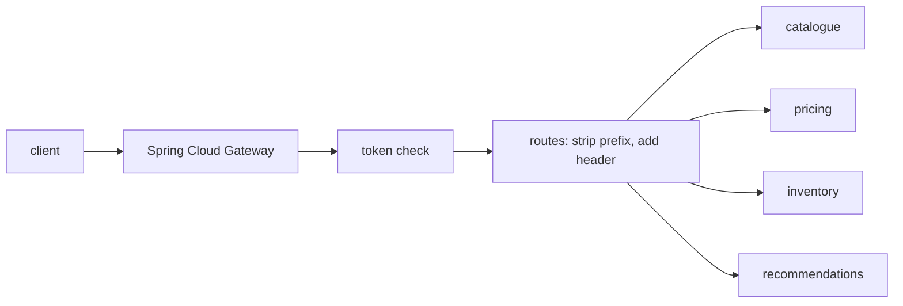

# API Gateway with Spring Cloud Gateway Pattern — Architecture Diagram

One address in front, four services behind.

Mermaid source

```mermaid
flowchart LR
    A["client"] --> G["Spring Cloud Gateway"]
    G --> T["token check"]
    T --> R["routes: strip prefix, add header"]
    R --> C["catalogue"]
    R --> P["pricing"]
    R --> I["inventory"]
    R --> M["recommendations"]
```

