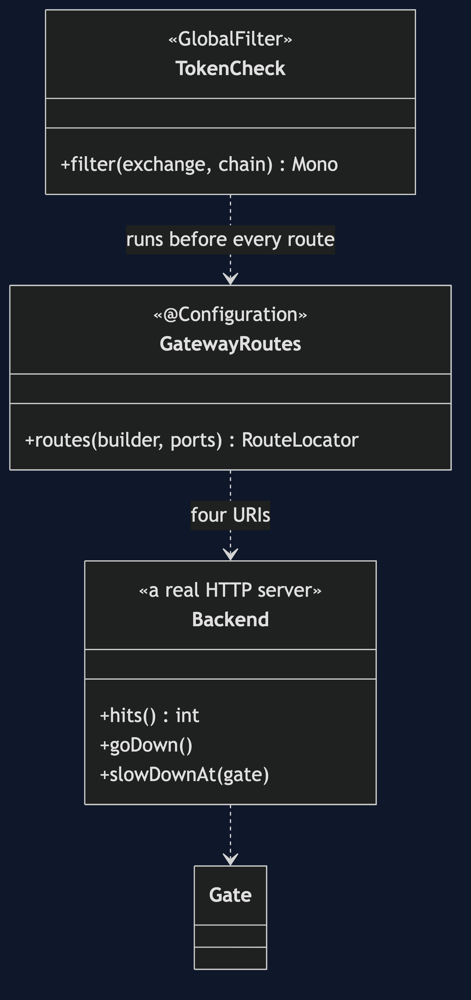
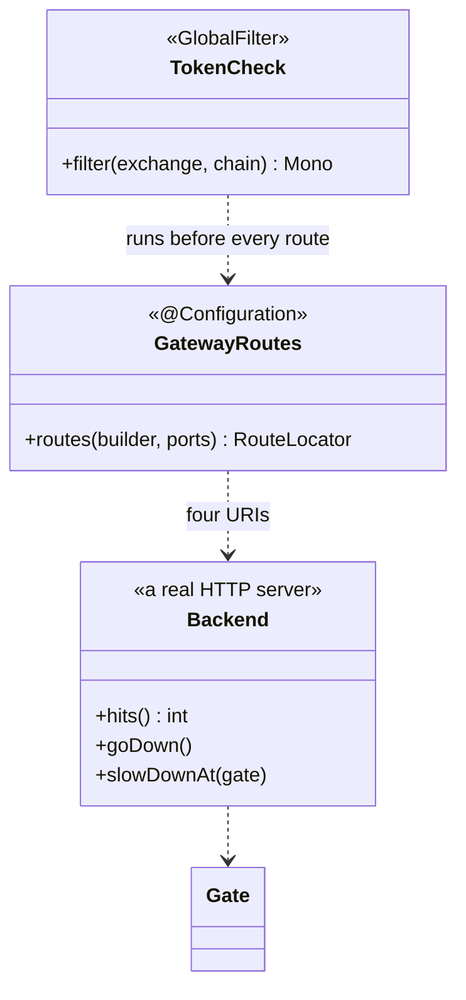

# API Gateway with Spring Cloud Gateway Pattern — Class Diagram

The routing table, one filter, and the stand-in services.

Mermaid source

```mermaid
classDiagram
    class GatewayRoutes {
        <<@Configuration>>
        +routes(builder, ports) RouteLocator
    }
    class TokenCheck {
        <<GlobalFilter>>
        +filter(exchange, chain) Mono
    }
    class Backend {
        <<a real HTTP server>>
        +hits() int
        +goDown()
        +slowDownAt(gate)
    }
    class Gate
    GatewayRoutes ..> Backend : four URIs
    TokenCheck ..> GatewayRoutes : runs before every route
    Backend ..> Gate
```

