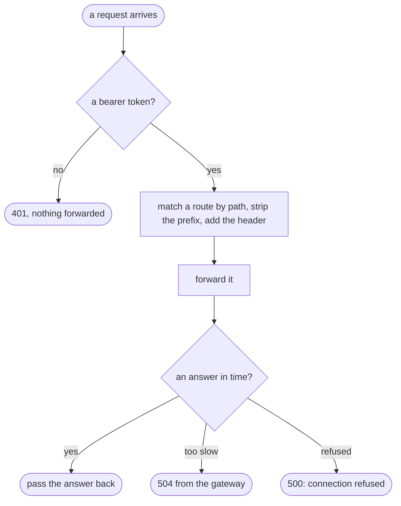

# API Gateway with Spring Cloud Gateway Pattern — Data Flow Diagram

What the gateway does with a request.

Mermaid source

```mermaid
flowchart TD
    Req(["a request arrives"])
    Tok{"a bearer token?"}
    No(["401, nothing forwarded"])
    Route["match a route by path, strip the prefix, add the header"]
    Fwd["forward it"]
    Ans{"an answer in time?"}
    Ok(["pass the answer back"])
    Slow(["504 from the gateway"])
    Dead(["500: connection refused"])
    Req --> Tok
    Tok -- no --> No
    Tok -- yes --> Route --> Fwd --> Ans
    Ans -- yes --> Ok
    Ans -- too slow --> Slow
    Ans -- refused --> Dead
```

