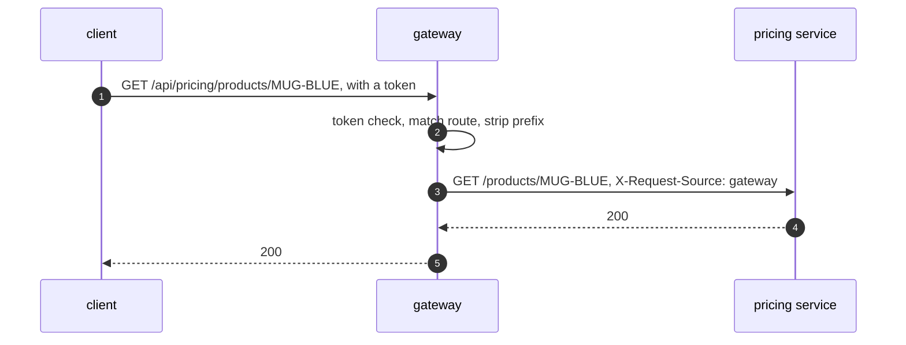

# API Gateway with Spring Cloud Gateway Pattern — Sequence Diagram

Written for a listener with the screen off.

Say it in words. The client sends a request to the gateway with a token. The token filter checks it and lets it through. The gateway matches the path to the pricing route, strips the prefix, adds the source header, and forwards it to the pricing service. The pricing service answers. The gateway passes the answer straight back to the client.

Mermaid source

The load-bearing sentence: **the gateway forwards one request for each client request.**
