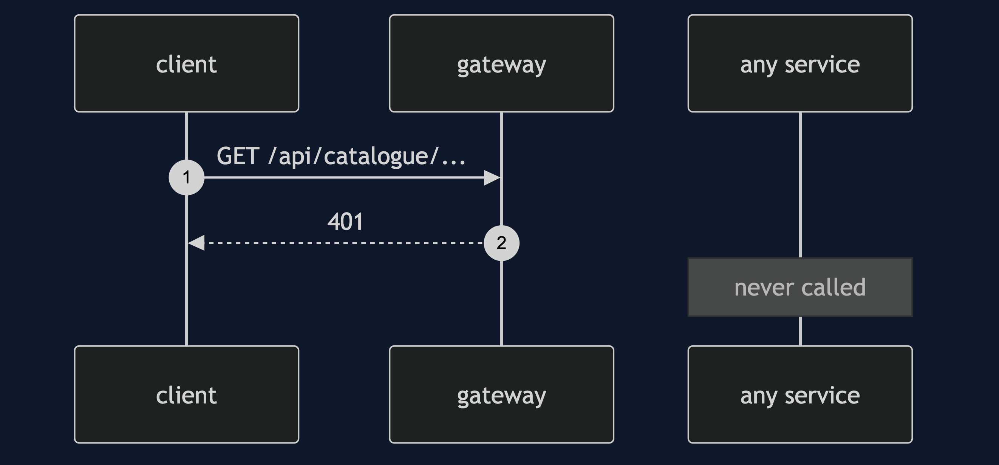
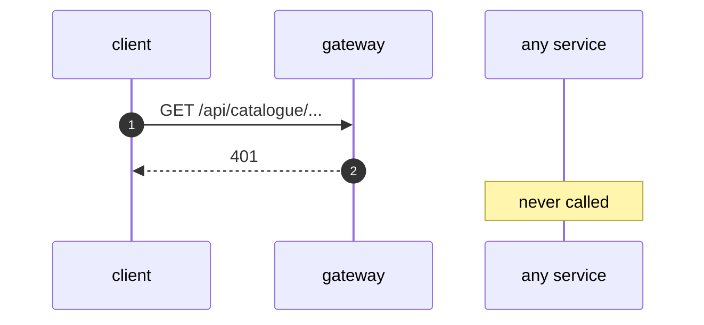
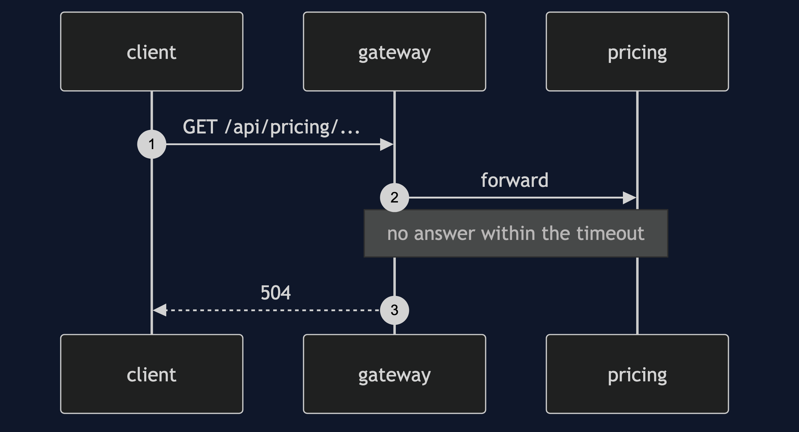
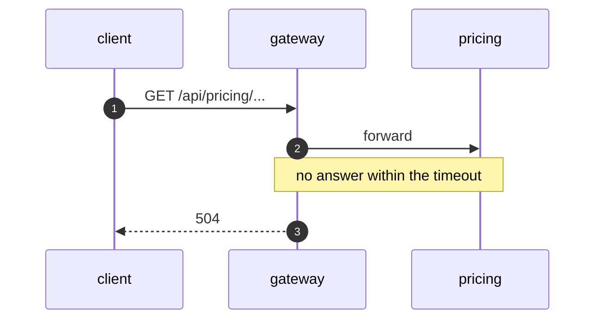

# API Gateway with Spring Cloud Gateway Pattern — UML Sequence Diagrams

Four sequences.

## 1. A Request Without A Token

Mermaid source

```mermaid
sequenceDiagram
    autonumber
    participant C as client
    participant G as gateway
    participant S as any service
    C->>G: GET /api/catalogue/...
    G-->>C: 401
    Note over S: never called
```

## 2. A Slow Service

Mermaid source

```mermaid
sequenceDiagram
    autonumber
    participant C as client
    participant G as gateway
    participant P as pricing
    C->>G: GET /api/pricing/...
    G->>P: forward
    Note over G,P: no answer within the timeout
    G-->>C: 504
```

