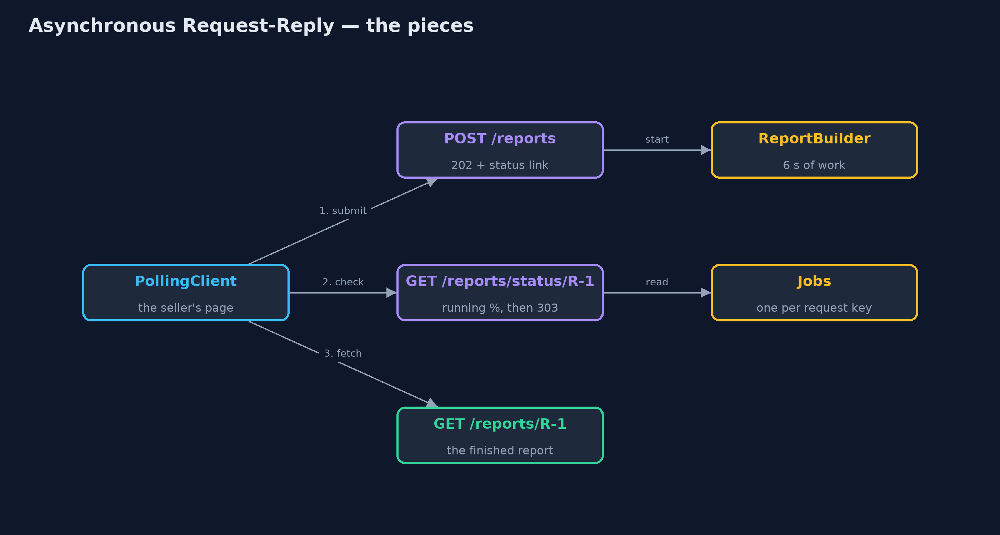
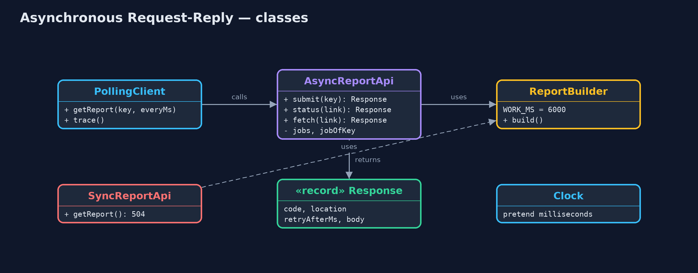
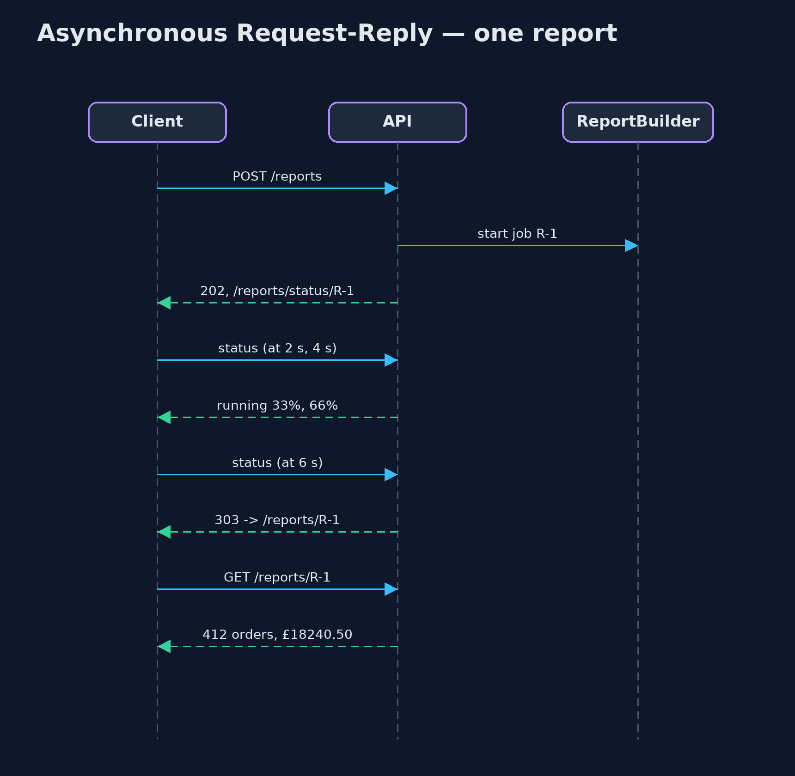

# Asynchronous Request-Reply Pattern

```
src/main/java/com/jk/explore/asyncreply/
├── AsyncReportApi.java         The pattern: accept the request at once, hand back a status link, and let the caller come back
├── AsyncRequestReplyDemo.java  The five acts: waiting and timing out, accepted at once, checking back, asking twice, and the bill
├── Clock.java                  A pretend clock in milliseconds, so the demo can show seconds of waiting without really waiting
├── PollingClient.java          The caller's side: submit, then check the status link, waiting between checks, until it is sent to the result
├── ReportBuilder.java          The slow work: adding up every order into a sales report, which takes 6 seconds
├── Response.java               What the server answers: an HTTP status code, an optional link, a retry hint in milliseconds, and a body
└── SyncReportApi.java          Without the pattern: the request waits while the report is built, and the gateway gives up after 3 seconds
```

**When work takes longer than a caller can wait, accept the request at once, hand back a link to check, and let the caller come back for the result.**

Asynchronous Request-Reply is a pattern for slow work behind an HTTP API. A
normal request waits for its answer, and everything in between (the browser,
the load balancer, the gateway) gives up after a few seconds. For work that
takes longer, the server answers straight away with `202 Accepted` and a
status link. The caller checks that link from time to time, and when the work
is done, it is sent on to the result.

Nobody waits on an open connection, nothing times out, and the work is done
once, even if the caller asks twice.

## The idea in everyday terms

Think of a dry cleaner. You do not stand at the counter while your coat is
cleaned. You hand it over, you get a ticket with a number, and you are told to
come back on Thursday. On Thursday you show the ticket and collect the coat.

If you come back on Tuesday, they just tell you "not yet, try Thursday". And if
you hand in the same coat twice by mistake, a good cleaner notices it is the
same order.

## The scenario

Sellers in the online store can ask for a sales report for the month. Building
it adds up every order and takes about six seconds. The gateway in front of the
store gives up on any request after three seconds, so the seller always saw
"504 Gateway Timeout", clicked again, and the store built the same report again,
for nobody.

## Run

```bash
./gradlew run
```

The demo tells the story in 5 acts, each printing exact numbers that the tests check:

| Act | What it shows |
| --- | --- |
| 1. Waiting for a slow report | The report takes 6 s, the gateway gives up at 3 s: 504 twice, built 2 times, received 0 times. |
| 2. Accepted at once | POST /reports answers 202 Accepted at once, with a status link and a hint to retry after 2 s. |
| 3. Check back, then fetch | At 2 s and 4 s the status says running, 33% then 66%; at 6 s it answers 303 See Other; the fetch returns 412 orders, £18240.50. |
| 4. Asking twice | A second POST with the same request key returns the same job, R-1; the report is built once. |
| 5. The bill | One report takes 5 requests instead of 1; an impatient client checking every 0.1 s sends 62; the server stores every job. |

## Test

```bash
./gradlew test
```

12 tests in `AsyncReportApiTest`, `DemoRunsTest`. Every number the demo prints is asserted, and nothing depends on the clock, so every run gives the same result.

## Technologies and versions

| Technology | Version | Used for |
| --- | --- | --- |
| Java | 21 | the code (toolchain set in `build.gradle`) |
| Gradle | 9.2.1 (wrapper) | build and run, nothing to install |
| JUnit | 5.10.2 | the tests |
| videokit | repository tool | the narrated video and animation: Piper `en_US-amy-medium`, speed 0.8, longer pauses (the approved `amy-slow` voice) |

## Learning Material

| Document | What it is for |
| --- | --- |
| [Problem statement](docs/problem-statement.md) | the situation and what the project must show |
| [Prerequisites](docs/prerequisites.md) | what you need to know first |
| [Asynchronous Request-Reply, explained](docs/async-request-reply-pattern-explained.md) | the acts in prose |
| [Session guide](docs/session.md) | a one-hour lesson with exercises |
| [Animated walkthrough](docs/animation.html) | the acts step by step, narrated |
| [Spec](docs/spec.md) | what this project must be true of |

### The pattern in one picture

Three addresses on the server: one to submit, one to check, one to collect.



### Where each piece sits

The API has three methods; the client loops over the middle one.



### How the data moves

Each answer tells the caller what to do next.


### Who calls whom, in order

The connection is never held open while the work runs.



### Video

`video/async-request-reply-pattern-explained.mp4` (with `.m4a` audio and `.srt` subtitles) is built by `video/build_video.sh`. Rendered media is not committed.

## What it costs

- **More requests.** One report now takes a submit, a few status checks and a fetch: five requests instead of one.
- **A smarter client.** The caller must remember the link, wait between checks, and follow the redirect.
- **State on the server.** Every job's progress and result must be stored until it is collected, and cleaned up after.
- **Impatient clients.** A client that ignores the retry hint and checks every tenth of a second sends sixty requests for one report.

## When this is too much

When the work reliably finishes in well under a second, a normal request is
simpler and better. And when the client can receive a message back, such as a
webhook or a web socket, the server can tell it when the work is done instead
of being asked again and again.

## Where you have already met this

- HTTP `202 Accepted` with a `Location` header, and `Retry-After`.
- Cloud APIs for long jobs: starting a virtual machine, transcoding a video, or an Azure long-running operation.
- "Your export is being prepared; we will show it here when it is ready" in many web apps.
- Payment providers that return `pending` and let you check the payment's status later.

## Where this sits

This project is in [micro-services-design-patterns](..). It pairs well with
[Idempotent Consumer](../idempotent-consumer-pattern), which uses the same idea
as the request key: asking twice must not do the work twice.
