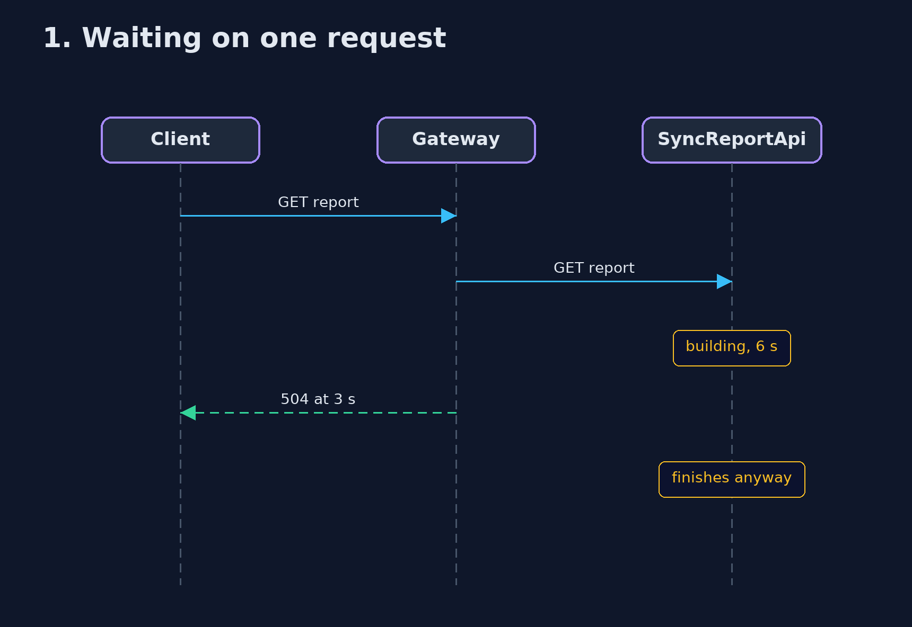
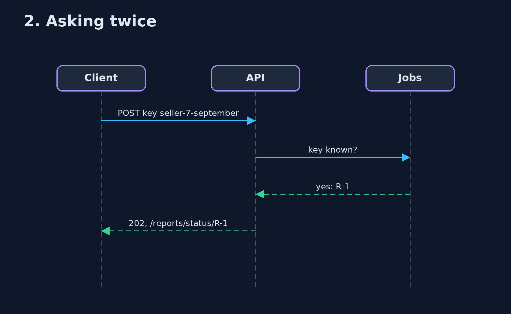

# Asynchronous Request-Reply Pattern — UML Sequence Diagrams

## 1. 1. Waiting on one request

The gateway gives up; the server carries on for nobody.

## 2. 2. Asking twice

The request key finds the existing job.

