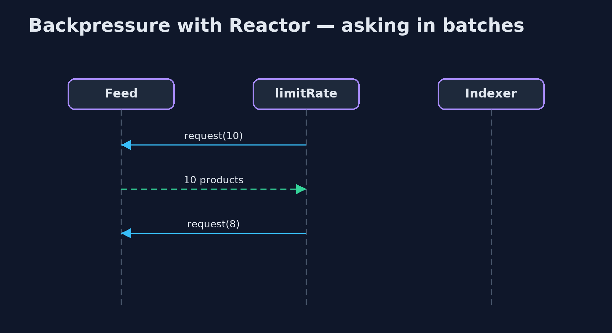

# Backpressure with Project Reactor Pattern

```
src/main/java/com/jk/explore/backpressurereactor/
└── ReactorBackpressureDemo.java  The five acts, with Project Reactor: a supplier's product feed into a slow search indexer
```

**Handle a fast supplier feed and a slow search indexer with Project Reactor, where every subscriber states its demand: Reactor refuses a source that ignores it, limitRate() asks in batches, and onBackpressureLatest() keeps only the newest stock level.**

This is the framework version of the Backpressure pattern. The plain Java
version, a separate project in this category, writes a bounded buffer and a
`Flow` publisher by hand. Here Project Reactor, the reactive library behind
Spring WebFlux, does the work. In Reactor, every stream, a `Flux`, carries
demand: a subscriber says how many items it wants, and the source may send
no more.

The demo shows what Reactor does with a source that ignores demand, how a
subscriber asks for items in batches, how `limitRate` does the asking for you,
and how `onBackpressureLatest` handles updates where only the newest one
matters.

## The idea in everyday terms

Think of a kitchen and its waiters. In a well-run kitchen, the chef calls out
"two more tickets" when ready, and the waiter hands over exactly two. A waiter
who ignores the chef and keeps shoving tickets through the hatch is stopped by
the head chef before the rail overflows. And for the daily-special board,
only the latest chalk counts; nobody reads the old ones.

## The scenario

The online store's search indexer reads a supplier's product feed. The
supplier sends ten thousand products as fast as it can; the indexer takes a
millisecond for each. Stock-level updates for popular items arrive by the
thousand, though the shop only ever needs the current level.

## Run

```bash
./gradlew run
```

The demo tells the story in 5 acts, each printing exact numbers that the tests check:

| Act | What it shows |
| --- | --- |
| 1. A source that ignores demand | A feed pushes 10,000 products regardless of demand into an indexer whose queue holds 256: Reactor stops the stream with an OverflowException. |
| 2. Produce only what is asked | The indexer requests 10 at a time from a feed that waits: all 10,000 indexed, never more than 10 asked for and undelivered. |
| 3. limitRate | limitRate(10) makes the feed see requests of 10, then 8, 8, 8: it tops up when three-quarters are used. |
| 4. Only the latest | 1,000 stock-level updates; the shop asks twice and gets [1000, 1]: onBackpressureLatest keeps only the newest. |
| 5. The bill | A source that can wait is simplest; one that cannot must buffer, drop or keep the latest, and an unbounded buffer just hides the pile. |

## Test

```bash
./gradlew test
```

1 tests in `DemoRunsTest`. Every number the demo prints is asserted, and nothing depends on the clock, so every run gives the same result.

## What the simulation got right, and what it left out

The plain Java version got the idea right: a producer faster than its consumer
must be slowed, bounded or pruned, and the JDK's own `Flow` interfaces let a
consumer request items in batches. What it left out is a library where demand
runs through every stage. Reactor refused a source that ignored demand with
an OverflowException instead of letting a buffer grow. `limitRate` asks for
ten and then tops up by eight when three-quarters are used, so the pipe never
runs dry. And `onBackpressureLatest` turned a thousand updates into the two
the shop actually asked for.

## Technologies and versions

| Technology | Version | Used for |
| --- | --- | --- |
| Java | 21 | the code (toolchain set in `build.gradle`) |
| Gradle | 9.2.1 (wrapper) | build and run, nothing to install |
| JUnit | 5.10.2 | the tests |
| Project Reactor | 3.8.7 | Flux, demand, limitRate, onBackpressureLatest |
| videokit | repository tool | the narrated video and animation: Piper `en_US-amy-medium`, speed 0.8, longer pauses (the approved `amy-slow` voice) |

## Learning Material

| Document | What it is for |
| --- | --- |
| [Dependencies](docs/dependencies.md) | what the framework and infrastructure are, and why they are here |
| [Problem statement](docs/problem-statement.md) | the situation and what the project must show |
| [Prerequisites](docs/prerequisites.md) | what you need to know first |
| [Backpressure with Project Reactor, explained](docs/backpressure-with-reactor-pattern-explained.md) | the acts in prose |
| [Session guide](docs/session.md) | a one-hour lesson with exercises |
| [Animated walkthrough](docs/animation.html) | the acts step by step, narrated |
| [Spec](docs/spec.md) | what this project must be true of |

### The pattern in one picture

Items one way, requests the other.


### Where each piece sits

What to do when nobody is asking.


### How the data moves

A thousand updates, two asked for.


### Who calls whom, in order

Ten, then top-ups of eight.



### Video

`video/backpressure-with-reactor-pattern-explained.mp4` (with `.m4a` audio and `.srt` subtitles) is built by `video/build_video.sh`. Rendered media is not committed.

## What it costs

- **Every source must choose.** A source that cannot wait must buffer, drop or keep the latest, and each loses something.
- **Unbounded buffers hide the problem.** `onBackpressureBuffer()` with no limit just moves the pile somewhere harder to see.
- **A new way of writing code.** Streams, operators and schedulers take time to learn and to debug.

## When this is too much

If the consumer always keeps up, a plain loop or a blocking queue is simpler.
Reactor pays off in services that stream data between fast and slow parts,
especially over the network.

## Where you have already met this

- Spring WebFlux, built on Reactor.
- RxJava, Akka Streams and Kotlin Flow, with the same ideas.
- The Reactive Streams interfaces, also in the JDK as `java.util.concurrent.Flow`.

## Where this sits

This project is in [micro-services-design-patterns](..). It is the framework
version of the plain Java Backpressure project in the same category, which is
left unchanged.
