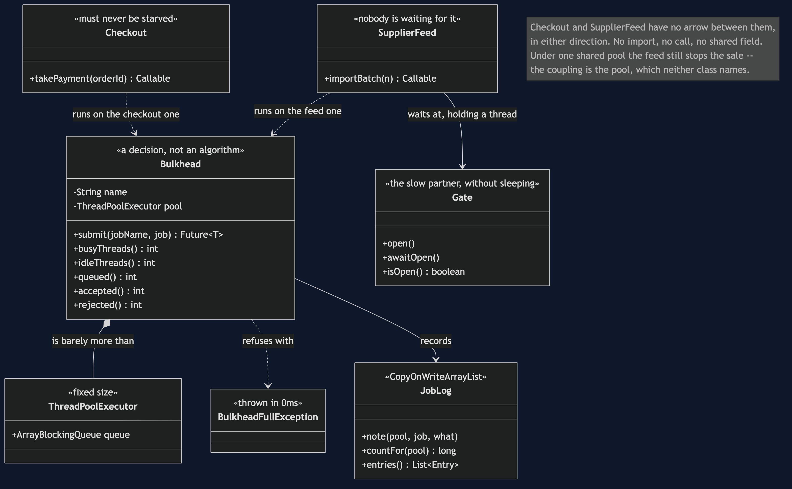

# Bulkhead

**In plain words:** do not let every job in the system draw from the same pot of
workers. Give the important work its own set, so that a slow job filling up its own
set cannot stop the important work getting a worker.

**Everyday analogy:** the watertight compartments in a ship's hull — which is
literally what a bulkhead is. A hole below the waterline floods one compartment and
the ship stays up. The same hole in an undivided hull sinks it. The cost is visible
in the analogy too: the walls take up space, and one compartment can be sitting empty
while the one next door is full.

In the shop, one thread pool serves everything. The nightly supplier feed calls a
partner API that is occasionally very slow, fills the pool, and checkout — which is
fine, and fast — cannot get a thread. The shop stops selling because of a background
job.

## The shared pool sinking

```
  ~  10ms  shared     feed-2         started on shared-worker
  ~  10ms  shared     feed-4         started on shared-worker
  ~  10ms  shared     feed-3         started on shared-worker
  ~  10ms  shared     feed-1         started on shared-worker
  checkout: still waiting for a thread after 300ms
```

Notice what is *missing* from that timeline: checkout. It has no line because it never
started. Nothing about it is broken — a test proves it runs correctly the instant a
thread frees up. It simply could not get one, and by then the shopper has gone.

## The partition holding

```
  ~   0ms  feed       feed-1         started on feed-worker
  ~   0ms  feed       feed-2         started on feed-worker
  ~   0ms  checkout   checkout       started on checkout-worker
  ~   0ms  checkout   checkout       finished
  checkout: paid ORD-5001
  the feed is jammed -- 2 threads busy, 2 jobs queued --
  and the shop is still selling, because it never shared.
```

Same slow partner, same four batches, same instant. The feed is *just as stuck* — a
test asserts that, so the isolation is demonstrably the reason and not luck — and
checkout completes in milliseconds on threads that were never available to the feed
in the first place. Another test puts twenty sales through while the feed sits there.

## The pattern is almost nothing

`Bulkhead` is a fixed thread pool with a bounded queue and a name. There is no clever
algorithm here, and that is worth saying out loud: **a bulkhead is a decision to stop
sharing.** The pattern is in having two of them, not in anything either one does.

Two choices inside it do matter.

**The queue is bounded.** An unbounded queue never refuses anything, which sounds
generous and is not: jobs pile up until memory runs out, and callers wait for work
that will not start for minutes.

**A full bulkhead refuses immediately.**

```
  feed is full: no thread and no room in the queue (in 0ms)
  4 accepted, 1 refused
```

The caller finds out in a millisecond and can do something else — shed the request,
degrade, try later. That is the circuit breaker's fast failure, applied to a queue
instead of to a broken service.

## The honest cost

```
  feed:     2 threads, 2 busy, 2 queued and waiting
  checkout: 2 threads, 0 busy, 2 idle
```

Read those two lines together. Two threads are doing nothing while two jobs are
waiting for a thread. One shared pool of four would have run all four batches at once
and finished the import sooner — and a test asserts exactly that, with the shared pool
showing four busy threads and an empty queue.

**Partitioned pools are idle capacity by design.** Bulkheads buy isolation and pay for
it in throughput. The trade is worth making for anything that must never be starved,
and it is not worth making for everything — a shop with fifteen bulkheads has fifteen
pools to size and a lot of threads doing nothing.

## Run it

```bash
./gradlew run     # four acts
./gradlew test    # 12 tests
```

## The tests are the proof, and they do not sleep

This is the only project in the category that uses real threads, so it is the only one
that has to be careful about time. It uses two devices instead of sleeping:

- **A closed `Gate`** stands in for the slow partner API. A job waiting at a closed
  gate holds its thread exactly as a job waiting on a slow network does, and it holds
  it for precisely as long as the test wants — not a guessed number of milliseconds.
  A `Thread.sleep(200)` is only long enough until the machine running it is busy,
  which is how thread tests become flaky.
- **A short bounded `Future.get`** where a test has to prove something is *not*
  happening. `oneSharedPoolStarvesCheckout` expects a `TimeoutException` after 250ms;
  that is the shopper's patience, not a guess about scheduling.

`JobLog` is a `CopyOnWriteArrayList` because several worker threads write to it at
once. The suite was run repeatedly to check it is not flaky.

## One JVM, no infrastructure

No Docker, no Resilience4j, no message broker. `java.util.concurrent` and a JDK.

Note that this project deliberately has no `SimulatedClock`: everywhere else in the
category time is something the test controls, and here it cannot be, because the
subject *is* threads genuinely waiting for one another.

## Where this sits

The circuit breaker refuses to call the broken thing. The bulkhead attacks the same
problem from the other end: it makes sure the threads waiting on the broken thing were
never the threads checkout needed. In production you want both — a breaker so you stop
calling a dead service, and a bulkhead so that the calls still in flight cannot drown
anything that matters.

This closes the resilience movement. The next three projects change subject to data:
how services own it, and how a page is assembled once they no longer share a database.

## Learning Material

| Document | What it covers |
| --- | --- |
| [`docs/problem-statement.md`](docs/problem-statement.md) | A background job nobody was waiting for stops the shop selling, and why a bigger pool is not the answer |
| [`docs/bulkhead-pattern-explained.md`](docs/bulkhead-pattern-explained.md) | The ship's hull, the four acts, and the part most treatments skip — where the walls take up space |
| [`docs/class-diagram.md`](docs/class-diagram.md) | The structure, and the arrow that is missing on purpose between `Checkout` and `SupplierFeed` |
| [`docs/uml-diagram.md`](docs/uml-diagram.md) | All four acts as sequences: which thread ran what, and which job never started at all |
| [`docs/animation.html`](docs/animation.html) | The four threads being taken one at a time, and checkout arriving to find none left, step by step in a browser |
| [`docs/prerequisites.md`](docs/prerequisites.md) | What you need to know, what you explicitly do not, and 60-second primers on thread starvation, bounded queues and the gate |
| [`docs/session.md`](docs/session.md) | A one-hour taught session with exercises |
| [`docs/spec.md`](docs/spec.md) | The generated specification, with measured test counts and timings |
| [`docs/youtube.md`](docs/youtube.md) | Title, description and chapters for the video |
| [`video/README.md`](video/README.md) | The video pipeline, the scene list, and how to rebuild it |

### The pattern in one picture



### Video

The narrated walkthrough is built from [`video/scenes.py`](video/scenes.py) by
[`video/build_video.sh`](video/build_video.sh). It runs about seventeen minutes
across sixteen scenes, and the rendered file is not committed — see the
repository README for why — so producing it takes about ten minutes on macOS.
