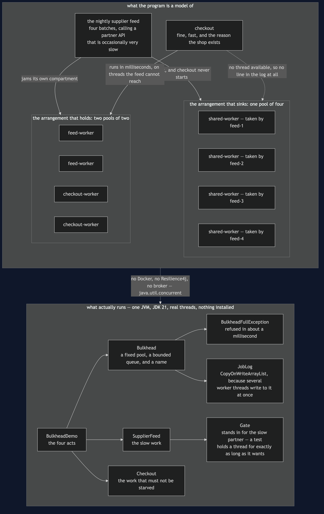
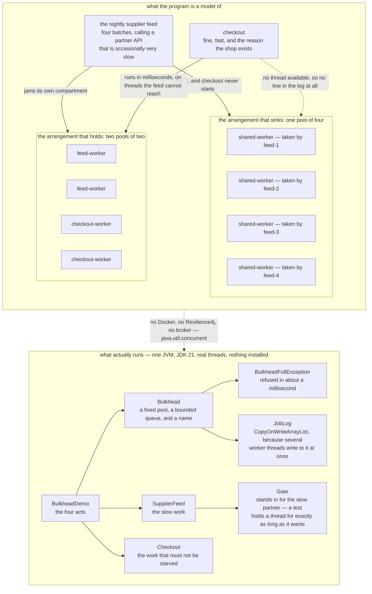

# Bulkhead — Architecture Diagram

Where each piece of this project sits, and — unusually for this category — quite a lot of
it is literally true. This is the only project in the twelve that uses **real threads**,
because the subject is threads genuinely waiting for one another, and that cannot be
simulated without simulating the very thing being taught.

Read the picture as two halves stacked. The upper half is the shop as it is being modelled:
a nightly supplier feed calling a partner API that is occasionally very slow, a checkout
that is fine and fast, and the workers they draw on. The lower half is the program, which
is small enough that almost every box in it is a class you can open and read in a minute.

The whole pattern is in the count of pools in the upper half. Draw **one** and the feed
fills it and the shop stops selling. Draw **two** and the same slow partner jams the same
feed while checkout completes in milliseconds on threads the feed was never allowed to
touch.

The second thing to look for is the wall between the two pools, and specifically the fact
that nothing crosses it. There is no overflow, no borrowing, no "use a checkout thread if
the feed is desperate". A bulkhead that lends is not a bulkhead; the watertight compartment
whose door is propped open is the one that sinks the ship.

Mermaid source

## What the diagram is telling you to count

**Four workers in the shared pool and four batches in the feed.** That is the entire
outage. Checkout is not broken, not slow and not failing — a test proves it runs correctly
the instant a thread frees up. It simply never started, which is why it has no line in the
demo's timeline. The most expensive failures in a shop are often the ones that leave no
trace in the log.

**Two pools of two, and the feed is still stuck.** This matters more than it looks. The
bulkhead did not fix the feed and was never supposed to. A test asserts the feed is just as
jammed as before, so the isolation is demonstrably the reason checkout survived rather than
luck about scheduling.

**No arrow crosses between the two small pools.** The class diagram makes the same point by
omission: `Checkout` has no reference to `SupplierFeed` and never did. They were never
related in code. They were related by a resource, which is the sneakiest kind of coupling
there is, because it does not appear in any import statement.

**`Gate` is in the lower half because honesty about testing matters.** A job waiting at a
closed gate holds its thread exactly as a job waiting on a slow network does, and it holds
it for precisely as long as the test wants. `Thread.sleep(200)` is only long enough until
the machine running it is busy, which is how thread tests become flaky.

## What it deliberately leaves out

**The idle capacity is drawn but not dwelt on, and it is the real bill.** Two checkout
threads sit doing nothing while two feed batches wait for a thread. A single shared pool of
four would have run all four batches at once and finished the import sooner — and a test
asserts precisely that. Bulkheads buy isolation and pay for it in throughput.

There is no circuit breaker here. [Circuit Breaker](../circuit-breaker-pattern) attacks the
same problem from the other end by refusing to call the broken thing at all; this one makes
sure the calls still in flight cannot drown anything that matters. Production usually wants
both.

And there is no sizing advice, because there is none worth giving in the abstract. A shop
with fifteen bulkheads has fifteen pools to size and a great many threads doing nothing.
Deciding which work must never be starved is a business judgement, and it is the one part
of this pattern that cannot be copied from a diagram.
