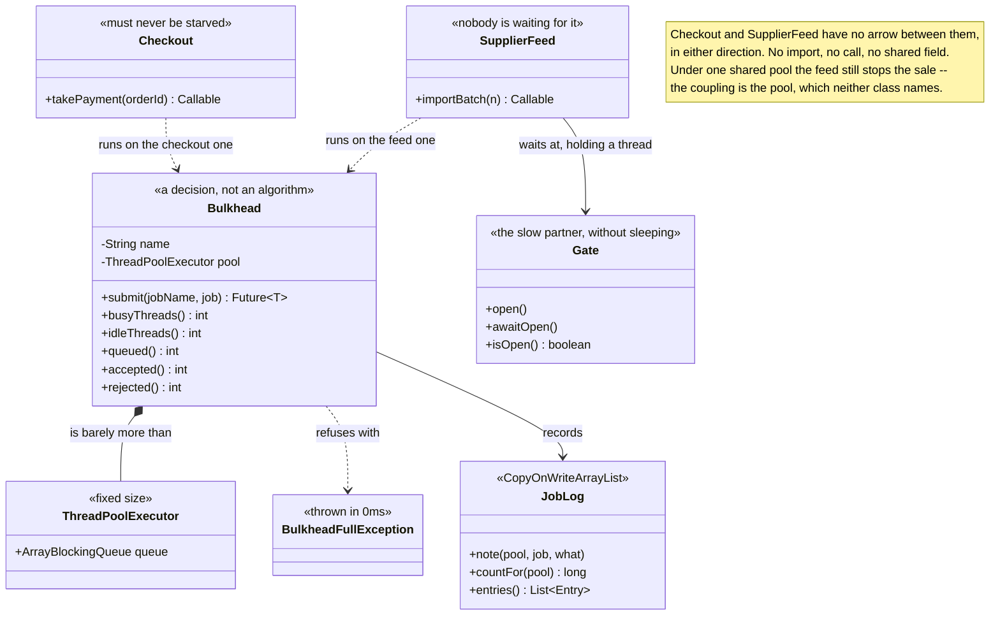

# Bulkhead — Class Diagram

Mermaid source

## What the arrows are saying

**The most important thing on this diagram is a missing arrow, which is why there is
a note pointing at the gap.** `Checkout` and `SupplierFeed` do not reference each other.
There is no import, no call, no shared field, no message between them. In the shared
pool version, a slow supplier feed still stops the shop selling. The coupling is
entirely through a resource neither class mentions, which is why no amount of reading
either file will reveal it.

**`Bulkhead` is drawn as a composition over `ThreadPoolExecutor` because that is
honestly all it is.** A fixed pool, a bounded queue, a name, and some counters. There
is no strategy here, nothing adaptive, nothing that reacts. Putting the stereotype
"a decision, not an algorithm" on it is the point of the diagram: the pattern is in
having two instances, and the interesting work — deciding where the wall goes — leaves
no trace in the type system at all.

**`Checkout` and `SupplierFeed` are stereotyped by what they mean to the business,
not by what they do.** "Must never be starved" and "nobody is waiting for it" are not
technical properties. Nothing in the code can derive them. They come from the people
who run the shop, and if they are not written down — as a pool, as a thread count —
then during an outage they are decided by whichever job asked for a thread first.

**`BulkheadFullException` carries a stereotype about time rather than about
meaning.** Thrown in 0ms is the whole value of it: the caller still has time to shed
the request or degrade. Contrast that with an unbounded queue, which would accept the
job, tell the caller nothing, and fail much later and much worse.

**`Gate` exists so the tests do not sleep.** It is a `CountDownLatch` dressed as a slow
partner API: a job waiting at a closed gate holds its thread in exactly the way a job
waiting on a slow network does, and it holds it for precisely as long as the test
wants. A `Thread.sleep(200)` is only long enough until the machine running it is busy,
which is how thread tests become flaky.

**`JobLog` is a `CopyOnWriteArrayList`, and the diagram says so on purpose.** This is
the only project in the category with real threads, so it is the only one where the
recording apparatus itself has to be thread-safe. A plain `ArrayList` written to by
four workers at once would quietly lose entries or corrupt itself, and the evidence
for the whole argument would be the thing that broke.

**Nothing here has a `SimulatedClock`, and that absence is deliberate.** Everywhere
else in this category time is something the test controls. Here it cannot be, because
the subject *is* threads genuinely waiting for one another.
