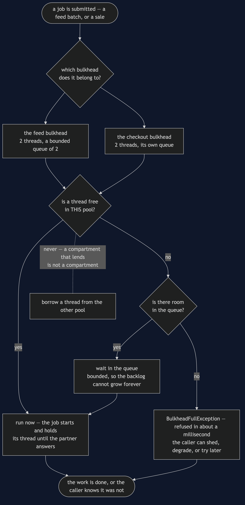
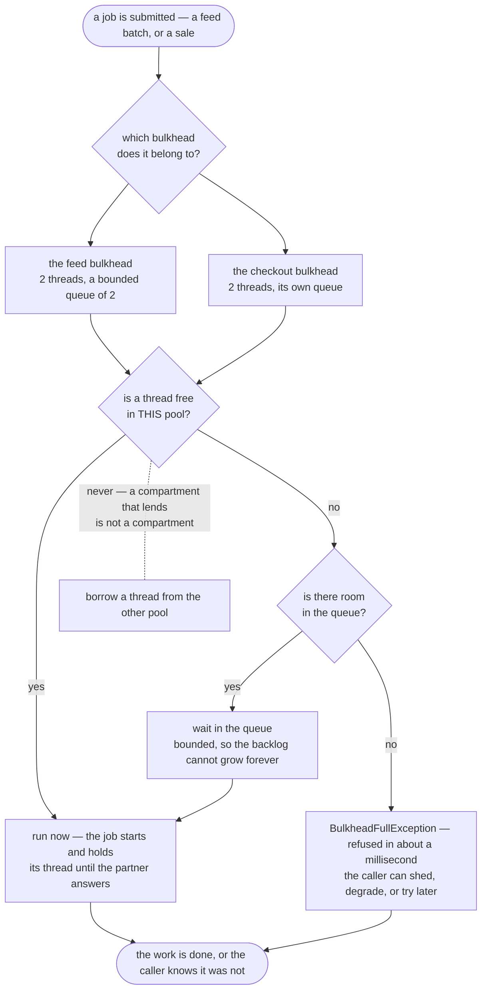

# Bulkhead — Data Flow Diagram

One job, followed from the moment it is submitted to the moment it runs, is refused, or
waits. The architecture diagram says how many pools there are; this one says **what
happens to a single piece of work when it arrives**, and it is deliberately the same
picture for both kinds of work — which is the point.

What flows here is not data in the usual sense. It is **a job looking for a thread**, and
the three possible outcomes are the whole pattern: it runs now, it waits in a bounded
queue, or it is told immediately that there is no room. Nothing else can happen, and
nothing is allowed to take a thread from the other compartment.

Follow the refusal path first. It is the shortest and the least intuitive, and it is what
makes a bulkhead useful rather than merely tidy. A caller that is told "no" in about a
millisecond can shed the request, degrade, or come back later. A caller that is quietly
queued behind an unbounded backlog can do none of those things, because it does not know
anything is wrong.

Mermaid source

## What the picture is telling you

**"Is a thread free in THIS pool" is the only question that matters.** Every other box in
the diagram is bookkeeping around it. The shared-pool version of the shop asks the same
question against a single pool, gets "no" for checkout, and the shop stops selling because
of a background job nobody was waiting for.

**The queue is bounded, and that is a choice rather than an oversight.** An unbounded queue
never refuses anything, which sounds generous and is not. Jobs pile up until memory runs
out, and callers wait for work that will not begin for minutes. A bound converts a slow
disaster into an immediate, actionable answer.

**Refusal is fast, and fast is the product.** `feed is full: no thread and no room in the
queue (in 0ms)` — four accepted, one refused, and the caller found out in about a
millisecond. This is the circuit breaker's fast failure applied to a queue instead of to a
broken service, and it is why the two patterns feel like siblings.

**The dotted box is the mistake worth naming.** Letting a desperate job borrow from the
neighbouring pool restores exactly the coupling the walls were built to remove. A hull with
a propped-open door floods just as completely as an undivided one, slightly later.

**Both kinds of work take the identical path.** There is no priority scheme here, no
preemption and no fairness algorithm. The importance of checkout is expressed entirely by
giving it threads of its own, which is the cheapest possible way to express it and the
hardest to get subtly wrong.

## The same job with one shared pool

Delete the first fork and every job queues against the same four threads. The picture gets
simpler and the demo's timeline gets an omission in it: four `feed` lines, and **no
checkout line at all**, because checkout never started. `checkout: still waiting for a
thread after 300ms` is the only evidence, and by then the shopper has gone.

The instinct at that point is to make the pool bigger. It does not work: eight threads buy
you eight slow feed batches, and the next busy night starves checkout again a little later
than before. Sizing is not the fix, because the problem is not capacity. The problem is
that two unrelated kinds of work were drawing from one pot, and the only fix is to stop
sharing.
