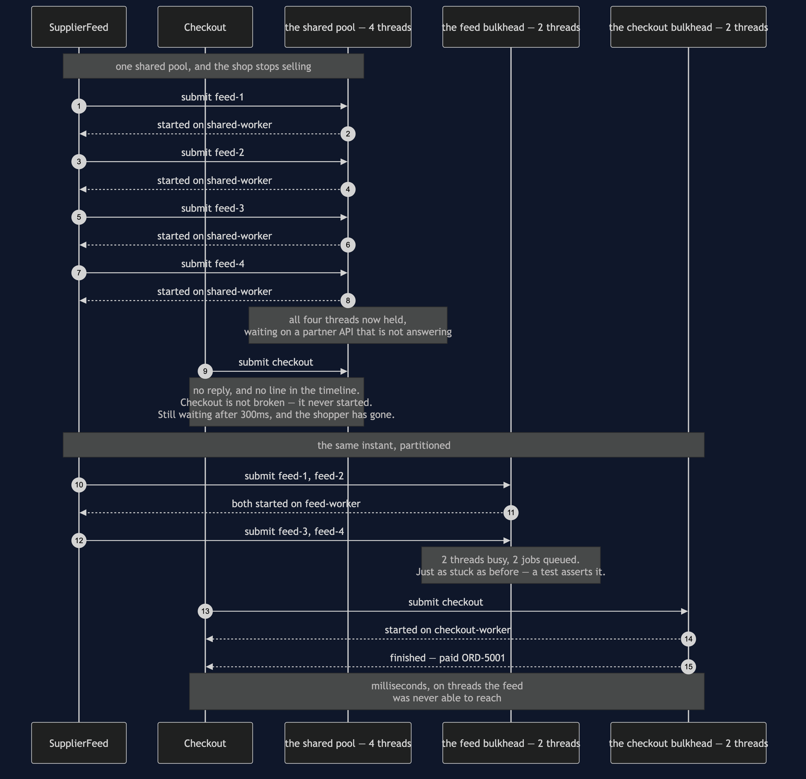
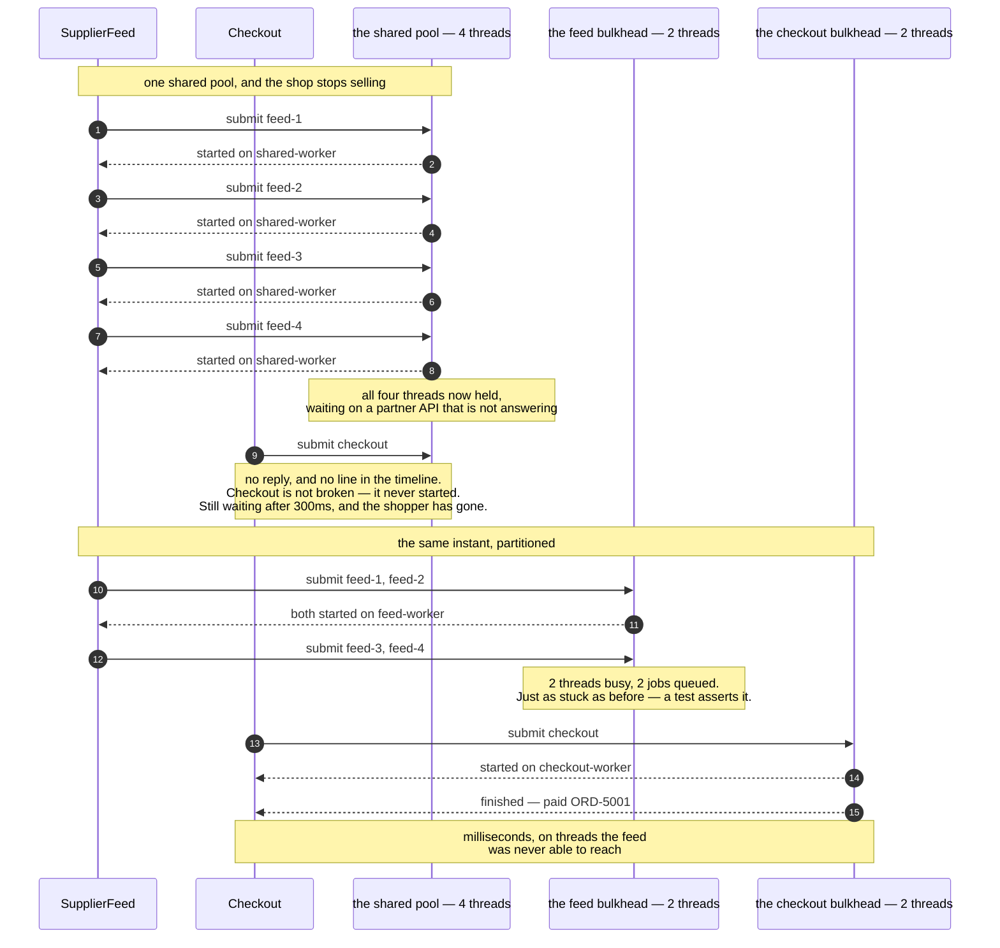

# Bulkhead — Sequence Diagram

The one sequence worth having in your head before the others make sense: the same slow
partner, the same four batches, the same instant — once with a shared pool and once
partitioned — and a sale that either happens or does not.

[`uml-diagram.md`](uml-diagram.md) holds the full set of four acts. This document puts the
two arrangements side by side in a single picture, because the pattern is not really a
mechanism at all. It is a **decision to stop sharing**, and a decision is only visible as a
comparison.

Read the top half first and count the lines. Four batches take four threads. Checkout then
arrives and there is nothing left, so it produces no line at all — and that absence is the
outage. Read the bottom half and notice that the feed is *just as stuck*: two threads busy,
two batches queued, the partner still not answering. Nothing was fixed. The sale went
through anyway.

Mermaid source

## Reading the timings

**The upper half has no checkout line, and that is the finding.** Failures that leave no
trace are the hardest ones to diagnose, and this is the shape of them: every log line
present is about a job that is behaving reasonably, and the missing line is the money.

**The lower half's feed is not rescued.** Two threads busy, two queued, and the partner
still slow. If the bulkhead had somehow made the feed faster the experiment would prove
nothing, because you could not tell isolation from luck. A test pins the feed as jammed,
which is what makes the surviving sale attributable.

**Checkout finishes in milliseconds, not because it was prioritised but because it was
separated.** There is no scheduler here making a judgement about importance. Importance was
expressed once, at construction time, by giving checkout two threads of its own — and that
is the cheapest imaginable way to express it.

**Another test puts twenty sales through while the feed sits there.** One surviving sale
could be a coincidence of timing. Twenty is a property of the arrangement.

## What changes in the other two acts

Submit a **fifth** batch and the feed bulkhead has no thread and no room in its queue, so
it refuses in about a millisecond: four accepted, one refused. That sounds like a loss and
it is the opposite. A caller told "no" immediately can shed the request or come back later;
a caller quietly queued behind an unbounded backlog waits for work that will not begin for
minutes and has no way to find out.

Run the same picture on **a quiet afternoon** and the bill arrives. Two checkout threads
idle while two feed batches wait for a thread, where one shared pool of four would have run
all four at once and finished the import sooner — and there is a test asserting exactly
that, shared pool showing four busy threads and an empty queue. Partitioned pools are idle
capacity by design. That trade is worth making for work that must never be starved, and it
is not worth making for everything.
