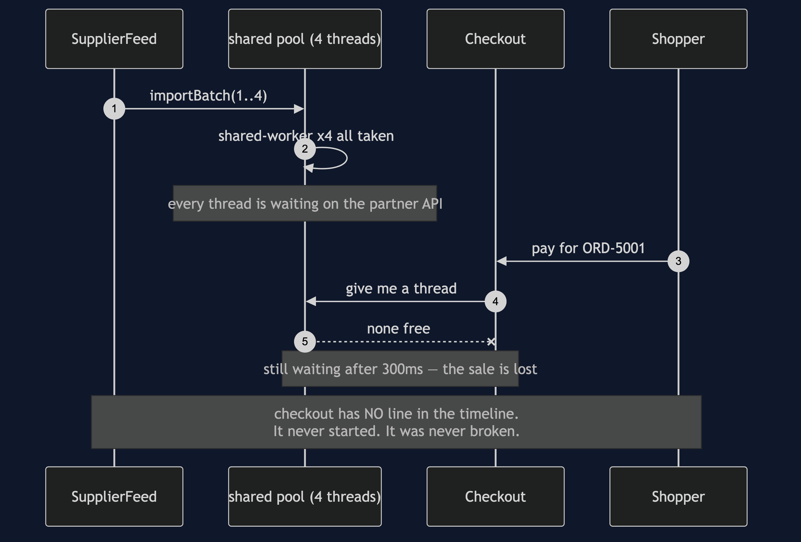
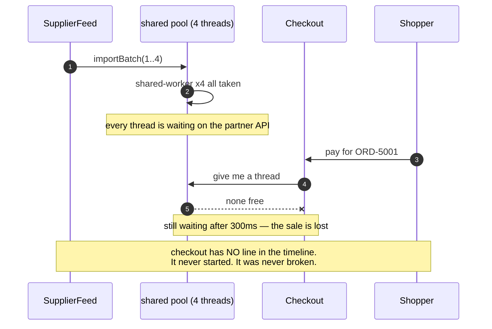
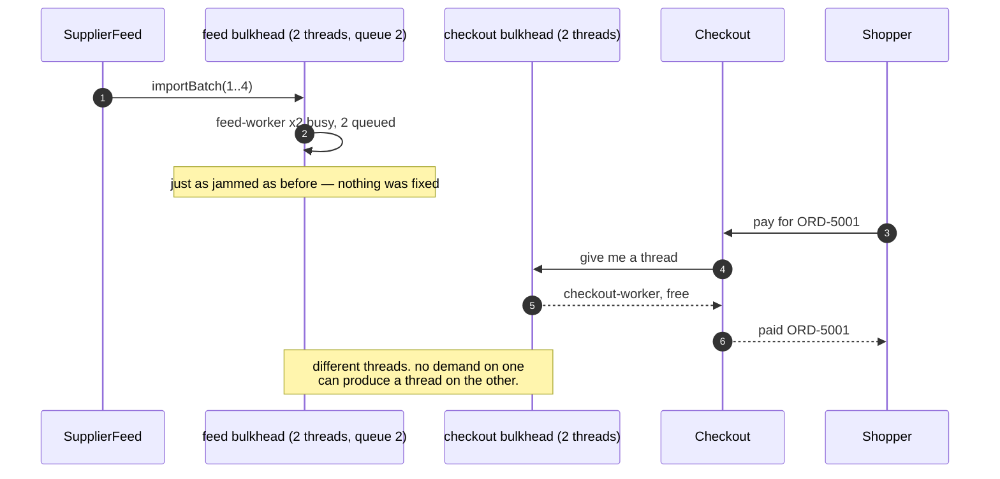
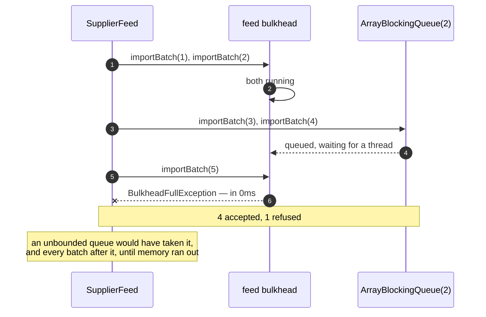
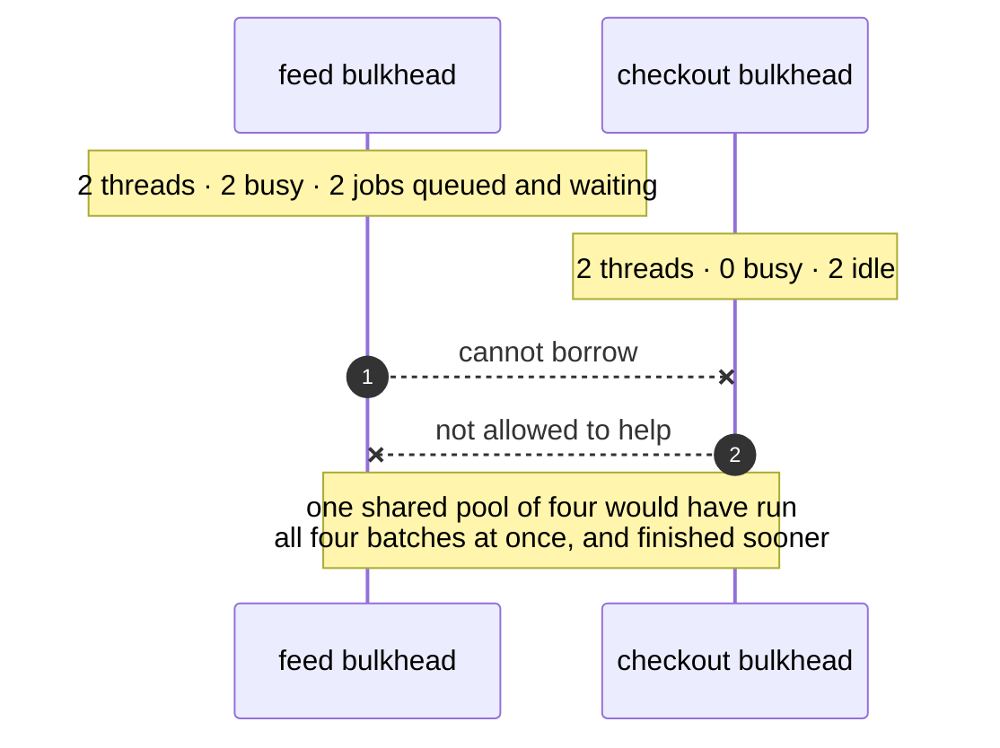

# Bulkhead — UML Sequence Diagrams

Four sequences over the same outage. Throughout, the partner API is slow — it answers
eventually, it just does not answer *now* — and a job waiting on it holds its thread.
Every line below comes out of `./gradlew run`.

## Act One: One Shared Pool Of Four

Mermaid source

Four batches take four threads and hold them. Checkout asks for a thread and there is
not one.

The line to stare at is the note at the bottom. In the real timeline, checkout does
not appear *at all* — not as an error, not as a slow entry, not as anything. Absence
is the symptom, which is precisely why this is so hard to diagnose while it is
happening: there is nothing in the logs to read.

`theStarvedCheckoutWasNeverBroken` runs that same checkout job the instant a thread is
free and watches it succeed. **Starved and broken look identical from outside, and
only one of them can be fixed in the code.**

## Act Two: Two Bulkheads

Same slow partner, same four batches, same instant. Checkout completes in
milliseconds.

The claim worth being careful about is not that checkout worked — it is that the feed
is *still stuck while it works*. `theFeedIsGenuinelyStuck` asserts exactly that,
because without it you cannot tell isolation from luck: a run where the partner
happened to recover would look the same. Nothing about the partner API was fixed.

`poolsDoNotBorrowFromEachOther` then pins the mechanism by name: work submitted to the
feed runs on `feed-worker`, work submitted to checkout runs on `checkout-worker`, and
neither pool will lend.

## Act Three: A Fifth Batch, With Nowhere To Go

Two threads busy, two jobs queued, and the queue holds two. The fifth batch is
refused, and `theRefusalIsFast` asserts it comes back immediately.

That speed is the whole value. The caller still has time to do something useful — shed
the batch, degrade, write it down for tonight. This is the circuit breaker's fast
failure applied to a queue rather than to a broken service.

An unbounded queue would have accepted batch five, and six, and every one after, and
told nobody anything. The failure does not go away; it is converted from a fast,
visible refusal into an out-of-memory error at an hour of its choosing.

## Act Four: The Bill, On A Quiet Afternoon

Not really a sequence — an argument drawn as one, because the shape is the point.
Two threads are doing nothing beside two jobs that are waiting for a thread, and the
walls are what stop them helping.

`thesharedPoolIsFasterOnAGoodDay` asserts the other side of it: one pool of four runs
all four batches at once, four busy threads and an empty queue.

**Partitioned pools are idle capacity by design.** That is the price, it is paid every
day including the days nothing goes wrong, and it is worth paying for work whose
failure ends the business.

## Notes

- Nothing in these diagrams is simulated. This is the only project in the category
  with real threads, because the subject *is* threads genuinely waiting for one
  another — so there is no `SimulatedClock` here, and the timestamps in the demo are
  real milliseconds.
- The partner API's slowness is a `Gate`, a `CountDownLatch` the test opens when it
  chooses. A job waiting at a closed gate holds its thread exactly as a job waiting on
  a slow network does. Nothing sleeps, so the suite is fast and not flaky.
- Where a test has to prove something is *not* happening, it uses a short bounded
  `Future.get`: `oneSharedPoolStarvesCheckout` expects a `TimeoutException` after
  250ms, which is the shopper's patience rather than a guess about scheduling.
- In a real service these pools would be an executor per dependency, or a semaphore
  per downstream call, or separate connection pools. Every argument above is unchanged.
