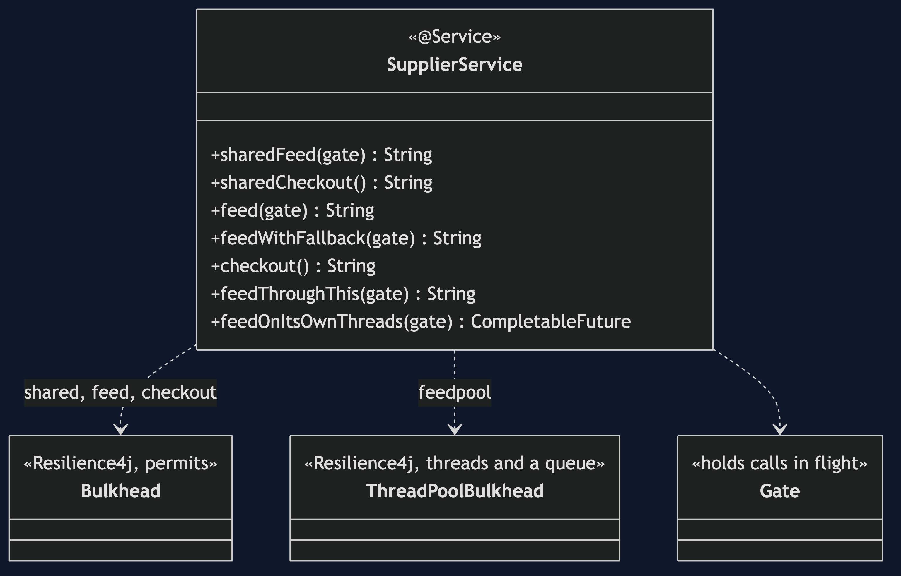
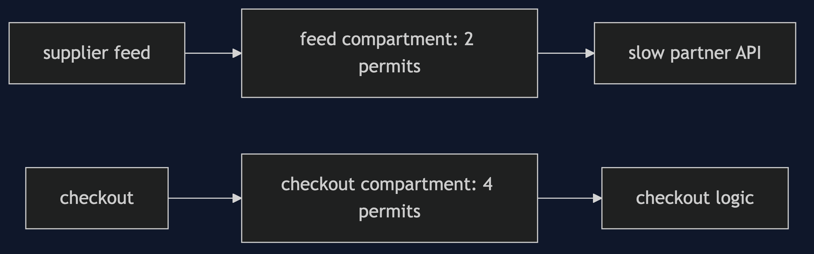
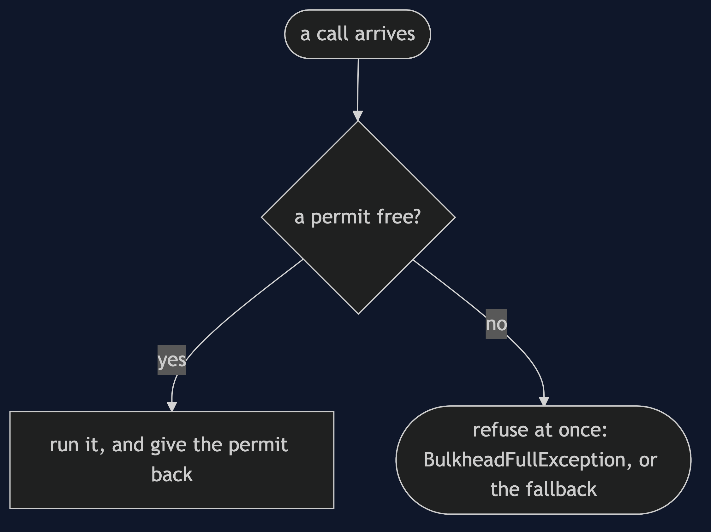
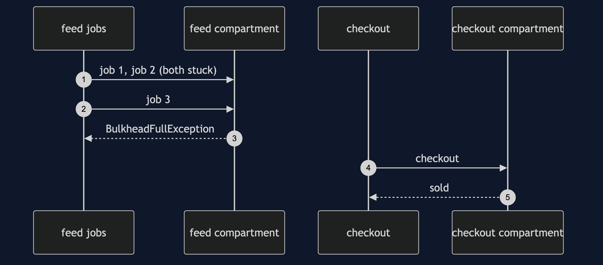

# Bulkhead with Resilience4j Pattern

```
src/main/java/com/jk/explore/bulkheadr4j/
├── SupplierApplication.java   the Spring Boot entry point and the six acts
├── SupplierService.java       the annotated methods
└── Gate.java                  holds calls in flight, so the demo can look
src/main/resources/application.properties   the compartments' sizes
```

**In Resilience4j a bulkhead is an annotation and a size. One kind counts permits, the other gives the work its own threads.**

This project is the framework version of [Bulkhead](../bulkhead-pattern). That project built the mechanism by hand. This one shows the same idea inside Resilience4j. It does not re-teach the pattern. It shows what Resilience4j adds, the failures that are its own, and what it costs.

## Run

```bash
./gradlew run
```

Six acts. The partner project, Bulkhead, built the mechanism by hand. Here the same idea runs through Resilience4j, and every count comes from real output.

```
ONE. One compartment for everything.
  four slow feed jobs hold every permit. checkout is refused: BulkheadFullException.
  a background job stopped the shop selling.
TWO. A compartment each.
  a third feed job is refused: BulkheadFullException.
  checkout while two feed jobs are stuck: sold.
THREE. What a full compartment does to its callers.
  with a fallback method, the third feed job gets: feed batch skipped tonight.
FOUR. The cost of the wall.
  permits free in the feed compartment: 0. in the checkout compartment: 4.
  checkout's four permits cannot help the feed, even now.
FIVE. The annotation is a proxy.
  10 feed jobs called through this, in a compartment of 2. all 10 are inside at once.
  permits free in the feed compartment: 2. it never saw them.
SIX. A compartment with its own threads.
  four submissions, and the caller was never blocked. running: 2. waiting in the queue: 1.
  the fourth was refused: BulkheadFullException.
  the first ran on: bulkhead-feedpool-N. all three finished: true.
```

## Test

```bash
./gradlew test
```

2 test classes, 5 test methods, offline, with each Spring context started inside the test, and no server.

## Technologies and versions

| What | Version | Why it is here |
| --- | --- | --- |
| Java | 21 | The repository standard, via the Gradle toolchain block |
| Gradle | 9.2.1 | The wrapper in this directory; no separate install needed |
| Spring Boot | 4.1.1 | The container and its proxies |
| resilience4j-spring-boot4 | 2.4.0 | Both bulkheads and their Spring Boot module |
| JUnit 5 | 5.10.2 | Test runner |

See [`docs/dependencies.md`](docs/dependencies.md).

## Learning Material

| Document | What it covers |
| --- | --- |
| [`docs/problem-statement.md`](docs/problem-statement.md) | The partner's compartments, and what is new |
| [`docs/bulkhead-with-resilience4j-pattern-explained.md`](docs/bulkhead-with-resilience4j-pattern-explained.md) | Two kinds of bulkhead as annotations |
| [`docs/class-diagram.md`](docs/class-diagram.md) | The types |
| [`docs/architecture-diagram.md`](docs/architecture-diagram.md) | Feed and checkout, in compartments |
| [`docs/data-flow-diagram.md`](docs/data-flow-diagram.md) | What a full compartment does |
| [`docs/sequence-diagram.md`](docs/sequence-diagram.md) | Written for a listener with the screen off |
| [`docs/uml-diagram.md`](docs/uml-diagram.md) | Four sequences |
| [`docs/animation.html`](docs/animation.html) | The six acts in a browser |
| [`docs/prerequisites.md`](docs/prerequisites.md) | What you need to know |
| [`docs/session.md`](docs/session.md) | A one-hour taught session |
| [`docs/spec.md`](docs/spec.md) | The generated specification |
| [`docs/youtube.md`](docs/youtube.md) | Title, description and chapters |
| [`docs/dependencies.md`](docs/dependencies.md) | What Resilience4j is, what it costs, and that skipping this project loses none of the pattern |

### The pattern in one picture



### Where each piece sits



### How one request moves



### Who calls whom, in order



### All four sequences


### Video

Built from [`video/scenes.py`](video/scenes.py) by
[`video/build_video.sh`](video/build_video.sh). The rendered file is not
committed; see the repository README for why.

## Where you have already met this

Any Spring service that calls several other services, some of them slow.

## When this is too much

For one caller and one dependency, the limit is a rate limiter's job, not a compartment's.

## Where this sits

This project pairs with [Bulkhead](../bulkhead-pattern), and is a framework version in [`micro-services-design-patterns`](..).
