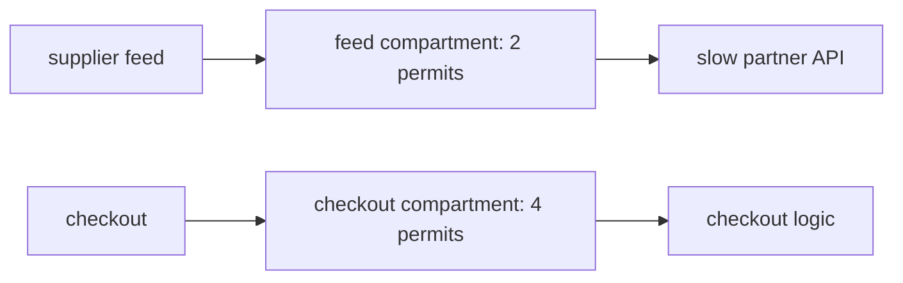

# Bulkhead with Resilience4j Pattern — Architecture Diagram

Each kind of work passes through its own compartment.

Mermaid source

```mermaid
flowchart LR
    F["supplier feed"] --> BF["feed compartment: 2 permits"]
    C["checkout"] --> BC["checkout compartment: 4 permits"]
    BF --> P["slow partner API"]
    BC --> S["checkout logic"]
```

