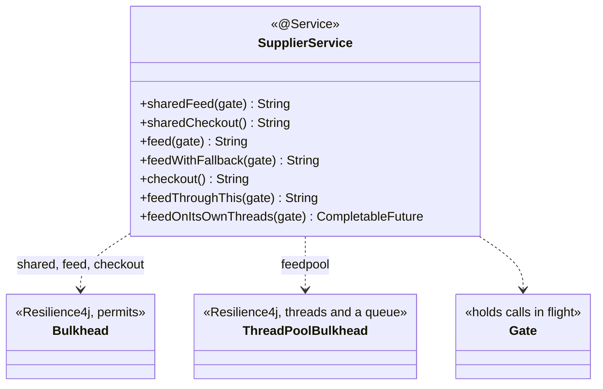

# Bulkhead with Resilience4j Pattern — Class Diagram

One service carries the annotations. The sizes live in configuration.

Mermaid source

```mermaid
classDiagram
    class SupplierService {
        <<@Service>>
        +sharedFeed(gate) String
        +sharedCheckout() String
        +feed(gate) String
        +feedWithFallback(gate) String
        +checkout() String
        +feedThroughThis(gate) String
        +feedOnItsOwnThreads(gate) CompletableFuture
    }
    class Bulkhead {
        <<Resilience4j, permits>>
    }
    class ThreadPoolBulkhead {
        <<Resilience4j, threads and a queue>>
    }
    class Gate {
        <<holds calls in flight>>
    }
    SupplierService ..> Bulkhead : shared, feed, checkout
    SupplierService ..> ThreadPoolBulkhead : feedpool
    SupplierService ..> Gate
```

