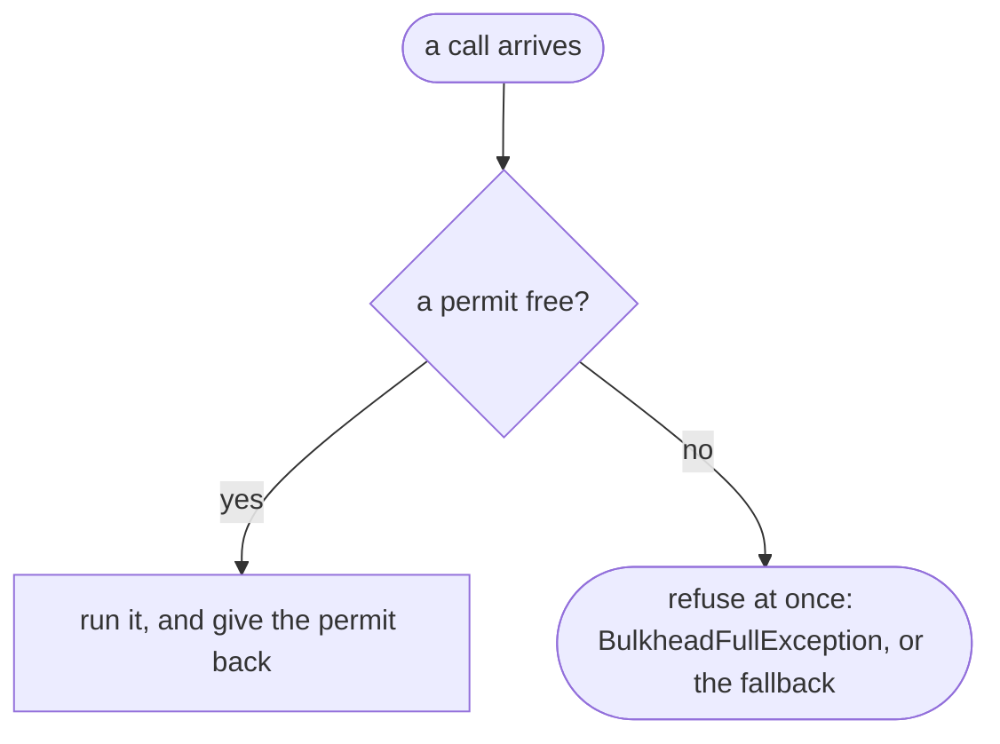

# Bulkhead with Resilience4j Pattern — Data Flow Diagram

What a compartment does with a new call.

Mermaid source

```mermaid
flowchart TD
    Call(["a call arrives"])
    Room{"a permit free?"}
    Run["run it, and give the permit back"]
    No(["refuse at once: BulkheadFullException, or the fallback"])
    Call --> Room
    Room -- yes --> Run
    Room -- no --> No
```

