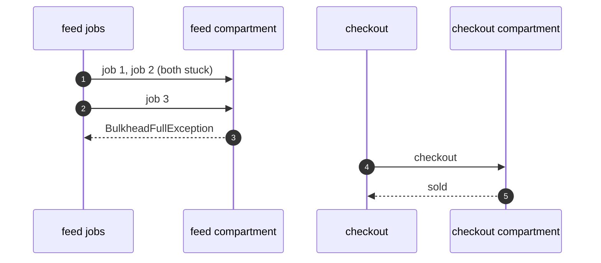

# Bulkhead with Resilience4j Pattern — Sequence Diagram

Written for a listener with the screen off.

Say it in words. Two feed jobs enter the feed compartment and stop at the gate, so both permits are taken. A third feed job arrives and is refused at once. At the same moment checkout arrives at its own compartment, which has four free permits, and runs straight through.

Mermaid source

The load-bearing sentence: **one full compartment does not touch the next.**
