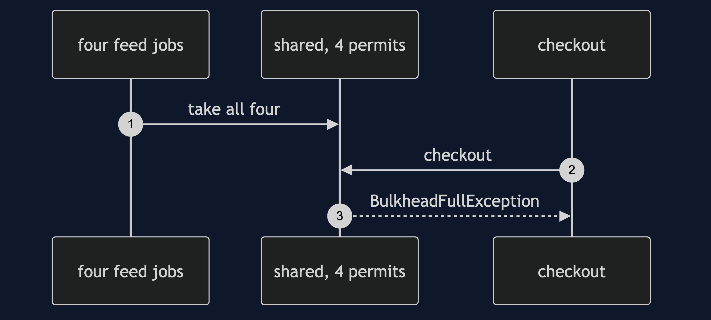
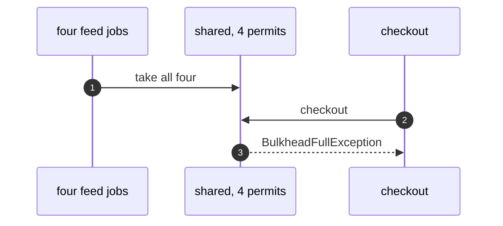
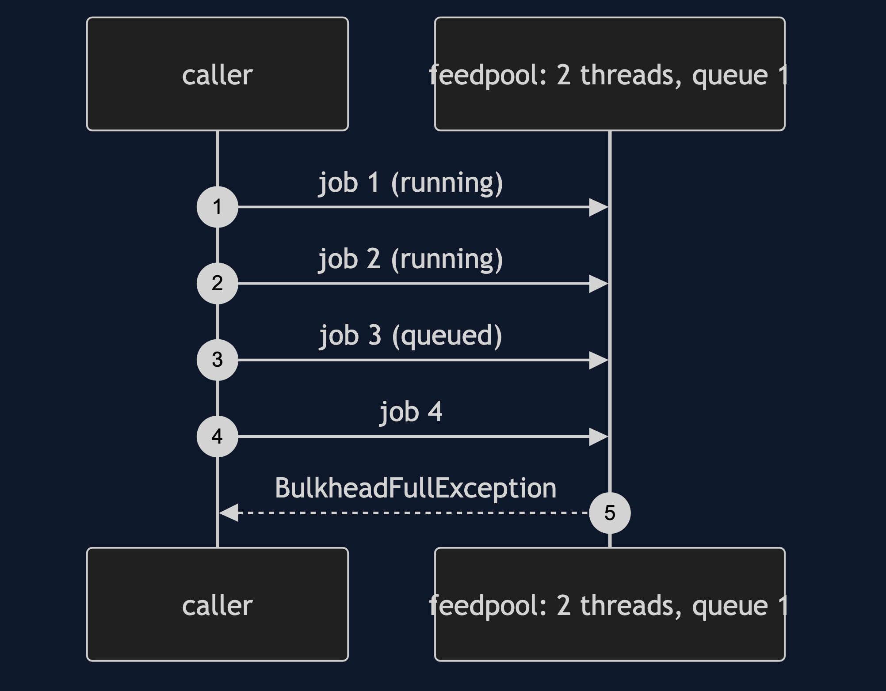
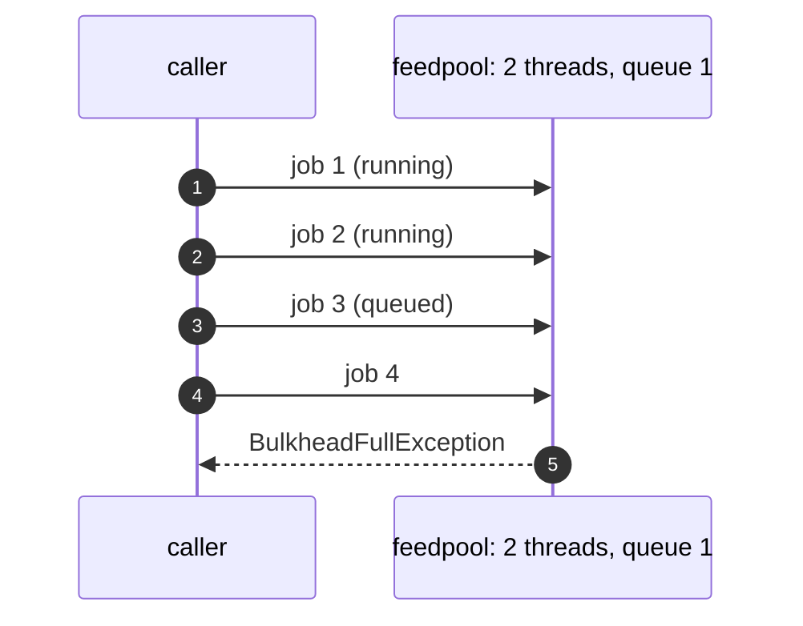

# Bulkhead with Resilience4j Pattern — UML Sequence Diagrams

Four sequences.

## 1. One Shared Compartment

Mermaid source

```mermaid
sequenceDiagram
    autonumber
    participant F as four feed jobs
    participant B as shared, 4 permits
    participant C as checkout
    F->>B: take all four
    C->>B: checkout
    B-->>C: BulkheadFullException
```

## 2. A Thread Pool Compartment

Mermaid source

```mermaid
sequenceDiagram
    autonumber
    participant K as caller
    participant P as feedpool: 2 threads, queue 1
    K->>P: job 1 (running)
    K->>P: job 2 (running)
    K->>P: job 3 (queued)
    K->>P: job 4
    P-->>K: BulkheadFullException
```

