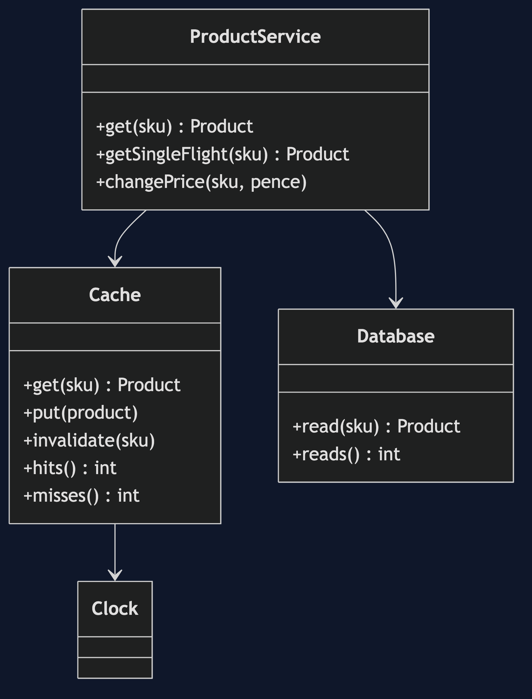
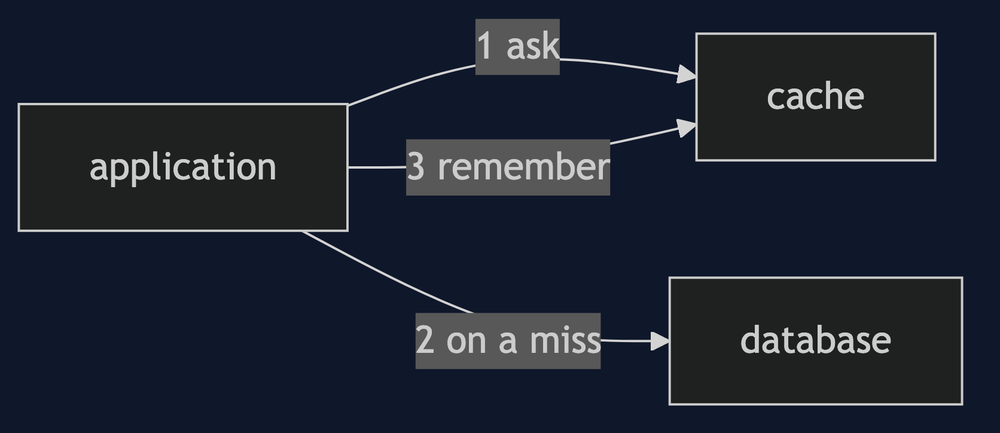
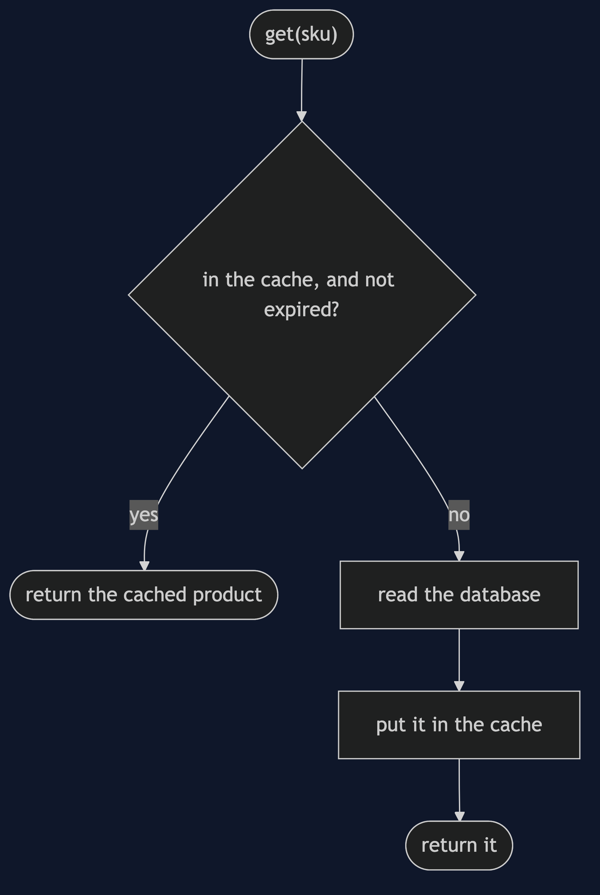
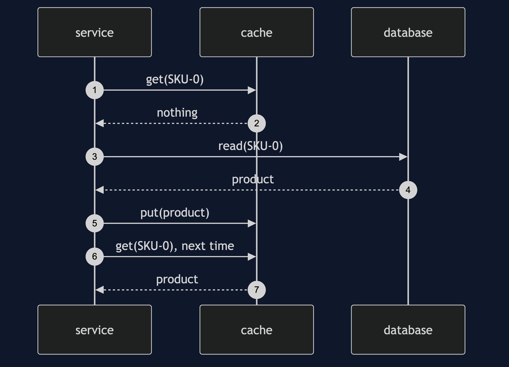
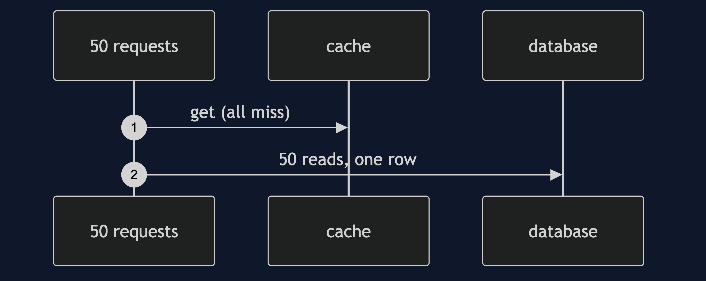
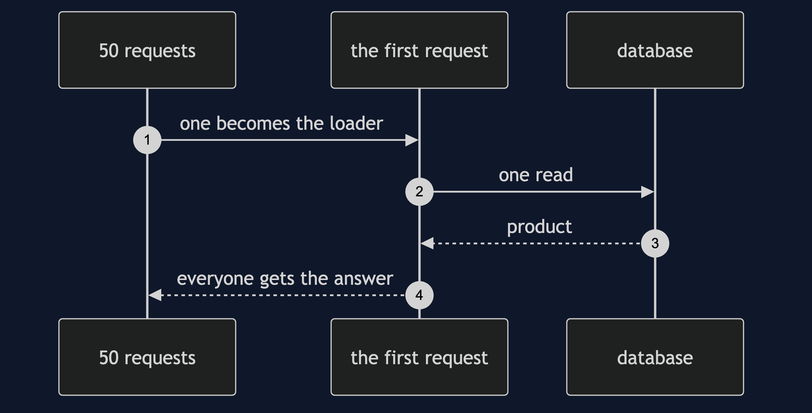

# Cache-Aside Pattern

```
src/main/java/com/jk/explore/cacheaside/
├── CacheAsideDemo.java              the six acts
├── ProductService.java              looks aside; single-flight variant; writes
├── Cache.java                       expiry per entry; counts hits and misses
├── Database.java                    the source of truth; counts every read
└── Clock.java  Product.java
```

**Cache-aside: ask the cache, and on a miss ask the source yourself and remember the answer.**

This project is in [micro-services-design-patterns](..). It is the most common caching pattern, and its costs are stale data, a stampede on a cold key, and one more thing to keep right.

## Run

```bash
./gradlew run
```

Six acts. Every number quoted below comes from this program's own output.

```
ONE. No cache.
  1000 product page views over 10 popular products: 1000 database reads.
TWO. Look aside.
  the same 1000 views: 10 database reads, 990 cache hits, 10 misses.
  ask the cache; on a miss, ask the database and remember the answer.
THREE. Writes.
  price changed to 1500 in the database, cache forgotten: a customer sees 1000.
  price changed to 1600, and the cached copy thrown away: a customer sees 1600.
FOUR. A time limit on staleness.
  another system changes the price to 2000. after 59 seconds: 1000.
  after 61 seconds: 2000.
  an expiry does not make the cache right. it makes it wrong for a bounded time.
FIVE. A stampede.
  50 requests arrive together for one popular product whose entry has just expired.
  every request checks the cache: 50 database reads.
  requests share one database read: 1 database read.
SIX. The bill.
  the cache is restarted, empty. the first 10 views: 10 database reads. the database takes the whole load again until it warms up.
  the cache is a copy, not the truth. there is now a second thing to keep right, to size, and to explain.
```

## Test

```bash
./gradlew test
```

2 test classes, 7 test methods, offline, with nothing installed and no framework.

## Technologies and versions

| What | Version | Why it is here |
| --- | --- | --- |
| Java | 21 | The repository standard, via the Gradle toolchain block |
| Gradle | 9.2.1 | The wrapper in this directory; no separate install needed |
| JUnit 5 | 5.10.2 | Test runner |

No framework. A hand-built project stays plain Java so the mechanism is the whole lesson.

## Learning Material

| Document | What it covers |
| --- | --- |
| [`docs/problem-statement.md`](docs/problem-statement.md) | The same ten rows, over and over |
| [`docs/cache-aside-pattern-explained.md`](docs/cache-aside-pattern-explained.md) | The pattern, and six acts |
| [`docs/class-diagram.md`](docs/class-diagram.md) | The types |
| [`docs/architecture-diagram.md`](docs/architecture-diagram.md) | The application, a cache and a database |
| [`docs/data-flow-diagram.md`](docs/data-flow-diagram.md) | What a read does |
| [`docs/sequence-diagram.md`](docs/sequence-diagram.md) | Written for a listener with the screen off |
| [`docs/uml-diagram.md`](docs/uml-diagram.md) | Four sequences |
| [`docs/animation.html`](docs/animation.html) | The six acts in a browser |
| [`docs/prerequisites.md`](docs/prerequisites.md) | What you need to know |
| [`docs/session.md`](docs/session.md) | A one-hour taught session |
| [`docs/spec.md`](docs/spec.md) | The generated specification |
| [`docs/youtube.md`](docs/youtube.md) | Title, description and chapters |

### The pattern in one picture



### Where each piece sits



### How one request moves



### Who calls whom, in order



### All four sequences






### Video

Built from [`video/scenes.py`](video/scenes.py) by
[`video/build_video.sh`](video/build_video.sh). The rendered file is not
committed; see the repository README for why.

## Where you have already met this

Spring's `@Cacheable`, Redis in front of a database, and every browser's HTTP cache.

## When this is too much

For data that changes on every read, or that is read once, a cache is overhead. For data that must be exact, staleness is a bug, not a trade.

## Where this sits

This project is in [`micro-services-design-patterns`](..), and is meant to be read with its neighbours there.
