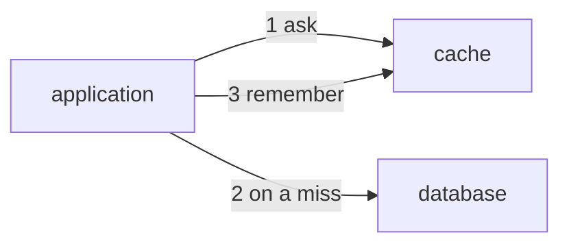

# Cache-Aside Pattern — Architecture Diagram

The cache sits beside the path to the database, not in front of it.

Mermaid source

```mermaid
flowchart LR
    A["application"] -->|1 ask| C["cache"]
    A -->|2 on a miss| D["database"]
    A -->|3 remember| C
```

