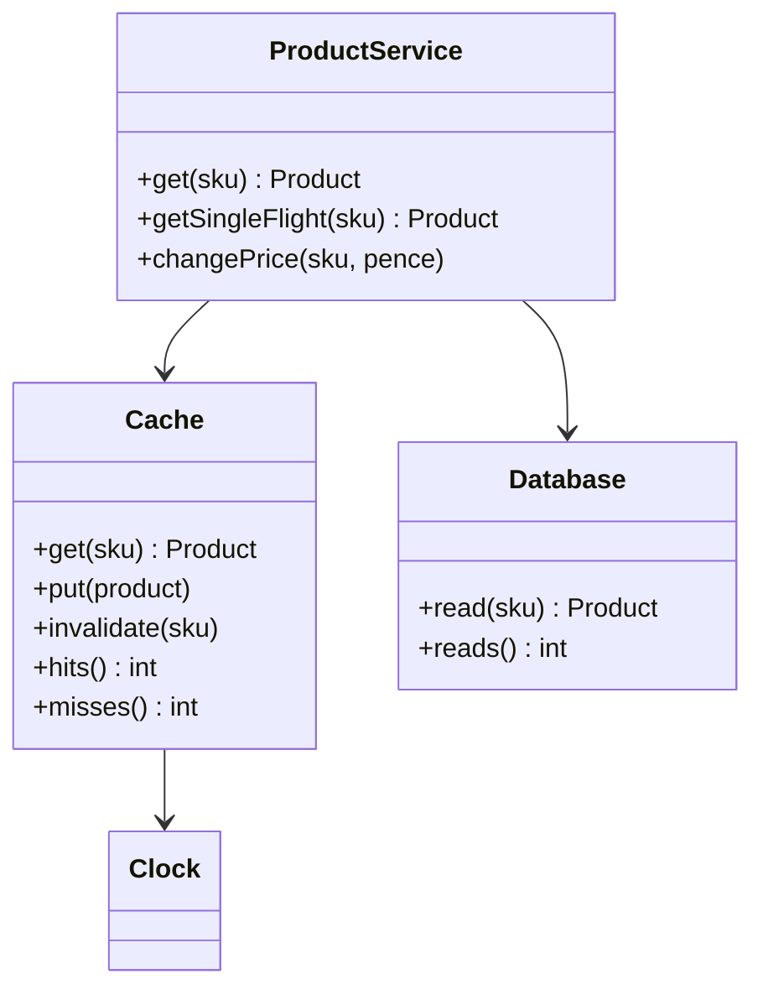

# Cache-Aside Pattern — Class Diagram

The service looks in the cache, and on a miss goes to the database itself.

Mermaid source

```mermaid
classDiagram
    class ProductService {
        +get(sku) Product
        +getSingleFlight(sku) Product
        +changePrice(sku, pence)
    }
    class Cache {
        +get(sku) Product
        +put(product)
        +invalidate(sku)
        +hits() int
        +misses() int
    }
    class Database {
        +read(sku) Product
        +reads() int
    }
    class Clock
    ProductService --> Cache
    ProductService --> Database
    Cache --> Clock
```

