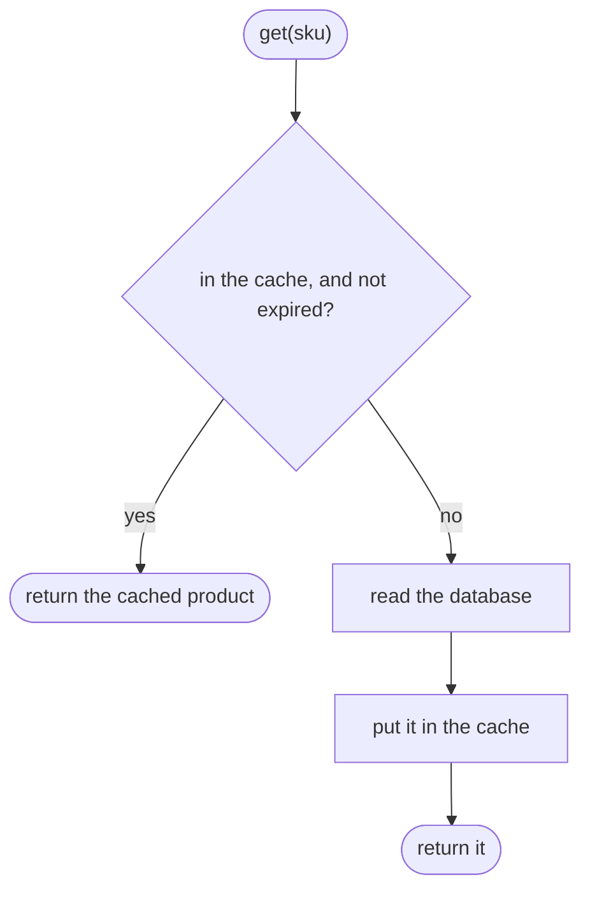

# Cache-Aside Pattern — Data Flow Diagram

What a read does.

Mermaid source

```mermaid
flowchart TD
    Ask(["get(sku)"])
    Hit{"in the cache, and not expired?"}
    Use(["return the cached product"])
    Read["read the database"]
    Put["put it in the cache"]
    Ret(["return it"])
    Ask --> Hit
    Hit -- yes --> Use
    Hit -- no --> Read --> Put --> Ret
```

