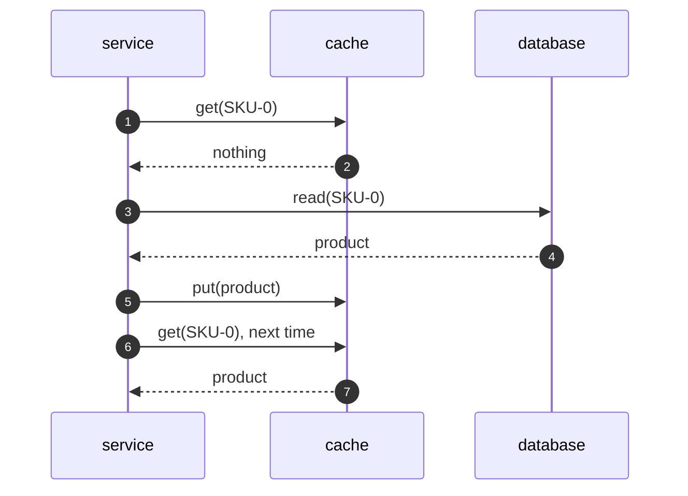

# Cache-Aside Pattern — Sequence Diagram

Written for a listener with the screen off.

Say it in words. The service is asked for a product. It asks the cache, which has nothing, so it is a miss. The service reads the database itself, and gets the product. It puts the product in the cache, and returns it. The next request asks the cache and gets the product straight away, and the database is not touched.

Mermaid source

The load-bearing sentence: **the application does the reading and the remembering, and the cache never calls the database.**
