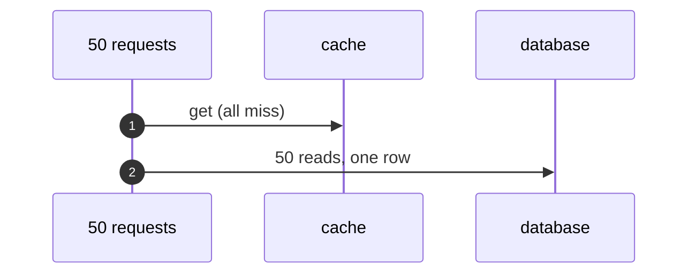
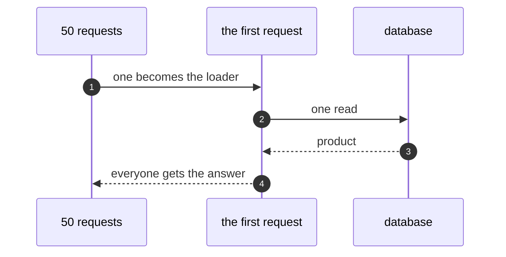

# Cache-Aside Pattern — UML Sequence Diagrams

Four sequences.

## 1. A Stampede

Mermaid source

```mermaid
sequenceDiagram
    autonumber
    participant R as 50 requests
    participant C as cache
    participant D as database
    R->>C: get (all miss)
    R->>D: 50 reads, one row
```

## 2. A Shared Read

Mermaid source

```mermaid
sequenceDiagram
    autonumber
    participant R as 50 requests
    participant L as the first request
    participant D as database
    R->>L: one becomes the loader
    L->>D: one read
    D-->>L: product
    L-->>R: everyone gets the answer
```

