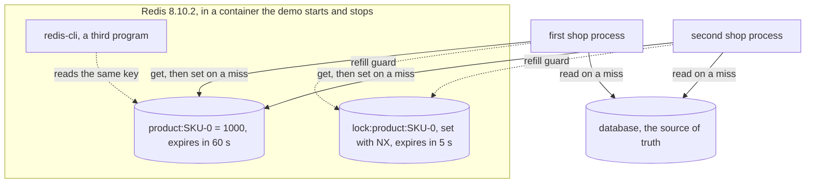

# Cache-Aside with Redis Pattern — Architecture Diagram

Two shop processes, one Redis, one database. Redis never talks to the database; each shop does the reading and the filling itself, and each sees what the other wrote.

Mermaid source

