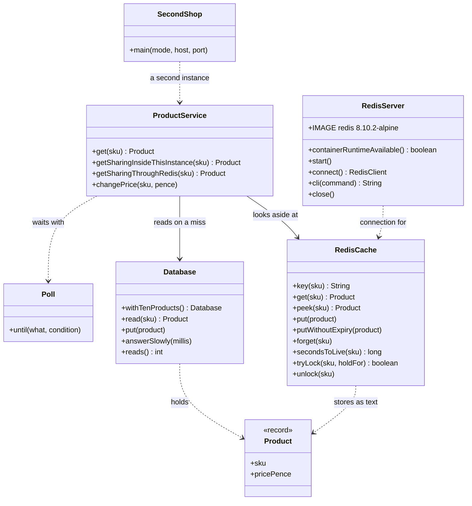

# Cache-Aside with Redis Pattern — Class Diagram

The pattern is one class, `ProductService`: look in Redis, and on a miss read the database and fill Redis. `RedisCache` is how a price is written into Redis and read back; `RedisServer` owns the container.

Mermaid source

