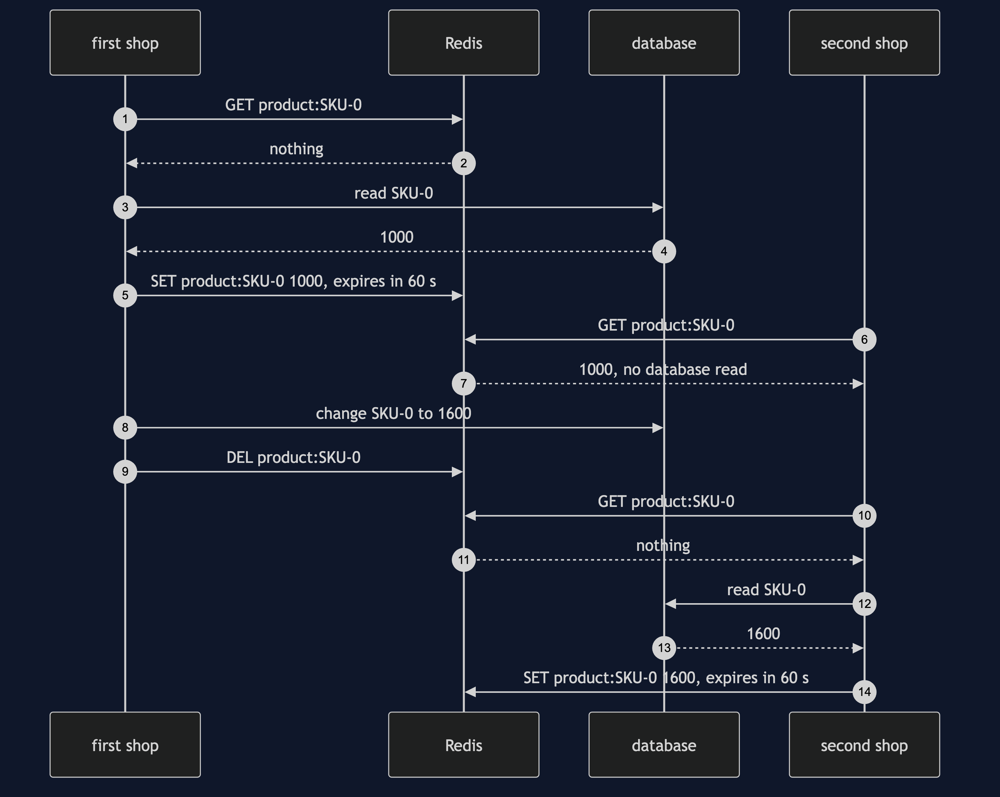

# Cache-Aside with Redis Pattern — Sequence Diagram

Written for a listener with the screen off.

Say it in words. The first shop is asked for the price of product SKU-0. It asks Redis first, and Redis has nothing. So the first shop reads the database itself, gets 1000 pence, and writes that price into Redis with a sixty-second expiry. It shows the customer 1000. Then a second shop, a separate program with its own memory, is asked for the same product. It asks Redis first, and Redis already has 1000, because the first shop left it there. The second shop never touches the database. Later, the first shop changes the price to 1600. It writes the new price to the database, then deletes the key in Redis, once. The next time either shop is asked, Redis has nothing, so that shop reads the database, gets 1600, and fills Redis again. One database read per change, shared by every shop.

The load-bearing sentence: **Redis never fetches anything itself; each shop reads the database on a miss and leaves the answer where every other shop can see it.**

For the expiry, the plain write, the stampede and the lock, see [`uml-diagram.md`](uml-diagram.md).
