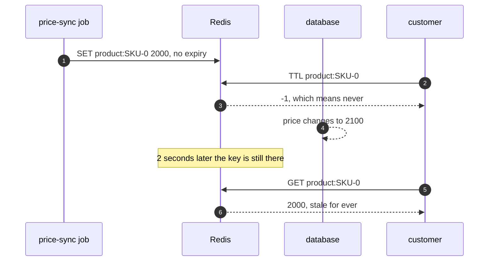
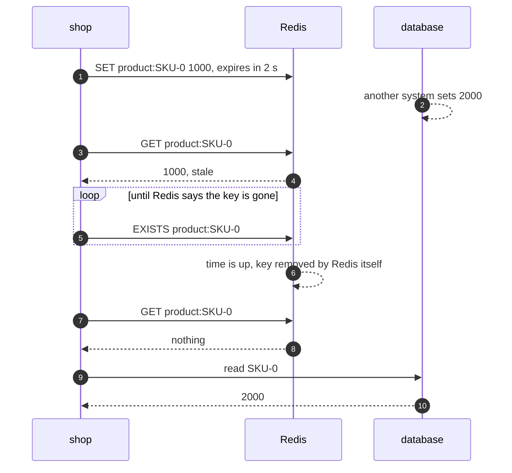
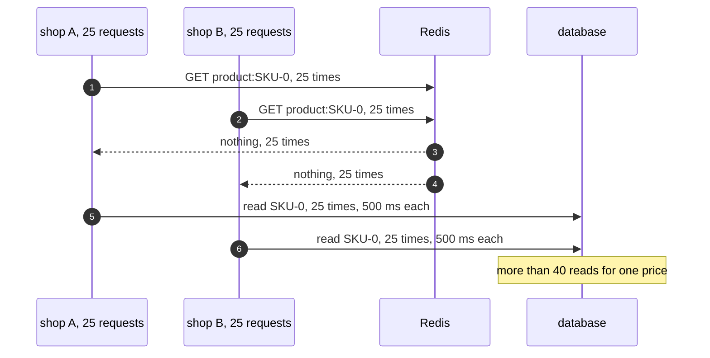
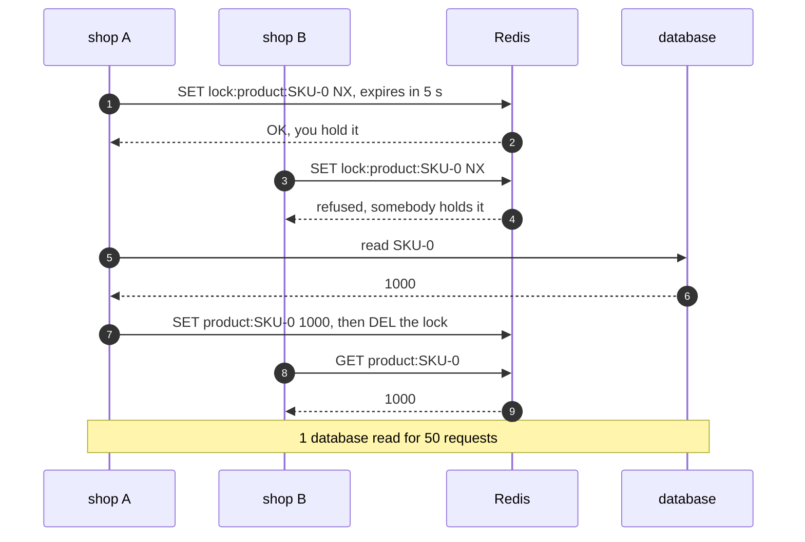

# Cache-Aside with Redis Pattern — UML Sequence Diagrams

Four sequences. The plain write comes first, because it is the headline find and the one thing a cache with a hand-moved clock could never show.

## 1. A Plain Write Switches The Expiry Off

A price-sync job writes SKU-0 back with a plain SET. Redis treats it as a new value with no expiry, and throws the old expiry away. The price changes in the database, and the stale entry never goes.

Mermaid source

## 2. Real Expiry

The entry is given 2 seconds. The price changes underneath it. Nobody deletes the key; Redis removes it on its own clock, and the next read fetches the new price.

Mermaid source

## 3. A Real Stampede

Fifty requests across two shop instances ask for SKU-0 just after it went. The database takes 500 milliseconds, so every request misses before any refill lands: more than 40 database reads for one price.

Mermaid source

## 4. A Lock Kept In Redis

The same fifty requests. Each one that misses tries to set a lock key with NX. Exactly one wins and reads the database; the rest, in both instances, wait for the price to appear in Redis. One database read.

Mermaid source

