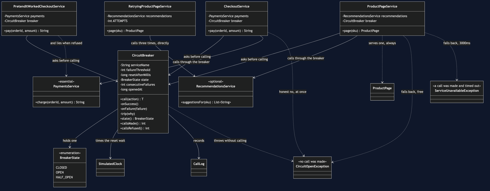

# Circuit Breaker

**In plain words:** count the failures. Once a service has failed enough times in a
row, stop calling it altogether for a while and fail instantly instead — then let
one call through later to see whether it has recovered.

**Everyday analogy:** the fuse box in a house, which is where this pattern gets both
its name and its three states. When something is badly wrong the fuse trips, and it
*stays* tripped. The point is not to punish the appliance; it is to stop the fault
setting the house on fire. Later somebody flips the switch back on to see whether
the problem has gone. If it has, everything runs. If it has not, it trips again
straight away.

**One piece of vocabulary, and it reads backwards:** *closed* is the healthy state.
A closed circuit is one where current flows, so calls go through. An **open** circuit
breaker is the broken-looking one.

In the shop, Recommendations has stopped answering. It does not fail quickly — every
call takes the full three-second timeout before giving up. So the product page is
three seconds slower for a feature nobody would miss, and for those three seconds a
thread that checkout needs is sitting idle waiting for an answer that is not coming.

## Retry is the wrong tool here

```
      0ms ->  3000ms  Recommendations  TIMEOUT   no answer in 3000ms
   3000ms ->  6000ms  Recommendations  TIMEOUT   no answer in 3000ms
   6000ms ->  9000ms  Recommendations  TIMEOUT   no answer in 3000ms
  the shopper waited 9000ms for a page with nothing extra on it,
  and a service that is already down received 3 more calls.
```

Nine seconds, and three times the traffic aimed at a service that is already on its
knees. Ten shoppers make that ninety seconds and thirty calls — a test asserts both
numbers.

**The question that separates the two patterns:** *is the next attempt plausibly
going to work?* For a dropped connection, yes — retry. For a service that has failed
the last twenty calls, no — break.

## What the breaker does instead

```
      0ms ->  3000ms  Recommendations  TIMEOUT   no answer in 3000ms
   3000ms ->  6000ms  Recommendations  TIMEOUT   no answer in 3000ms
   6000ms ->  9000ms  Recommendations  TIMEOUT   no answer in 3000ms
   9000ms ->  9000ms  Recommendations  OPENED    3 failures in a row, not calling for 5000ms
   9000ms ->  9000ms  Recommendations  REFUSED   circuit open, no call made
   9000ms ->  9000ms  ProductPage      DEGRADED  page served without suggestions, no call made
  6 pages served, every one of them buyable, none with suggestions
  3 calls reached Recommendations, 3 were refused without a call
  total time 9000ms
```

Read the timestamps on the last few lines: they do not move. Once the breaker is
open, a page costs nothing to serve. The first three shoppers paid for the outage
and everybody after them got their page instantly. A test takes this further — twenty
more pages after the trip, and the clock does not advance by a single millisecond.

Note also the word *consecutive* in the rule. One success resets the count, because a
service that answers three times and fails once is not down; it is a service having
a bad moment, and retry already handles that.

## Recovering without anybody deploying anything

```
   9000ms ->  9000ms  Recommendations  REFUSED   circuit open, no call made
  14000ms -> 14000ms  Recommendations  HALF-OPEN letting one call through to test
  14000ms -> 14020ms  Recommendations  OK        [SKU-2001, SKU-2002]
  14020ms -> 14020ms  Recommendations  CLOSED    the probe worked, calls resume
  state: CLOSED -- nobody deployed anything to make that happen.
```

Five seconds after tripping, exactly one call is let through. That is the
**half-open** state: the fuse being flipped back to see what happens. If the probe
works, the breaker closes and normal service resumes. If it fails, the breaker opens
again for another full wait — and one failed probe is enough, it does not need to
reach the threshold a second time.

## The half everybody skips: what to do while it is open

A breaker is not a device for making failures disappear. It is a device for failing
**quickly**. What that speed buys you differs completely by dependency, and this
project shows both.

**Recommendations — hide it, and say so.** The page goes out with no suggestions and
a `degraded` flag set. That flag matters: it means nobody has to guess later whether
an empty list meant "we had none" or "the service was down".

**Payments — refuse, and say so.**

```
   9000ms ->  9000ms  Payments         REFUSED   circuit open, no call made
   9000ms ->  9000ms  Checkout         HONEST-NO told the shopper at once, card untouched
  5 shoppers were told honestly that we cannot take payment
  0 cards were charged
```

There is no substitute for taking the money, so there is no fallback to buy here.
What the breaker buys instead is a clear message in a hundredth of a second rather
than a spinner for three seconds — and it stops a thousand shoppers each spending
three seconds discovering the same outage, with a thousand blocked threads between
them.

### The fallback that must never be written

```
   3000ms ->  3000ms  Checkout         PRETENDED returned a receipt for money that never moved
  the shopper was shown receipt chg-assumed-ok and thanked
  cards actually charged: 0
```

`PretendItWorkedCheckoutService` is built exactly like `CheckoutService` and differs
in one respect: when Payments cannot be reached it returns a made-up receipt. Every
dashboard goes green, the shopper is thanked, no exception is thrown, no alert fires,
and the warehouse ships an espresso machine nobody paid for.

It exists because "add a fallback" is the advice that comes attached to this pattern,
and it is only good advice when there is something *true* to fall back to. An empty
list of suggestions is true. A receipt for money that never moved is not. **A
fallback that hides a real failure is worse than the error it replaced** — the error
would have been noticed in seconds; this will be noticed at the end of the month.

## The honest cost

A breaker adds state, tuning, and a new way to be wrong. Too sensitive and it opens
on a blip, cutting off a service that was fine. Too slow and it never opens at all,
so you have the complexity and none of the protection. And it forces you to answer
"what do we do while it is open?" for every single dependency — which is real design
work, not configuration.

## Run it

```bash
./gradlew run     # five acts
./gradlew test    # 26 tests
```

## The tests are the proof

- `CircuitBreakerTest` — the three states and every transition between them,
  including that it stays open right up to the last millisecond of the wait, that a
  failed probe restarts the wait from the probe rather than the original trip, and
  that one success resets the failure count.
- `FallbackChoiceTest` — twenty pages after the trip cost zero milliseconds and zero
  calls; ten pages cost three timeouts, not ten; checkout refuses with the basket
  intact and no card charged; and the lying fallback is pinned by a **passing** test
  asserting that the shopper was thanked and charged nothing.
- `RetryingProductPageServiceTest` — nine seconds for one page, ninety for ten, and
  a side-by-side assertion against the breaker's nine and three.
- `DemoRunsTest` — the demo is teaching material, so a test keeps it working.

No test sleeps. Three-second timeouts and five-second waits cost nothing, because
`SimulatedClock` only moves when something moves it.

## One JVM, no infrastructure

No Resilience4j, no Hystrix, no network, no Docker. The breaker is about a hundred
lines and you can read all of it. Everything you need is a JDK.

## Where this sits

Retry (the previous project) handles a blip; this handles an outage. They are
complements, not rivals, and the usual production arrangement is both — a retry
inside a breaker, so a dropped connection is retried and a dead service is left
alone. The pattern after this one, the bulkhead, attacks the same problem from the
other end: instead of refusing to call the broken thing, it makes sure the threads
waiting on it were never the threads checkout needed.

## Learning Material

| Document | What it covers |
| --- | --- |
| [`docs/problem-statement.md`](docs/problem-statement.md) | A service that stopped answering, and the retry loop that turns a broken feature into a nine-second page |
| [`docs/circuit-breaker-pattern-explained.md`](docs/circuit-breaker-pattern-explained.md) | The pattern from a fuse box, the vocabulary that reads backwards, and the half that gets left out |
| [`docs/class-diagram.md`](docs/class-diagram.md) | The structure, and the arrows that are missing — the breaker has never heard of shopping |
| [`docs/uml-diagram.md`](docs/uml-diagram.md) | The state machine, then all five acts as sequences |
| [`docs/animation.html`](docs/animation.html) | The three states, the refusals and the probe, one step at a time, in a browser |
| [`docs/prerequisites.md`](docs/prerequisites.md) | What you need to know, what you explicitly do not, and 60-second primers on the states and on fallbacks |
| [`docs/session.md`](docs/session.md) | A one-hour taught session with exercises |
| [`docs/spec.md`](docs/spec.md) | The generated specification, with measured test counts and timings |
| [`docs/youtube.md`](docs/youtube.md) | Title, description and chapters for the video |
| [`video/README.md`](video/README.md) | The video pipeline, the scene list, and how to rebuild it |

### The pattern in one picture



### Video

The narrated walkthrough is built from [`video/scenes.py`](video/scenes.py) by
[`video/build_video.sh`](video/build_video.sh). It runs about eighteen minutes
across sixteen scenes, and the rendered file is not committed — see the
repository README for why — so producing it takes about ten minutes on macOS.
