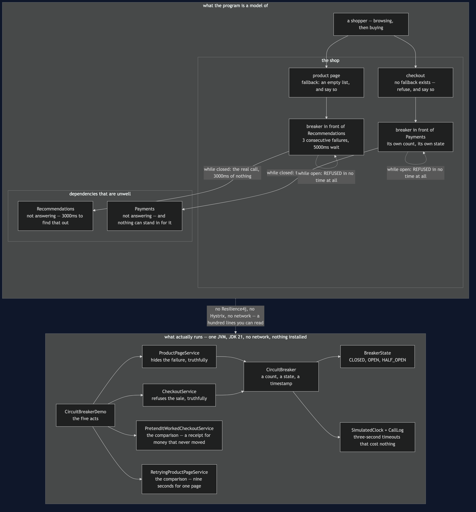
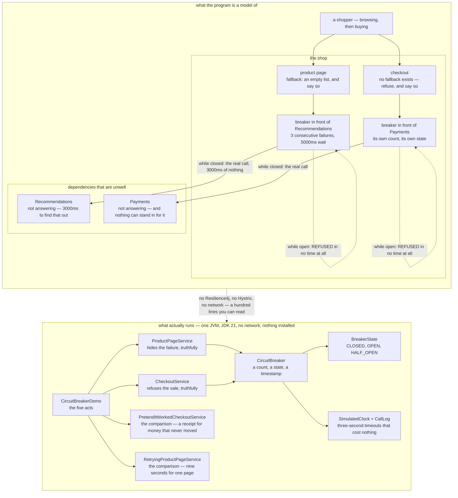

# Circuit Breaker — Architecture Diagram

Where each piece of this project sits, and — because this project starts nothing — what
each piece *stands for*. The class diagram shows the types and the state machine shows the
transitions; this one answers the question those two cannot, which is **where the breaker
is placed, how many of them there are, and what each one is protecting**.

Read the picture as two halves stacked. The upper half is what the program is a model of:
a shop with two dependencies that are both unwell, and a breaker in front of each. The
lower half is the literal truth — one Java program, about a hundred lines of breaker, and a
clock that only moves when something moves it.

The most important thing in the upper half is that there are **two breakers, not one**. A
breaker is per dependency, because the failure counts are per dependency and — much more
importantly — because the question "what do we do while it is open?" has a completely
different answer for each. Recommendations gets hidden. Payments gets refused. One shared
breaker could not tell those apart.

The second thing to look for is what sits *beside* each breaker rather than behind it. The
fallback is not part of the breaker; it is the caller's decision about what a fast failure
should become. `ProductPageService` turns a refusal into an empty list of suggestions and a
`degraded` flag. `CheckoutService` turns it into an honest "we cannot take payment right
now". Both are correct, and neither could have been written by the breaker.

Mermaid source

## What the diagram is telling you to count

**Two breakers, two answers, and that is the design work.** A breaker is a device for
failing quickly, not for making failures disappear. What the speed buys you is entirely
different on the two paths: for the product page it buys a page that is still worth
looking at; for checkout it buys a clear answer in a hundredth of a second rather than a
spinner for three.

**The dotted self-loops are where the saving is.** While the breaker is open the arrow
never reaches the dependency at all. That is why the demo's timestamps stop moving after
9000ms: three shoppers paid for the outage, and everybody after them got a page instantly.
A test pushes this to twenty more pages and asserts the clock does not advance by a single
millisecond.

**`CircuitBreaker` has no arrow to anything shop-shaped.** It counts consecutive failures,
watches a clock and returns one of three states. It has never heard of recommendations,
pages or money — which is why one class serves both paths without a flag distinguishing
them.

**`PretendItWorkedCheckoutService` is in the picture on purpose.** It is built exactly like
`CheckoutService` and differs in one respect: it invents a receipt when Payments cannot be
reached. Every dashboard goes green and the warehouse ships an espresso machine nobody paid
for. It is drawn here because "add a fallback" is the advice that comes attached to this
pattern, and it is only good advice when there is something *true* to fall back to.

## What it deliberately leaves out

There is no bulkhead. This picture attacks the problem by refusing to call the broken
thing; the next pattern along, [Bulkhead](../bulkhead-pattern), attacks it from the other
end by making sure the threads waiting on Recommendations were never the threads checkout
needed. Both are usually present in a real system.

There is no retry inside the breaker either, though that is the usual production
arrangement: a dropped connection deserves a second attempt, a service that has failed its
last twenty calls does not. [Retry](../retry-pattern) is the previous project, and the two
compose rather than compete.

And the thresholds are drawn as if they were obvious. They are not. Too sensitive and the
breaker opens on a blip, cutting off a service that was fine; too slow and it never opens,
so you carry the complexity and get none of the protection. That tuning is real work and no
diagram can do it for you.
