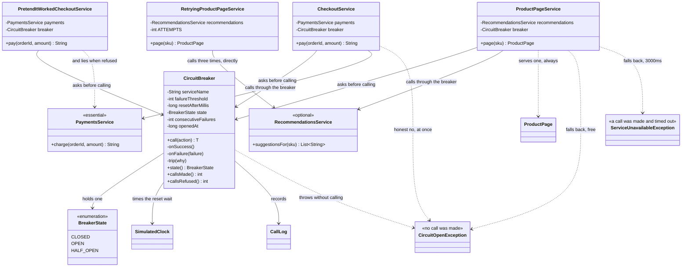

# Circuit Breaker — Class Diagram

Mermaid source

## What the arrows are saying

**Two callers share one class, and differ only in what they do when refused.**
`ProductPageService` and `CheckoutService` have identical wiring: a dependency, a
breaker, and a `catch`. The entire difference between them lives in the catch block —
one serves a page without suggestions, the other says plainly that it cannot take
payment. That is the pattern's real shape, and it is why the breaker holds no
fallback of its own.

**`CircuitBreaker` has no arrow to `ProductPage`, to `Money`, or to either service
interface.** It takes a `Supplier` and runs it. It has never heard of shopping. That
generality is what makes one class serve both callers — and it is also why the class
is structurally incapable of stopping you writing a fallback that lies.

**The two exception types mean genuinely different things, and the cost is the
difference.** `ServiceUnavailableException` means a call was made and three seconds
went by before it failed. `CircuitOpenException` means **no call was made at all** and
the answer arrived instantly. `ProductPageService` catches both and treats them the
same way from the shopper's point of view, which is the point: the fallback is
identical, the price is not.

**`CircuitBreaker` points at `SimulatedClock`, and that is the half-open mechanism.**
Nothing schedules anything, and no background thread wakes up to retry. The breaker
simply compares the current time against when it tripped, on the next call that
happens to arrive. Recovery is discovered by ordinary traffic, which is why it costs
nothing when there is no traffic.

**`RetryingProductPageService` has no arrow to `CircuitBreaker` at all.** It sits
beside the pattern rather than inside it, calling Recommendations directly, three
times. It is kept in the project on purpose so the comparison is something you can
run rather than something a document asserts — and its five tests all pass.

**`PretendItWorkedCheckoutService` has the same three arrows as `CheckoutService`.**
Structurally the two classes are indistinguishable. The difference is one `catch`
block that returns a made-up receipt instead of throwing, and no diagram can show you
which of those two is the right one. That judgement belongs to whoever knows what the
dependency is *for*.

**The services are marked with what they mean to the shop, not with what they
extend.** `<<optional>>` and `<<essential>>` are the only classification here, and
they are the whole basis for choosing a fallback. Suggestions are optional, so an
empty list is true. Payment is essential, so there is nothing true to substitute.
