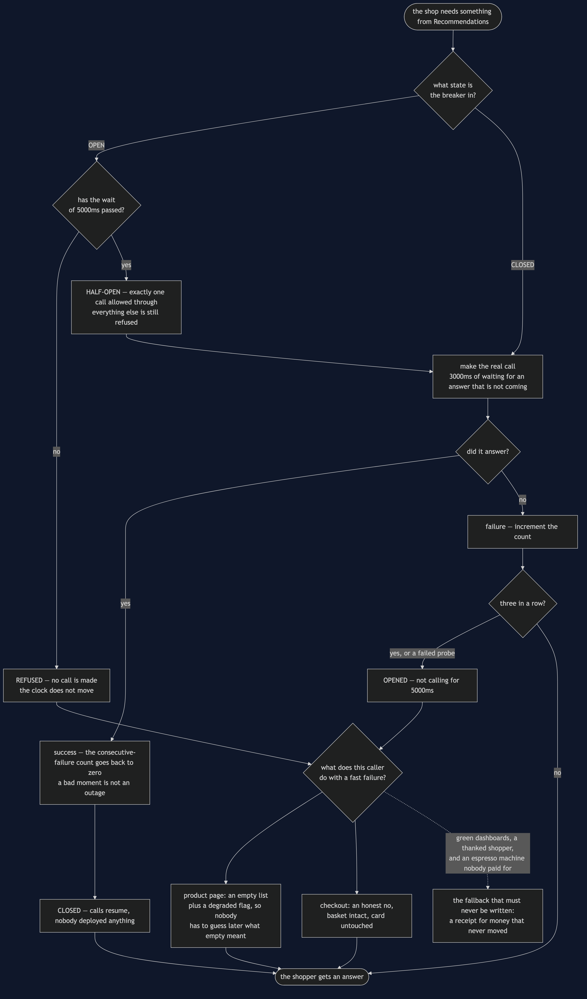
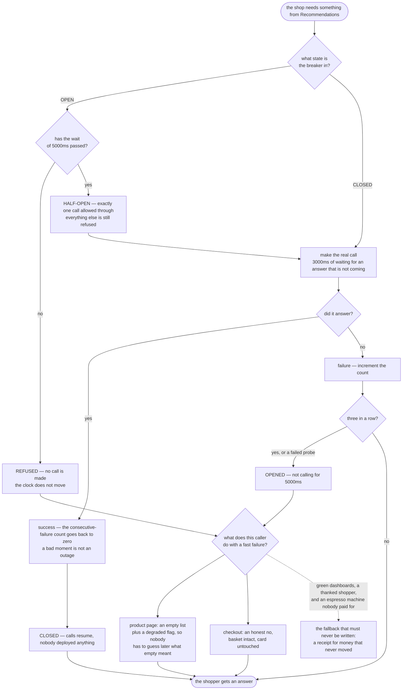

# Circuit Breaker — Data Flow Diagram

One request, followed from the moment the shop wants something from an unwell dependency
to the moment the shopper gets an answer. The architecture diagram says where the breakers
sit; the state machine says how the states change; this one says **what happens on a single
call, and which of the paths through it cost time**.

The picture is built around one fork, at the top: *is the breaker open right now?* Almost
everything worth understanding about the pattern follows from how cheap the right-hand side
of that fork is. A refusal costs nothing — no connection, no timeout, no waiting thread —
and because it costs nothing, the shop can serve an unlimited number of shoppers during an
outage at no charge.

The second thing to follow is the path from a refusal to an answer. The breaker produces a
`REFUSED`, and then the **caller** decides what that becomes. There is no arrow from the
breaker to the shopper anywhere in this diagram, and that absence is the half of the
pattern people leave out.

Mermaid source

## What the picture is telling you

**The refusal path contains no call and no clock.** Follow it: state is open, the wait has
not elapsed, refuse, decide, done. Nothing in that sequence touches the network or advances
time. That is the whole saving, and it is why the demo's timestamps freeze at 9000ms while
six pages go out.

**One success wipes the count.** The rule is *three consecutive* failures, and the reset
box is there because it changes what the pattern means. A service that answers three times
and fails once is not down; it is having a bad moment, and [Retry](../retry-pattern)
already handles that. Without the reset a breaker would trip on ordinary noise.

**One failed probe is enough to re-open.** The half-open path does not need to reach the
threshold a second time — a single failure sends it straight back to open for a full fresh
wait, timed from the probe rather than from the original trip. There is a test for exactly
that, because the alternative lets three more shoppers pay for the outage every cycle.

**The fork at the bottom is the design work.** Two of the three branches are honest. The
page says "no suggestions, and I am telling you I am degraded". Checkout says "we cannot
take payment". The third invents a receipt, throws no exception, fires no alert, and is
pinned in this project by a **passing** test asserting that the shopper was thanked and
charged nothing — because that is what a bug of this kind looks like from the inside.

## The same request with retry instead

Replace the breaker with a retry loop and the diagram loses its left-hand branch entirely.
Every request goes all the way to the dependency, three times, at three seconds each: nine
seconds for one product page with nothing extra on it, and three more calls aimed at a
service that is already on its knees. Ten shoppers make that ninety seconds and thirty
calls, and both numbers are asserted by tests.

The question that separates the two patterns is worth saying in one line: **is the next
attempt plausibly going to work?** For a dropped connection, yes — retry. For a service
that has failed the last twenty calls, no — break. Real systems use both, one inside the
other.
