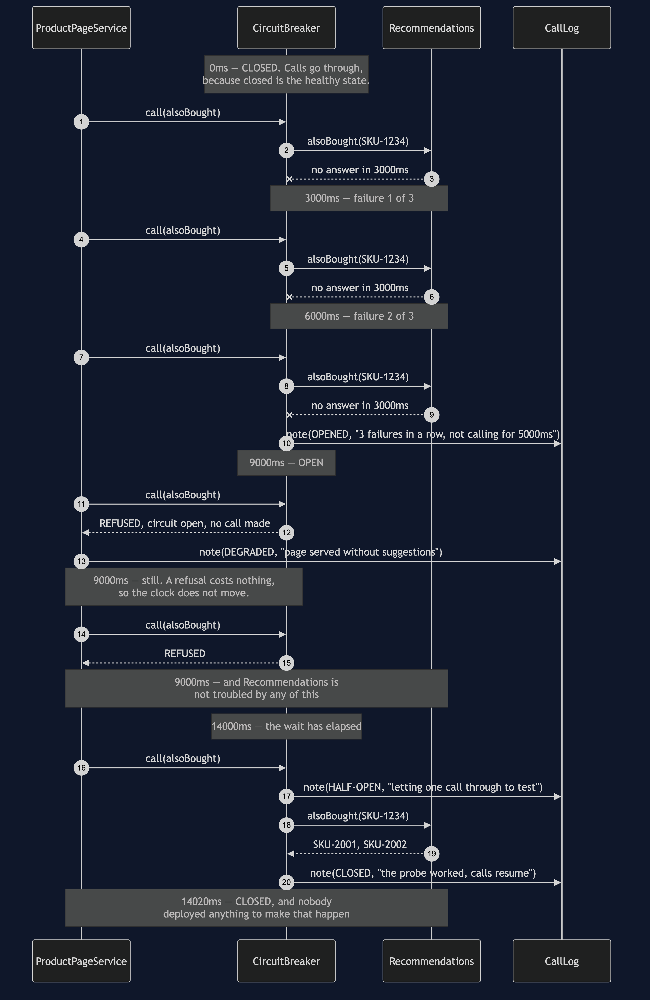
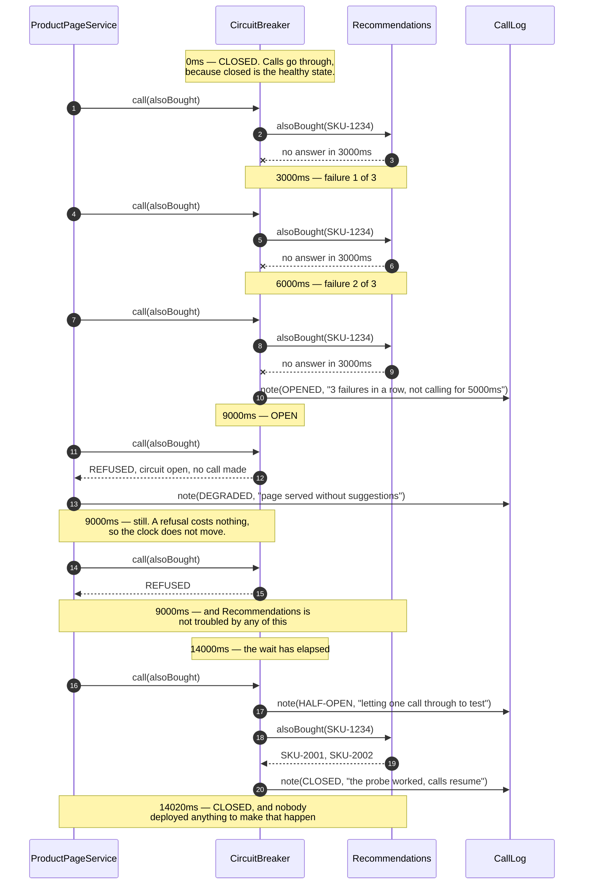

# Circuit Breaker — Sequence Diagram

The one sequence worth having in your head before the others make sense: three shoppers
pay for an outage, the breaker trips, everybody after them gets a page instantly — and five
seconds later the shop lets itself back in without anybody deploying anything.

[`uml-diagram.md`](uml-diagram.md) holds the full set: the state machine and all five acts.
This document takes the trip and the recovery together, because they are one story and
separating them is how people end up building a breaker that opens and never closes.

The clock runs in the notes, and every figure is one the demo prints. Watch it in three
phases. Between 0ms and 9000ms it moves in three-second jumps, and that is the outage being
paid for. Between 9000ms and 9000ms it does not move at all, and that is the pattern
working. At 14000ms it moves once more, deliberately, to ask a question.

Mermaid source

## Reading the timings

**Nine seconds is the bill, and it is paid once.** Three shoppers waited three seconds each
for a feature nobody would miss. Everybody after them got a page in no time at all. A
breaker cannot prevent the first failures — it has to see them to know anything — so the
cost of an outage under this pattern is bounded by the threshold rather than by the number
of shoppers.

**The timestamps between the trip and the probe are identical.** That is not a drawing
convention, it is the point. `REFUSED` involves no connection, no timeout and no waiting
thread, so serving a degraded page during an outage is free. A test takes this further:
twenty more pages after the trip, zero milliseconds, zero calls.

**Recommendations receives nothing during the open window.** Look for arrows to it between
9000ms and 14000ms; there are none. That protects the shop, and it also protects the
dependency — a service that is struggling does not recover faster for being asked more
often, which is exactly the mistake the retry version makes.

**The probe at 14000ms is a real call with a real cost.** Twenty milliseconds, in this
case, because the service had recovered. Had it failed, the breaker would have gone
straight back to open for another full 5000ms — timed from the probe, not from the original
trip, and without needing three failures again. One is enough.

**Nothing in this sequence involves a human.** No deployment, no toggle, no runbook. The
breaker closed itself because it asked a question and liked the answer, and that
self-healing is most of why the pattern is worth its complexity.

## What changes on the checkout path

Replace the product page with checkout and the top of the diagram is identical — three
timeouts, a trip, then refusals that cost nothing. What changes is the last step. There is
no substitute for taking the money, so there is no empty list to return. `CheckoutService`
tells the shopper at once that the shop cannot take payment, leaves the basket intact and
the card untouched, and five shoppers get that answer in a hundredth of a second rather
than a spinner for three.

Replace it with `PretendItWorkedCheckoutService` and the sequence ends with `PRETENDED — a
receipt for money that never moved`. No exception, no alert, a thanked shopper and a green
dashboard. The error it replaced would have been noticed in seconds; this will be noticed
at the end of the month.
