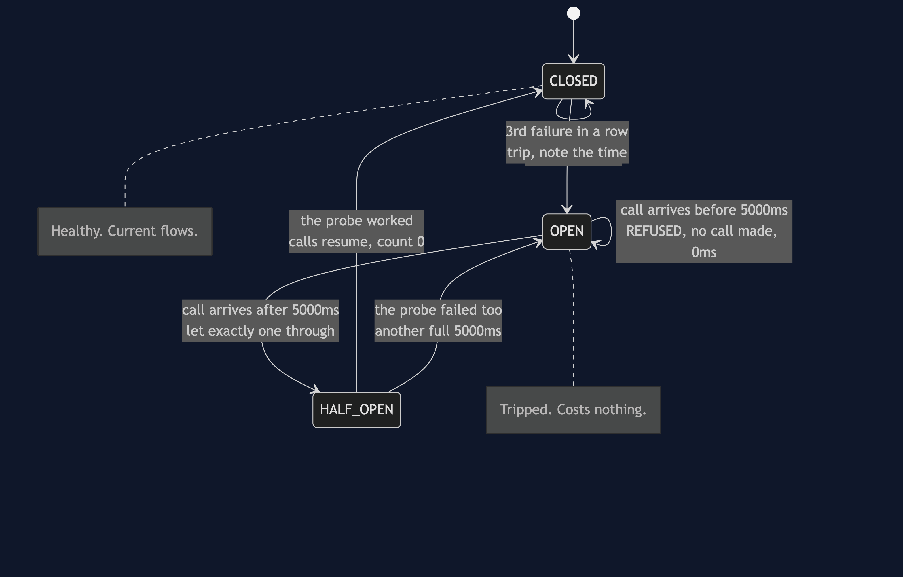
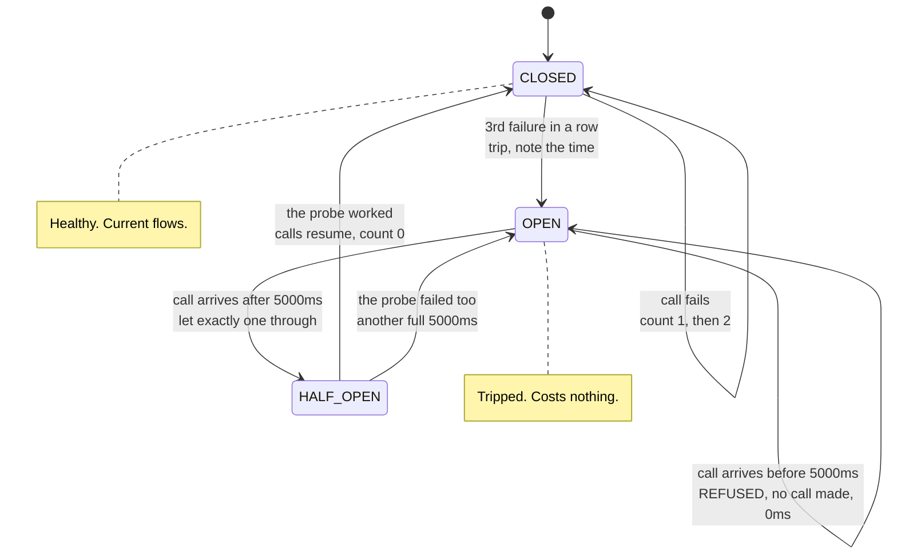
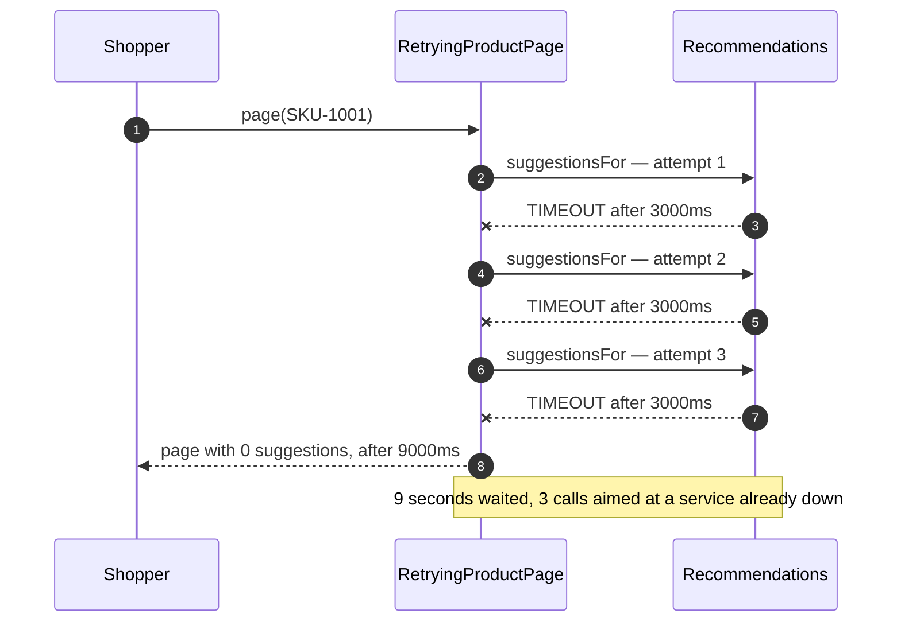
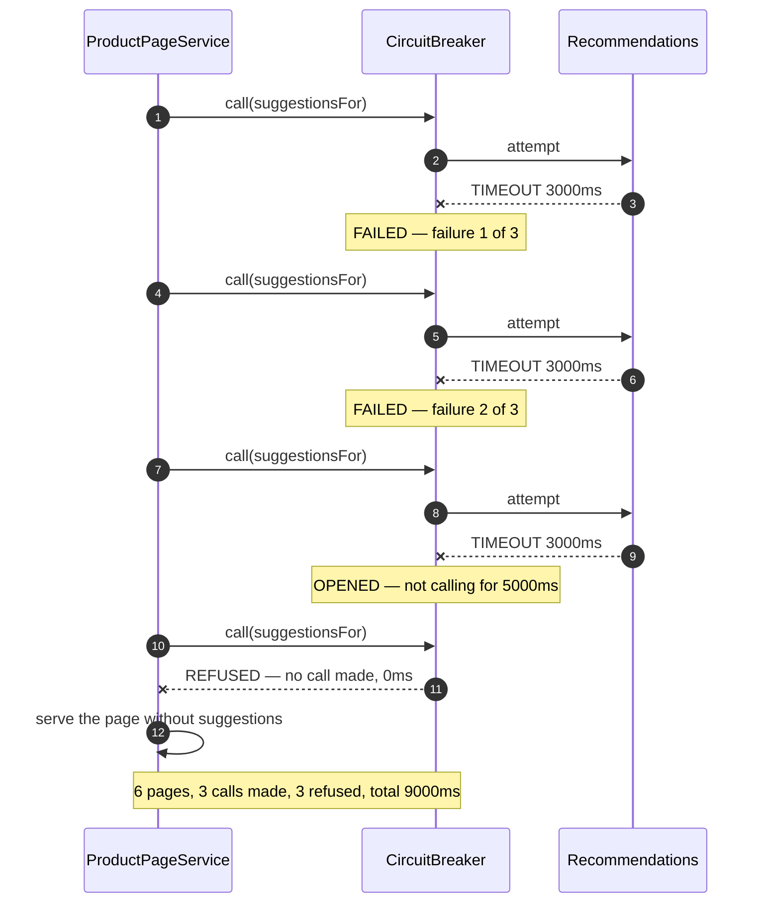
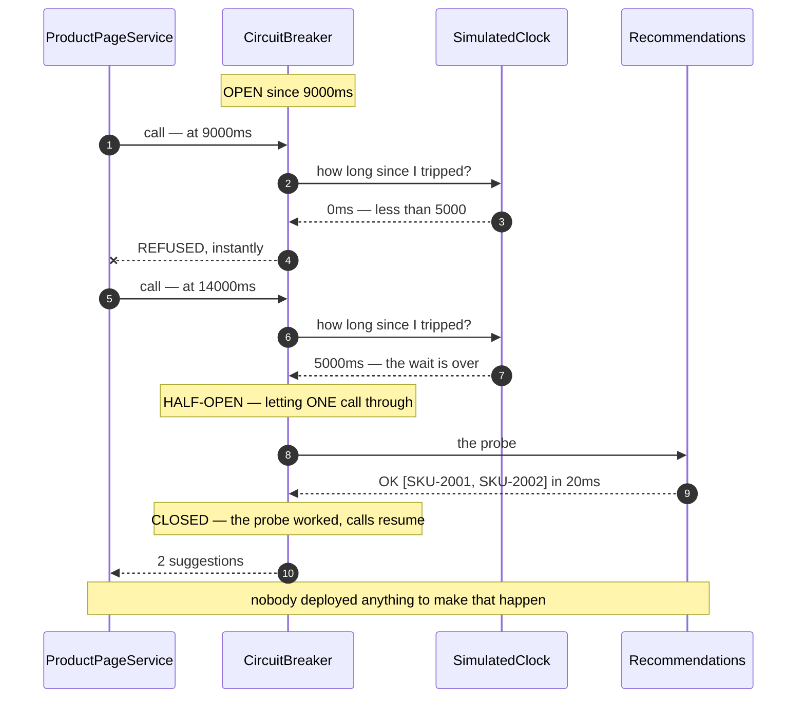
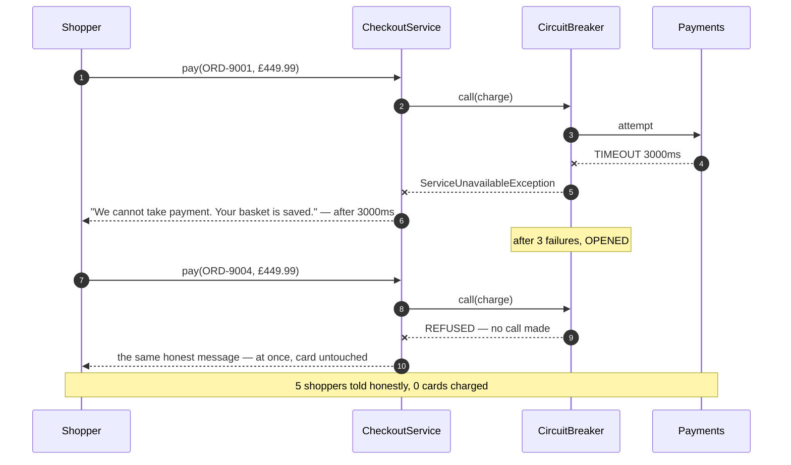
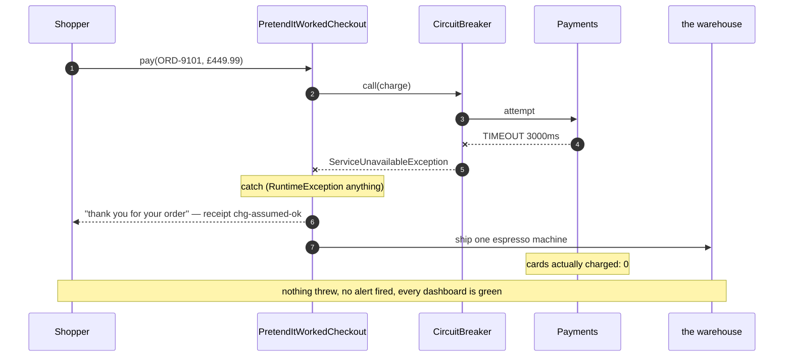

# Circuit Breaker — UML Sequence Diagrams

Six sequences over the same outage. Recommendations has stopped answering, and every
call to it takes the full three-second timeout before giving up.

Throughout: the threshold is **three consecutive failures**, the reset wait is
**5000ms**, and one failed call costs **3000ms**. Every number below comes out of
`./gradlew run`.

## The State Machine

Mermaid source

Three states, four transitions worth remembering, and one word that matters:
**consecutive**. A success in the closed state does not merely fail to increment the
count, it resets it to zero. A service that answers three times and fails once is not
down.

## Act One: Retry, Applied To An Outage

The page the shopper eventually receives is identical to the page they would have got
at zero seconds. Every one of those nine seconds bought nothing, and a service on its
knees received three times the traffic for the privilege.

Ten shoppers make that ninety seconds and thirty calls. A test asserts both numbers.

## Act Two: Six Pages, With A Breaker

Read the clock rather than the arrows. The first three pages cost three seconds each;
the last three cost nothing at all, because no call left the building.

That is the trade this pattern makes, stated honestly: it does not protect the people
who discover the outage. It protects everybody after them.

## Act Three: It Lets Itself Back In

There is no scheduler here and no background thread. The breaker compares the clock
against the moment it tripped, on whatever call happens to arrive next — which is why
recovery costs nothing at all when there is no traffic.

And note how cheap the probe is. **One** call. Had Recommendations still been down,
that single shopper would have waited three seconds, the breaker would have reopened
for another full five, and everybody else would have carried on being served
instantly.

## Act Four: Checkout, Where There Is No Fallback

There is nothing a shop can substitute for taking the money, so the breaker buys no
fallback here. What it buys instead is **a fast, honest "no" rather than a spinner** —
and, less visibly but more importantly, it stops a thousand shoppers each holding a
thread open for three seconds while they discover the same outage.

Compare the two messages. Both say the same thing. One arrives after three seconds,
the other in a hundredth of a second. That difference is the entire value of the
pattern on a dependency that has no fallback.

## Act Five: The Fallback That Lies

This class is wired identically to the honest one. The difference is a single `catch`
block that returns a made-up receipt instead of throwing.

The distinction to take away is not "fallbacks are bad" — the product page's fallback
is excellent. It is this: **an empty list of suggestions is true.** The shop really
does have no suggestions to show. **A receipt for money that never moved is not
true.** A fallback that hides a real failure is worse than the error it replaced,
because the error would have been noticed in seconds, and this will be noticed at the
end of the month.

## Notes

- All five acts use the *same* `CircuitBreaker` class with the same threshold and the
  same reset wait. Nothing about the breaker changes between them. What changes is
  the caller's `catch` block, which is the only place the pattern leaves a decision.
- `CircuitBreaker` runs a `Supplier<T>` and has never heard of product pages, money
  or shopping. That is what lets one class serve all four callers, and it is also why
  it cannot possibly warn you that act five is lying.
- Every millisecond here comes from `SimulatedClock`, which moves only when a service
  or the breaker moves it. The five-second reset wait costs no real time, so the whole
  suite of 26 tests finishes in about a second and every number is exact rather than
  approximately reproducible.
- `CallLog` keeps the timeline — who called whom, when, and what happened — which is
  what makes the timestamps in act two readable as an argument rather than as noise.
