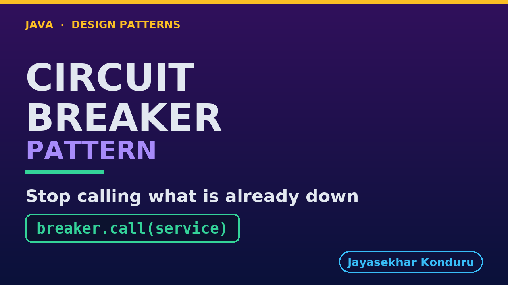

# YouTube — Circuit Breaker Pattern

Everything needed to publish `video/circuit-breaker-pattern-explained.mp4`. Copy the fields straight out of this file.

Chapter timings are generated from the video's `.srt`. Re-run `python3 docs/make_youtube_docs.py circuit-breaker` after any change to the narration, or they will be wrong.

## Title

```
Circuit Breaker in Java - When a Service Stops
```

46 characters — under the 60 YouTube shows before truncating in search results.

## Description

The first two lines are what a viewer sees above the fold, so they carry the hook rather than the boilerplate.

```
Learn the circuit breaker pattern in Java 21, starting from a service that has stopped answering — not refusing, which would be easy, but simply not replying. The retry loop is presented fairly: no bug, the right page, every test passing, and nine seconds spent producing a page you could have had immediately. The third cost is the one that actually breaks the shop: while those threads wait, checkout cannot get one. We use a fuse box as the analogy and then build the breaker as three questions inside one method, with the states named as a wire rather than a door — closed, open, half open — and a success that resets rather than decrements. Six pages, three calls, three refusals, and the clock stops moving. Then the hinge: a breaker makes failures fast, not invisible. Checkout has no fallback, so speed buys it a fast honest no, and the same wiring with one different catch block prints a receipt for money that never moved.

CHAPTERS
00:00 Introduction
01:11 The Scenario
02:19 The Obvious Answer — Just Try Again
03:09 Act One — Retry, Applied To An Outage
04:01 Three Costs — And The Third Closes The Shop
05:03 The Fuse Box
06:02 One Word That Reads Backwards
06:56 The Whole Decision, In One Method
08:04 Act Two — Six Pages, With A Breaker
09:33 The Pieces, And What Each One Decides
11:09 Act Three — It Lets Itself Back In
12:18 Now The Half That Gets Left Out
13:16 Act Four — Checkout, Where There Is No Fallback
14:23 Act Five — The Fallback That Lies
15:35 What It Costs, And When Not To
16:45 Thanks for Watching

SOURCE CODE, WRITTEN NOTES AND AN INTERACTIVE ANIMATION
https://github.com/jk-boot-up/java-design-patterns/tree/main/gradle-java/micro-services-design-patterns/circuit-breaker-pattern

WHAT YOU NEED FIRST
Java 21 and a working knowledge of classes and interfaces. No prior design-pattern knowledge is assumed. The full prerequisites are in docs/prerequisites.md in the repository.
```

## Chapters

YouTube renders these as chapters only if there are at least three and the first is at `00:00`.

```
00:00 Introduction
01:11 The Scenario
02:19 The Obvious Answer — Just Try Again
03:09 Act One — Retry, Applied To An Outage
04:01 Three Costs — And The Third Closes The Shop
05:03 The Fuse Box
06:02 One Word That Reads Backwards
06:56 The Whole Decision, In One Method
08:04 Act Two — Six Pages, With A Breaker
09:33 The Pieces, And What Each One Decides
11:09 Act Three — It Lets Itself Back In
12:18 Now The Half That Gets Left Out
13:16 Act Four — Checkout, Where There Is No Fallback
14:23 Act Five — The Fallback That Lies
15:35 What It Costs, And When Not To
16:45 Thanks for Watching
```

## Tags

```
circuit breaker pattern, resilience4j, fault tolerance java, design patterns, java design patterns, gang of four, java 21, software design, clean code, object oriented design, java tutorial, ecommerce, programming tutorial
```

222 characters, under YouTube's 500 limit.

## Thumbnail



**Upload `docs/thumbnail.png`** — 1280×720, the size YouTube recommends, generated by `docs/make_thumbnails.py`. It is deliberately not the same image as the video's opening frame: a thumbnail is judged at about 360 pixels wide in a search result, so this one carries only the pattern name, one line of promise and one short piece of code, each set large enough to survive the shrink.

`video/poster.png` is the 1920×1080 opening frame, produced by the video build. It stays in the repository as the title card; it is not what gets uploaded.

YouTube will not pick the thumbnail up on its own — upload it under **Details → Thumbnail → Upload file**. A custom thumbnail requires a verified channel.

## Upload checklist

- [ ] Upload `video/circuit-breaker-pattern-explained.mp4` (1080p, H.264, 30 fps, AAC 48 kHz — already YouTube's recommended settings, no re-encode needed)
- [ ] Set the video language to **English** first, or the subtitle option may not appear
- [ ] Add subtitles: *Video elements → Add subtitles → Upload file → With timing* → `video/circuit-breaker-pattern-explained.srt`
- [ ] Upload `docs/thumbnail.png` as the thumbnail — do not let YouTube auto-pick a frame
- [ ] Paste the title, description and tags from above
- [ ] Add to the **Java Design Patterns** playlist, in learning order
- [ ] Wait for 1080p processing before sharing the link — code slides are unreadable at 360p

## Cards and end screen

End screen links to whichever pattern video goes up next — set it at upload time rather than assuming an order.

Add a card partway through pointing at the playlist, so a viewer who arrives at this pattern from search can find the rest of the series.

## Runtime

Approximately 18:05, narrated at 145 words per minute.
