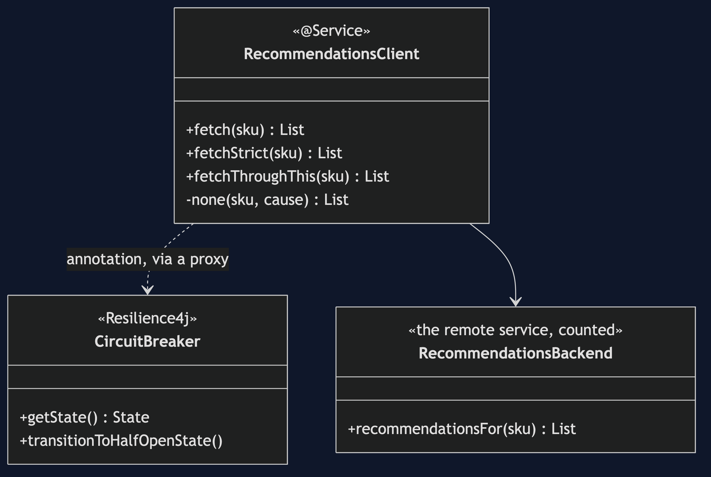
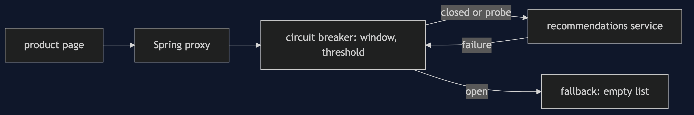
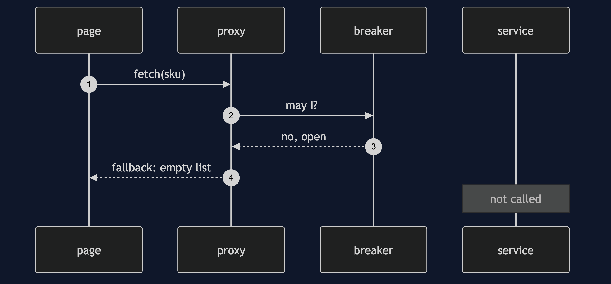
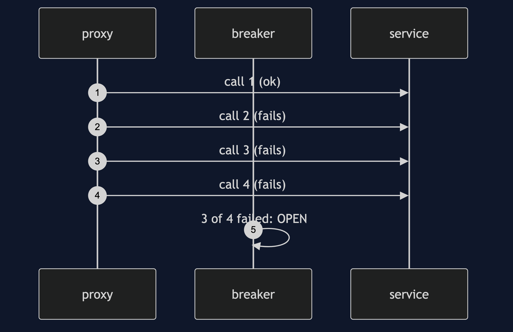
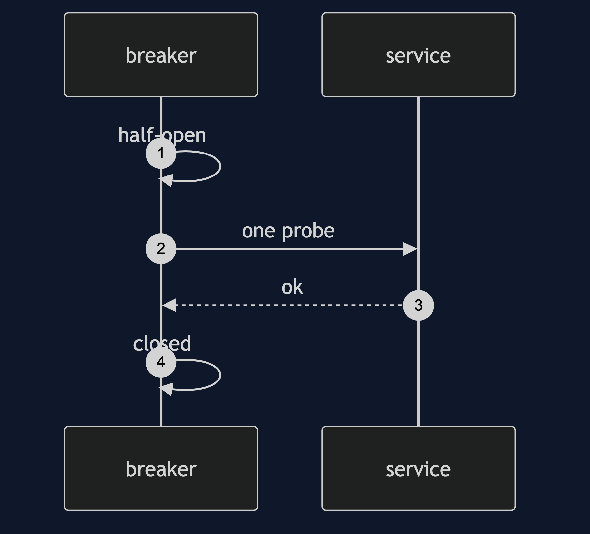

# Circuit Breaker with Resilience4j Pattern

```
src/main/java/com/jk/explore/circuitbreakerr4j/
├── RecommendationsApplication.java   the Spring Boot entry point and the six acts
├── RecommendationsClient.java        the annotated methods, and the fallback
├── RecommendationsBackend.java       the remote service, in memory, counted
└── BackendDown.java
src/main/resources/application.properties   the breaker's numbers
```

**In Resilience4j a breaker is an annotation and a few numbers. The state machine is the same as the partner's, and it can be bypassed like any proxy.**

This project is the framework version of [Circuit Breaker](../circuit-breaker-pattern). That project built the mechanism by hand. This one shows the same idea inside Resilience4j. It does not re-teach the pattern. It shows what Resilience4j adds, the failures that are its own, and what it costs.

## Run

```bash
./gradlew run
```

Six acts. The partner project, Circuit Breaker, built the mechanism by hand. Here the same idea runs through Resilience4j, and every count comes from real output.

```
ONE. Healthy.
  page shows: [Blue Mug Set, Tea Towel]. breaker: CLOSED. backend calls: 1.
TWO. The service goes down.
  call 1: page shows []. breaker: CLOSED. backend calls: 2.
  call 2: page shows []. breaker: CLOSED. backend calls: 3.
  call 3: page shows []. breaker: OPEN. backend calls: 4.
  call 4: page shows []. breaker: OPEN. backend calls: 4.
THREE. Open: fail fast.
  100 more page views. backend calls: 0 more. breaker: OPEN.
  calls refused by the breaker: 100. the page never saw an error.
FOUR. Half-open: one probe.
  service still down. one probe reached it (1 call). breaker: OPEN.
  service back. the probe shows: [Blue Mug Set, Tea Towel]. breaker: CLOSED.
FIVE. What counts as a failure.
  8 requests for a product that does not exist.
  breaker that ignores IllegalArgumentException: CLOSED.
  breaker that counts everything: OPEN.
SIX. The annotation is a proxy.
  10 calls through this. errors that reached the caller: 10. backend calls: 10.
  breaker: CLOSED. it never saw a call.
```

## Test

```bash
./gradlew test
```

2 test classes, 7 test methods, offline, with each Spring context started inside the test, and no server.

## Technologies and versions

| What | Version | Why it is here |
| --- | --- | --- |
| Java | 21 | The repository standard, via the Gradle toolchain block |
| Gradle | 9.2.1 | The wrapper in this directory; no separate install needed |
| Spring Boot | 4.1.1 | The container and its proxies |
| resilience4j-spring-boot4 | 2.4.0 | The circuit breaker and its Spring Boot module |
| JUnit 5 | 5.10.2 | Test runner |

See [`docs/dependencies.md`](docs/dependencies.md).

## Learning Material

| Document | What it covers |
| --- | --- |
| [`docs/problem-statement.md`](docs/problem-statement.md) | The partner's breaker, and what is new |
| [`docs/circuit-breaker-with-resilience4j-pattern-explained.md`](docs/circuit-breaker-with-resilience4j-pattern-explained.md) | A breaker as an annotation and settings |
| [`docs/class-diagram.md`](docs/class-diagram.md) | The types |
| [`docs/architecture-diagram.md`](docs/architecture-diagram.md) | Page, proxy, breaker and service |
| [`docs/data-flow-diagram.md`](docs/data-flow-diagram.md) | What the breaker does with each call |
| [`docs/sequence-diagram.md`](docs/sequence-diagram.md) | Written for a listener with the screen off |
| [`docs/uml-diagram.md`](docs/uml-diagram.md) | Four sequences |
| [`docs/animation.html`](docs/animation.html) | The six acts in a browser |
| [`docs/prerequisites.md`](docs/prerequisites.md) | What you need to know |
| [`docs/session.md`](docs/session.md) | A one-hour taught session |
| [`docs/spec.md`](docs/spec.md) | The generated specification |
| [`docs/youtube.md`](docs/youtube.md) | Title, description and chapters |
| [`docs/dependencies.md`](docs/dependencies.md) | What Resilience4j is, what it costs, and that skipping this project loses none of the pattern |

### The pattern in one picture



### Where each piece sits



### How one request moves


### Who calls whom, in order



### All four sequences






### Video

Built from [`video/scenes.py`](video/scenes.py) by
[`video/build_video.sh`](video/build_video.sh). The rendered file is not
committed; see the repository README for why.

## Where you have already met this

Any Spring service that calls another service over the network and must keep serving when it fails.

## When this is too much

For a call that is local, fast and reliable, a breaker is only more code.

## Where this sits

This project pairs with [Circuit Breaker](../circuit-breaker-pattern), and is a framework version in [`micro-services-design-patterns`](..).
